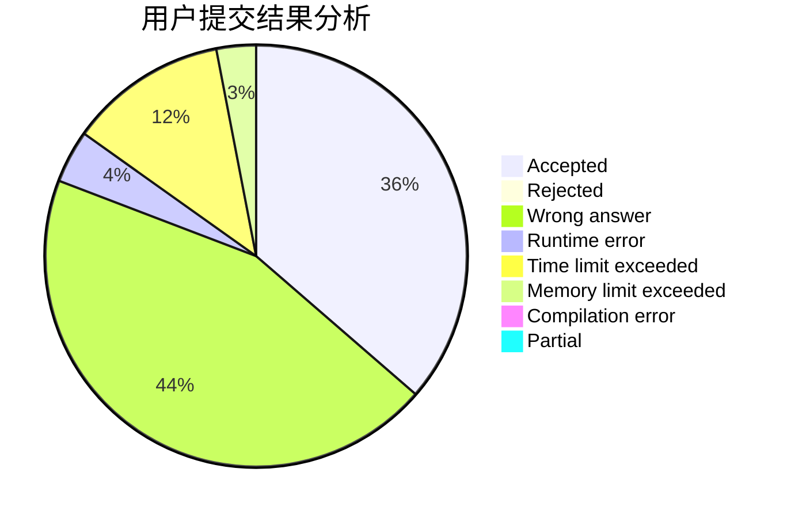
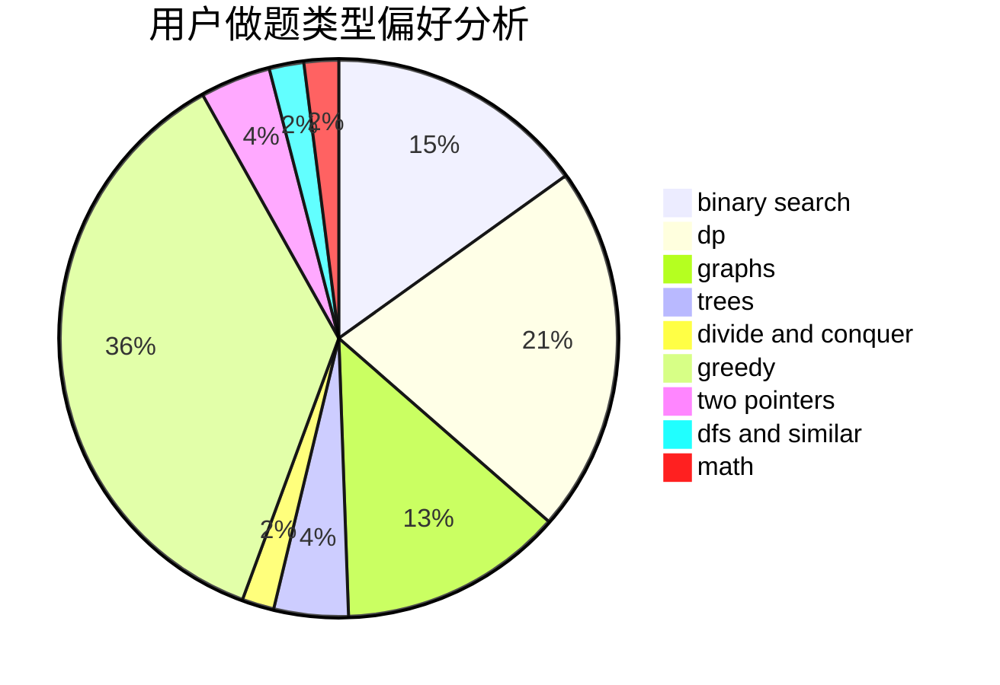

# hao_qing233

<!-- tabs:start -->

#### **用户提交结果分析**

#### **用户做题类型偏好分析**

<!-- tabs:end -->
# 推荐题目
[1166D](https://codeforces.com/contest/1166/problem/D)
[442B](https://codeforces.com/contest/442/problem/B)
[612A](https://codeforces.com/contest/612/problem/A)
[548B](https://codeforces.com/contest/548/problem/B)
[7E](https://codeforces.com/contest/7/problem/E)
[864C](https://codeforces.com/contest/864/problem/C)
[317E](https://codeforces.com/contest/317/problem/E)
[1495E](https://codeforces.com/contest/1495/problem/E)
[1358C](https://codeforces.com/contest/1358/problem/C)
[772C](https://codeforces.com/contest/772/problem/C)
