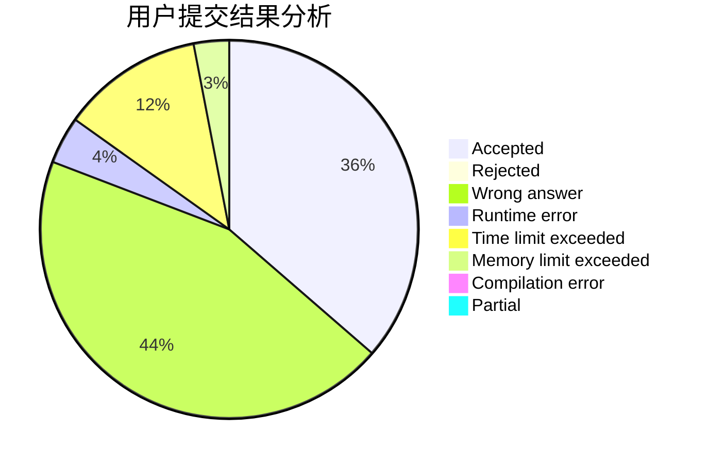
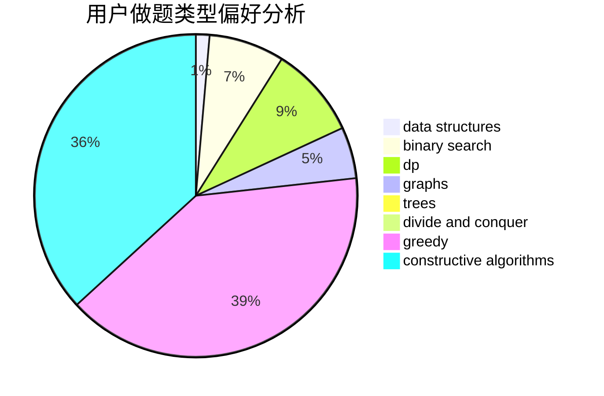
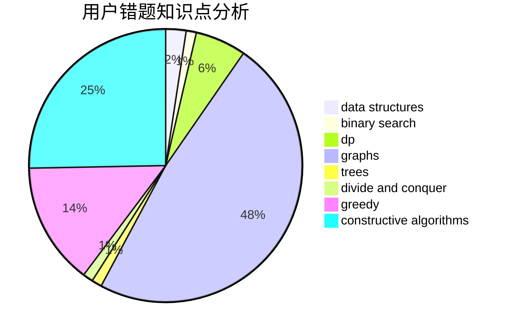

# hao_qing233
<!-- tabs:start -->
#### **用户提交结果分析**

#### **用户做题类型偏好分析**

#### **用户错题知识点分析**

<!-- tabs:end -->
# 推荐题目
[Seven Digit Number (2 points)](https://codeforces.com/contest/1164/problem/M)		nan		  
[A and B and Compilation Errors](http://codeforces.com/problemset/problem/519/B)		data structures,
                        implementation,
                        sortings		  
[Football](http://codeforces.com/problemset/problem/417/C)		constructive algorithms,
                        graphs,
                        implementation		  
[Happy Tree Party](http://codeforces.com/problemset/problem/593/D)		data structures,
                        dfs and similar,
                        graphs,
                        math,
                        trees		  
[Rotate, Flip and Zoom](http://codeforces.com/problemset/problem/523/A)		*special problem,
                        implementation		  
[Andryusha and Socks](https://codeforces.com/contest/782/problem/A)		implementation		  
[Enlarge GCD](http://codeforces.com/problemset/problem/1034/A)		number theory		  
[World of Darkraft](http://codeforces.com/problemset/problem/138/D)		dp,
                        games		  
[Leha and another game about graph](https://codeforces.com/contest/841/problem/D)		constructive algorithms,
                        data structures,
                        dfs and similar,
                        dp,
                        graphs		  
[Dominated Subarray](http://codeforces.com/problemset/problem/1257/C)		greedy,
                        implementation,
                        sortings,
                        strings,
                        two pointers		  
<!-- tabs:start -->
#### **data structures**
[Seven Digit Number (2 points)](http://codeforces.com/problemset/problem/519/B)		data structures,
                        implementation,
                        sortings		  
[A and B and Compilation Errors](http://codeforces.com/problemset/problem/593/D)		data structures,
                        dfs and similar,
                        graphs,
                        math,
                        trees		  
[Football](https://codeforces.com/contest/841/problem/D)		constructive algorithms,
                        data structures,
                        dfs and similar,
                        dp,
                        graphs		  
[Happy Tree Party](http://codeforces.com/problemset/problem/567/C)		binary search,
                        data structures,
                        dp		  
[Rotate, Flip and Zoom](http://codeforces.com/problemset/problem/1282/E)		constructive algorithms,
                        data structures,
                        dfs and similar,
                        graphs		  
[Andryusha and Socks](http://codeforces.com/problemset/problem/238/D)		data structures,
                        implementation		  
[Enlarge GCD](http://codeforces.com/problemset/problem/1266/E)		data structures,
                        greedy,
                        implementation		  
[World of Darkraft](http://codeforces.com/problemset/problem/1163/C2)		data structures,
                        geometry,
                        implementation,
                        math		  
[Leha and another game about graph](https://codeforces.com/contest/697/problem/C)		brute force,
                        data structures,
                        implementation,
                        trees		  
[Dominated Subarray](http://codeforces.com/problemset/problem/258/E)		data structures,
                        dfs and similar,
                        trees		  
#### **binary search**
[Seven Digit Number (2 points)](http://codeforces.com/problemset/problem/567/C)		binary search,
                        data structures,
                        dp		  
[A and B and Compilation Errors](https://codeforces.com/contest/1240/problem/A)		binary search,
                        greedy		  
[Football](https://codeforces.com/contest/831/problem/D)		binary search,
                        brute force,
                        dp,
                        greedy,
                        sortings		  
[Happy Tree Party](http://codeforces.com/problemset/problem/1195/B)		binary search,
                        brute force,
                        math		  
[Rotate, Flip and Zoom](http://codeforces.com/problemset/problem/1016/E)		binary search,
                        geometry		  
[Andryusha and Socks](http://codeforces.com/problemset/problem/1486/C2)		binary search,
                        interactive		  
[Enlarge GCD](http://codeforces.com/problemset/problem/1492/C)		binary search,
                        data structures,
                        dp,
                        greedy,
                        two pointers		  
[World of Darkraft](http://codeforces.com/problemset/problem/1463/D)		binary search,
                        constructive algorithms,
                        greedy,
                        two pointers		  
[Leha and another game about graph](http://codeforces.com/problemset/problem/1490/G)		binary search,
                        data structures,
                        math		  
[Dominated Subarray](http://codeforces.com/problemset/problem/1479/D)		binary search,
                        bitmasks,
                        brute force,
                        data structures,
                        probabilities,
                        trees		  
#### **dp**
[Seven Digit Number (2 points)](http://codeforces.com/problemset/problem/138/D)		dp,
                        games		  
[A and B and Compilation Errors](https://codeforces.com/contest/841/problem/D)		constructive algorithms,
                        data structures,
                        dfs and similar,
                        dp,
                        graphs		  
[Football](http://codeforces.com/problemset/problem/567/C)		binary search,
                        data structures,
                        dp		  
[Happy Tree Party](http://codeforces.com/problemset/problem/850/D)		constructive algorithms,
                        dp,
                        graphs,
                        greedy,
                        math		  
[Rotate, Flip and Zoom](http://codeforces.com/problemset/problem/1155/F)		brute force,
                        dp,
                        graphs		  
[Andryusha and Socks](http://codeforces.com/problemset/problem/316/B2)		dfs and similar,
                        dp		  
[Enlarge GCD](https://codeforces.com/contest/831/problem/D)		binary search,
                        brute force,
                        dp,
                        greedy,
                        sortings		  
[World of Darkraft](http://codeforces.com/problemset/problem/1185/G1)		bitmasks,
                        combinatorics,
                        dp		  
[Leha and another game about graph](http://codeforces.com/problemset/problem/721/C)		dp,
                        graphs		  
[Dominated Subarray](http://codeforces.com/problemset/problem/1105/E)		bitmasks,
                        brute force,
                        dp,
                        meet-in-the-middle		  
#### **graph**
[Seven Digit Number (2 points)](http://codeforces.com/problemset/problem/417/C)		constructive algorithms,
                        graphs,
                        implementation		  
[A and B and Compilation Errors](http://codeforces.com/problemset/problem/593/D)		data structures,
                        dfs and similar,
                        graphs,
                        math,
                        trees		  
[Football](https://codeforces.com/contest/841/problem/D)		constructive algorithms,
                        data structures,
                        dfs and similar,
                        dp,
                        graphs		  
[Happy Tree Party](http://codeforces.com/problemset/problem/850/D)		constructive algorithms,
                        dp,
                        graphs,
                        greedy,
                        math		  
[Rotate, Flip and Zoom](http://codeforces.com/problemset/problem/1282/E)		constructive algorithms,
                        data structures,
                        dfs and similar,
                        graphs		  
[Andryusha and Socks](http://codeforces.com/problemset/problem/1155/F)		brute force,
                        dp,
                        graphs		  
[Enlarge GCD](http://codeforces.com/problemset/problem/240/E)		dfs and similar,
                        graphs,
                        greedy		  
[World of Darkraft](http://codeforces.com/problemset/problem/721/C)		dp,
                        graphs		  
[Leha and another game about graph](https://codeforces.com/contest/782/problem/E)		constructive algorithms,
                        dfs and similar,
                        graphs		  
[Dominated Subarray](http://codeforces.com/problemset/problem/724/G)		bitmasks,
                        graphs,
                        math,
                        number theory,
                        trees		  
#### **trees**
[Seven Digit Number (2 points)](http://codeforces.com/problemset/problem/593/D)		data structures,
                        dfs and similar,
                        graphs,
                        math,
                        trees		  
[A and B and Compilation Errors](http://codeforces.com/problemset/problem/754/E)		bitmasks,
                        brute force,
                        fft,
                        strings,
                        trees		  
[Football](https://codeforces.com/contest/697/problem/C)		brute force,
                        data structures,
                        implementation,
                        trees		  
[Happy Tree Party](http://codeforces.com/problemset/problem/258/E)		data structures,
                        dfs and similar,
                        trees		  
[Rotate, Flip and Zoom](http://codeforces.com/problemset/problem/724/G)		bitmasks,
                        graphs,
                        math,
                        number theory,
                        trees		  
[Andryusha and Socks](http://codeforces.com/problemset/problem/1479/D)		binary search,
                        bitmasks,
                        brute force,
                        data structures,
                        probabilities,
                        trees		  
[Enlarge GCD](http://codeforces.com/problemset/problem/1511/C)		brute force,
                        data structures,
                        implementation,
                        trees		  
[World of Darkraft](http://codeforces.com/problemset/problem/1499/F)		combinatorics,
                        dfs and similar,
                        dp,
                        trees		  
[Leha and another game about graph](http://codeforces.com/problemset/problem/1491/E)		brute force,
                        dfs and similar,
                        divide and conquer,
                        number theory,
                        trees		  
[Dominated Subarray](http://codeforces.com/problemset/problem/1466/D)		data structures,
                        greedy,
                        sortings,
                        trees		  
#### **divide and conquer**
[Seven Digit Number (2 points)](http://codeforces.com/problemset/problem/1461/D)		binary search,
                        brute force,
                        data structures,
                        divide and conquer,
                        implementation,
                        sortings		  
[A and B and Compilation Errors](http://codeforces.com/problemset/problem/1466/G)		combinatorics,
                        divide and conquer,
                        hashing,
                        math,
                        string suffix structures,
                        strings		  
[Football](http://codeforces.com/problemset/problem/1490/D)		dfs and similar,
                        divide and conquer,
                        implementation		  
[Happy Tree Party](https://codeforces.com/contest/1483/problem/C)		data structures,
                        divide and conquer,
                        dp		  
[Rotate, Flip and Zoom](http://codeforces.com/problemset/problem/1491/E)		brute force,
                        dfs and similar,
                        divide and conquer,
                        number theory,
                        trees		  
[Andryusha and Socks](http://codeforces.com/problemset/problem/1303/G)		data structures,
                        divide and conquer,
                        geometry,
                        trees		  
[Enlarge GCD](http://codeforces.com/problemset/problem/1494/D)		constructive algorithms,
                        data structures,
                        dfs and similar,
                        divide and conquer,
                        dsu,
                        greedy,
                        sortings,
                        trees		  
[World of Darkraft](http://codeforces.com/problemset/problem/1482/E)		data structures,
                        divide and conquer,
                        dp		  
[Leha and another game about graph](http://codeforces.com/problemset/problem/566/C)		dfs and similar,
                        divide and conquer,
                        trees		  
[Dominated Subarray](http://codeforces.com/problemset/problem/1428/F)		binary search,
                        data structures,
                        divide and conquer,
                        dp,
                        two pointers		  
#### **greedy**
[Seven Digit Number (2 points)](http://codeforces.com/problemset/problem/1257/C)		greedy,
                        implementation,
                        sortings,
                        strings,
                        two pointers		  
[A and B and Compilation Errors](http://codeforces.com/problemset/problem/850/D)		constructive algorithms,
                        dp,
                        graphs,
                        greedy,
                        math		  
[Football](https://codeforces.com/contest/1240/problem/A)		binary search,
                        greedy		  
[Happy Tree Party](http://codeforces.com/problemset/problem/1266/E)		data structures,
                        greedy,
                        implementation		  
[Rotate, Flip and Zoom](http://codeforces.com/problemset/problem/1136/D)		greedy		  
[Andryusha and Socks](http://codeforces.com/problemset/problem/1325/B)		greedy,
                        implementation		  
[Enlarge GCD](http://codeforces.com/problemset/problem/240/E)		dfs and similar,
                        graphs,
                        greedy		  
[World of Darkraft](https://codeforces.com/contest/831/problem/D)		binary search,
                        brute force,
                        dp,
                        greedy,
                        sortings		  
[Leha and another game about graph](http://codeforces.com/problemset/problem/1455/E)		brute force,
                        constructive algorithms,
                        flows,
                        geometry,
                        greedy,
                        implementation,
                        math,
                        ternary search		  
[Dominated Subarray](http://codeforces.com/problemset/problem/1158/D)		constructive algorithms,
                        geometry,
                        greedy,
                        math		  
#### **constructive algorithms**
[Seven Digit Number (2 points)](http://codeforces.com/problemset/problem/417/C)		constructive algorithms,
                        graphs,
                        implementation		  
[A and B and Compilation Errors](https://codeforces.com/contest/841/problem/D)		constructive algorithms,
                        data structures,
                        dfs and similar,
                        dp,
                        graphs		  
[Football](http://codeforces.com/problemset/problem/850/D)		constructive algorithms,
                        dp,
                        graphs,
                        greedy,
                        math		  
[Happy Tree Party](http://codeforces.com/problemset/problem/1282/E)		constructive algorithms,
                        data structures,
                        dfs and similar,
                        graphs		  
[Rotate, Flip and Zoom](http://codeforces.com/problemset/problem/737/F)		constructive algorithms,
                        math		  
[Andryusha and Socks](http://codeforces.com/problemset/problem/1455/E)		brute force,
                        constructive algorithms,
                        flows,
                        geometry,
                        greedy,
                        implementation,
                        math,
                        ternary search		  
[Enlarge GCD](http://codeforces.com/problemset/problem/1158/D)		constructive algorithms,
                        geometry,
                        greedy,
                        math		  
[World of Darkraft](http://codeforces.com/problemset/problem/398/C)		constructive algorithms		  
[Leha and another game about graph](http://codeforces.com/problemset/problem/774/C)		*special problem,
                        constructive algorithms,
                        greedy,
                        implementation		  
[Dominated Subarray](https://codeforces.com/contest/782/problem/E)		constructive algorithms,
                        dfs and similar,
                        graphs		  
#### **sortings**
[Seven Digit Number (2 points)](http://codeforces.com/problemset/problem/519/B)		data structures,
                        implementation,
                        sortings		  
[A and B and Compilation Errors](http://codeforces.com/problemset/problem/1257/C)		greedy,
                        implementation,
                        sortings,
                        strings,
                        two pointers		  
[Football](https://codeforces.com/contest/831/problem/D)		binary search,
                        brute force,
                        dp,
                        greedy,
                        sortings		  
[Happy Tree Party](http://codeforces.com/problemset/problem/1374/E1)		data structures,
                        greedy,
                        sortings		  
[Rotate, Flip and Zoom](https://codeforces.com/contest/1496/problem/C)		geometry,
                        greedy,
                        math,
                        sortings		  
[Andryusha and Socks](http://codeforces.com/problemset/problem/1495/A)		geometry,
                        greedy,
                        math,
                        sortings		  
[Enlarge GCD](http://codeforces.com/problemset/problem/1497/A)		brute force,
                        data structures,
                        greedy,
                        sortings		  
[World of Darkraft](http://codeforces.com/problemset/problem/1427/A)		math,
                        sortings		  
[Leha and another game about graph](http://codeforces.com/problemset/problem/1461/D)		binary search,
                        brute force,
                        data structures,
                        divide and conquer,
                        implementation,
                        sortings		  
[Dominated Subarray](http://codeforces.com/problemset/problem/1437/C)		dp,
                        flows,
                        graph matchings,
                        greedy,
                        math,
                        sortings		  
<!-- tabs:end -->
