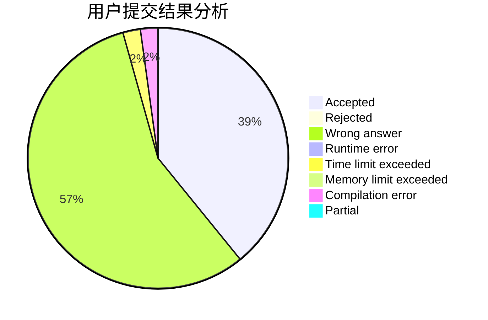
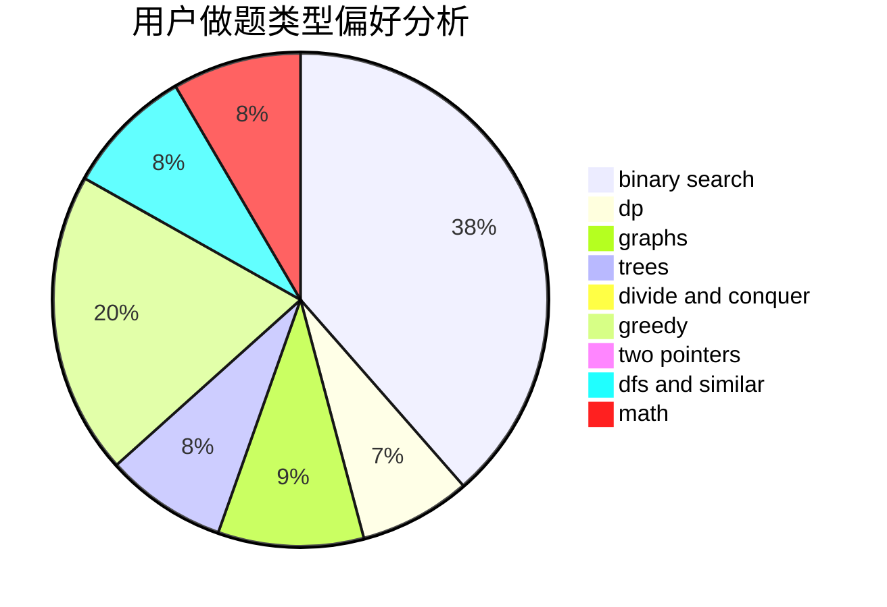

# haohaoh4

<!-- tabs:start -->

#### **用户提交结果分析**

#### **用户做题类型偏好分析**

<!-- tabs:end -->
# 推荐题目
[1139A](https://codeforces.com/contest/1139/problem/A)
[637B](https://codeforces.com/contest/637/problem/B)
[898B](https://codeforces.com/contest/898/problem/B)
[205D](https://codeforces.com/contest/205/problem/D)
[705A](https://codeforces.com/contest/705/problem/A)
[79D](https://codeforces.com/contest/79/problem/D)
[925F](https://codeforces.com/contest/925/problem/F)
[908F](https://codeforces.com/contest/908/problem/F)
[1380A](https://codeforces.com/contest/1380/problem/A)
[280D](https://codeforces.com/contest/280/problem/D)
