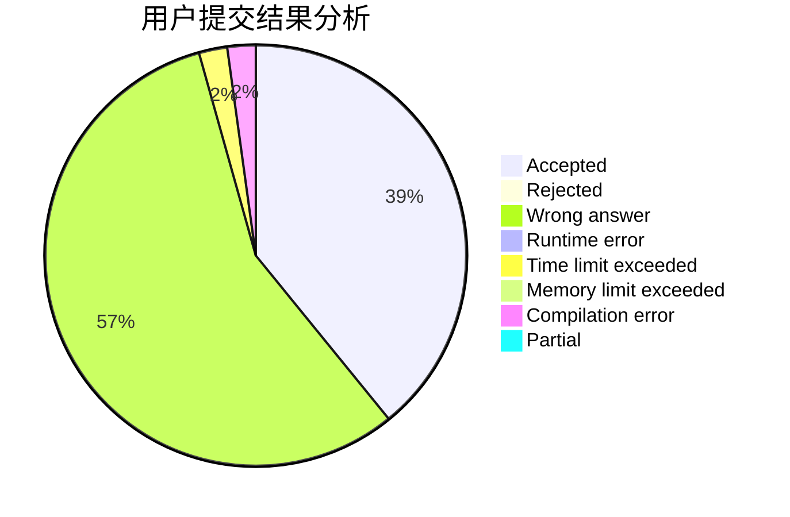
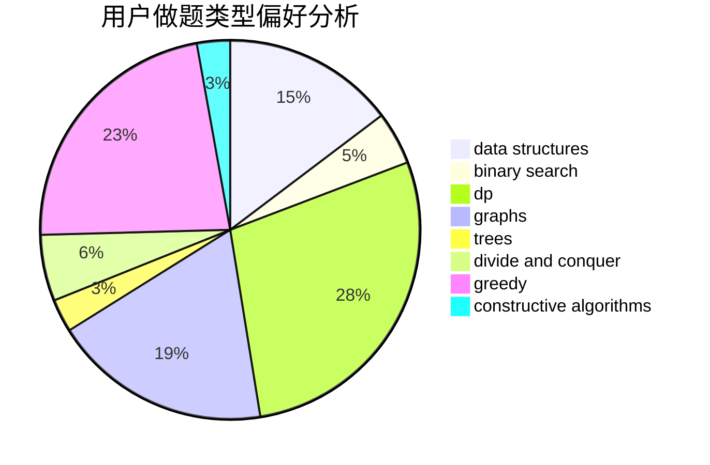
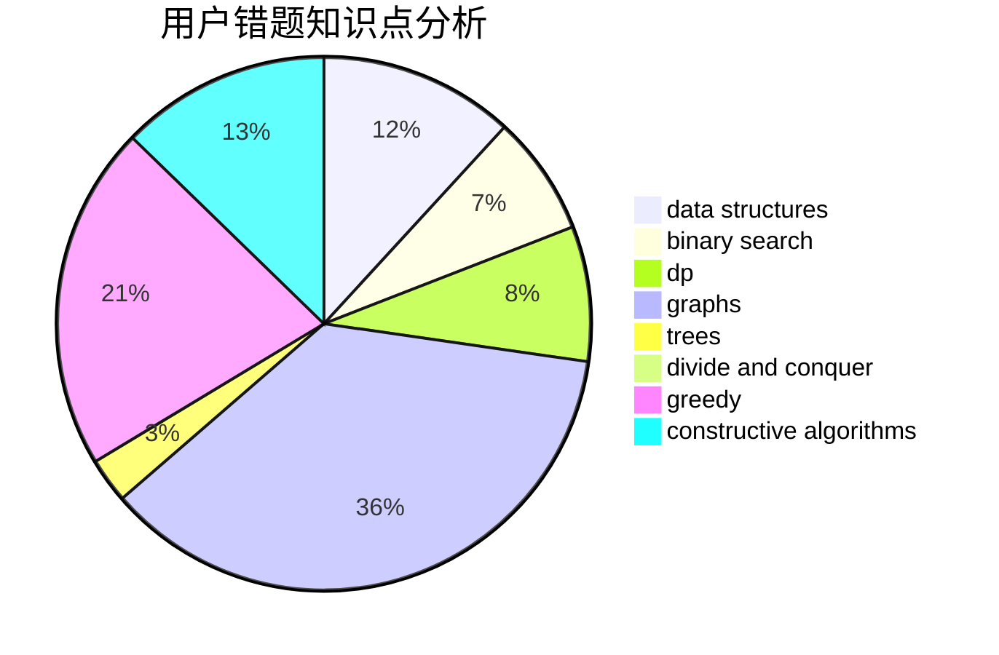

# haohaoh4

<!-- tabs:start -->

#### **用户提交结果分析**

#### **用户做题类型偏好分析**

#### **用户错题知识点分析**

<!-- tabs:end -->
# 推荐题目
[1136E](https://codeforces.com/contest/1136/problem/E)		binary search,
                        data structures		  
[618A](https://codeforces.com/contest/618/problem/A)		implementation		  
[877C](https://codeforces.com/contest/877/problem/C)		constructive algorithms		  
[180C](https://codeforces.com/contest/180/problem/C)		dp		  
[681B](https://codeforces.com/contest/681/problem/B)		brute force		  
[780H](https://codeforces.com/contest/780/problem/H)		binary search,
                        geometry,
                        implementation,
                        two pointers		  
[911A](https://codeforces.com/contest/911/problem/A)		implementation		  
[888G](https://codeforces.com/contest/888/problem/G)		bitmasks,
                        constructive algorithms,
                        data structures		  
[1371C](https://codeforces.com/contest/1371/problem/C)		greedy,
                        implementation,
                        math		  
[264D](https://codeforces.com/contest/264/problem/D)		dp,
                        two pointers		  
