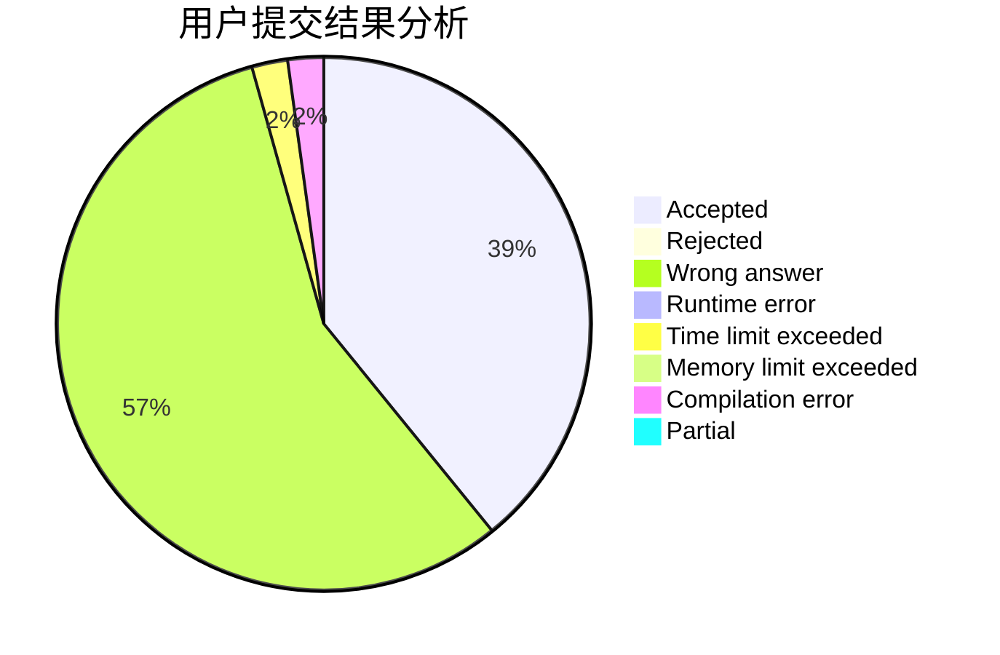
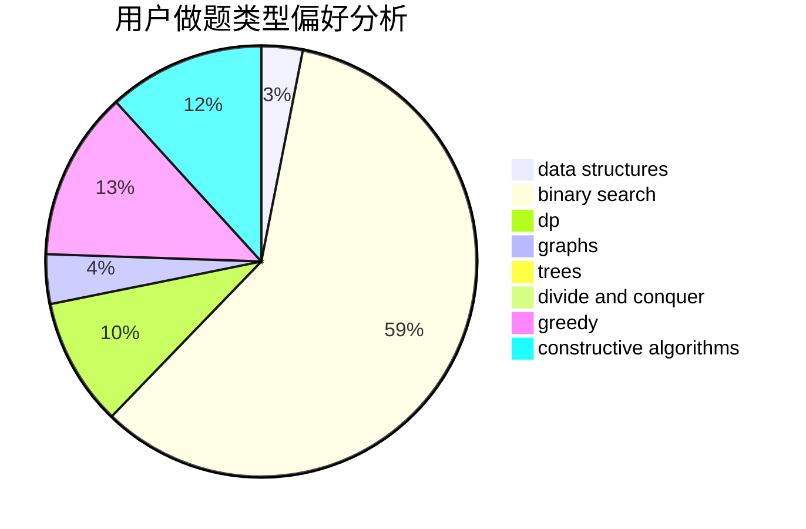
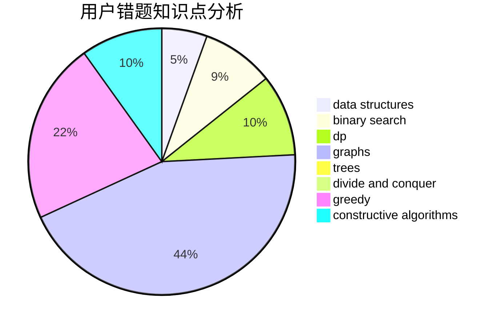

# haohaoh4

<!-- tabs:start -->

#### **用户提交结果分析**

#### **用户做题类型偏好分析**

#### **用户错题知识点分析**

<!-- tabs:end -->
# 推荐题目
[1139A](https://codeforces.com/contest/1139/problem/A)		implementation,
                        strings		  
[637B](https://codeforces.com/contest/637/problem/B)		*special problem,
                        binary search,
                        constructive algorithms,
                        data structures,
                        sortings		  
[898B](https://codeforces.com/contest/898/problem/B)		brute force,
                        implementation,
                        number theory		  
[205D](https://codeforces.com/contest/205/problem/D)		dsu,graphs,sortings,trees		  
[705A](https://codeforces.com/contest/705/problem/A)		implementation		  
[79D](https://codeforces.com/contest/79/problem/D)		bitmasks,
                        dp,
                        shortest paths		  
[925F](https://codeforces.com/contest/925/problem/F)		binary search,
                        flows		  
[908F](https://codeforces.com/contest/908/problem/F)		graphs,
                        greedy,
                        implementation		  
[1380A](https://codeforces.com/contest/1380/problem/A)		brute force,
                        data structures		  
[280D](https://codeforces.com/contest/280/problem/D)		data structures,
                        flows,
                        graphs,
                        implementation		  
