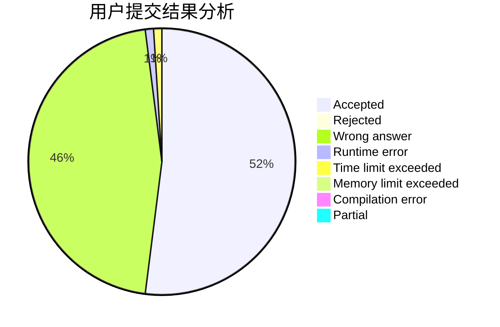
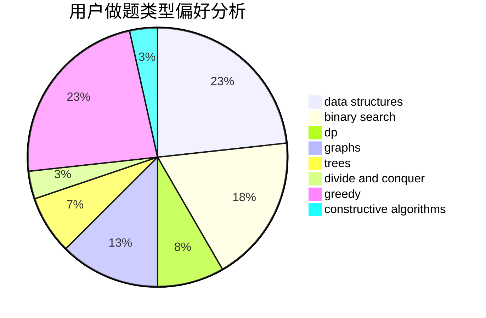
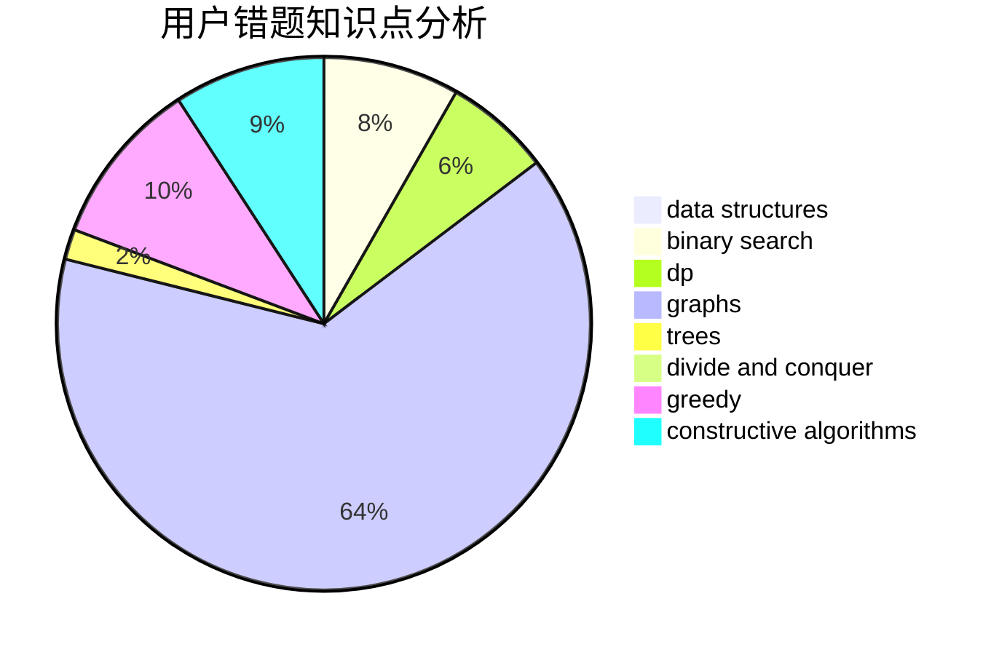

# haomie

<!-- tabs:start -->

#### **用户提交结果分析**

#### **用户做题类型偏好分析**

#### **用户错题知识点分析**

<!-- tabs:end -->
# 推荐题目
[25E](https://codeforces.com/contest/25/problem/E)		hashing,
                        strings		  
[1020E](https://codeforces.com/contest/1020/problem/E)		dsu,graphs,sortings,trees		  
[948A](https://codeforces.com/contest/948/problem/A)		brute force,
                        dfs and similar,
                        graphs,
                        implementation		  
[768C](https://codeforces.com/contest/768/problem/C)		brute force,
                        dp,
                        implementation,
                        sortings		  
[559E](https://codeforces.com/contest/559/problem/E)		dp,
                        sortings		  
[225C](https://codeforces.com/contest/225/problem/C)		dp,
                        matrices		  
[1148B](https://codeforces.com/contest/1148/problem/B)		binary search,
                        brute force,
                        two pointers		  
[984C](https://codeforces.com/contest/984/problem/C)		dsu,graphs,sortings,trees		  
[1510E](https://codeforces.com/contest/1510/problem/E)		nan		  
[1340F](https://codeforces.com/contest/1340/problem/F)		brute force,
                        data structures,
                        hashing		  
