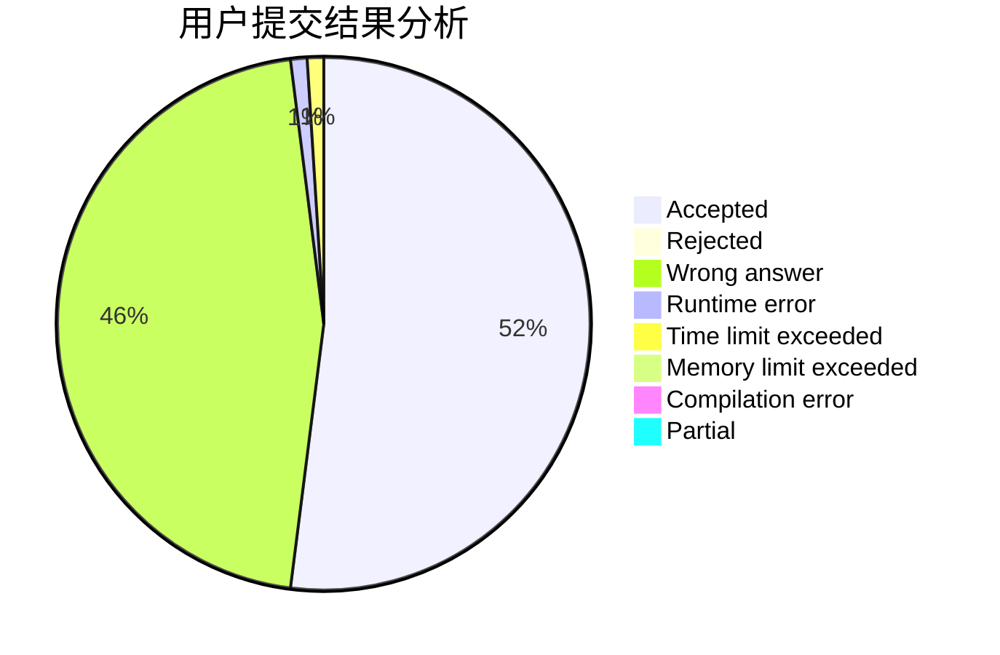
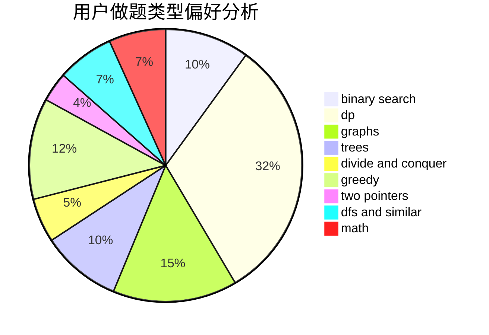

# haomie

<!-- tabs:start -->

#### **用户提交结果分析**

#### **用户做题类型偏好分析**

<!-- tabs:end -->
# 推荐题目
[277E](https://codeforces.com/contest/277/problem/E)
[1023C](https://codeforces.com/contest/1023/problem/C)
[965B](https://codeforces.com/contest/965/problem/B)
[788B](https://codeforces.com/contest/788/problem/B)
[582C](https://codeforces.com/contest/582/problem/C)
[243C](https://codeforces.com/contest/243/problem/C)
[114B](https://codeforces.com/contest/114/problem/B)
[99B](https://codeforces.com/contest/99/problem/B)
[165A](https://codeforces.com/contest/165/problem/A)
[1347E](https://codeforces.com/contest/1347/problem/E)
