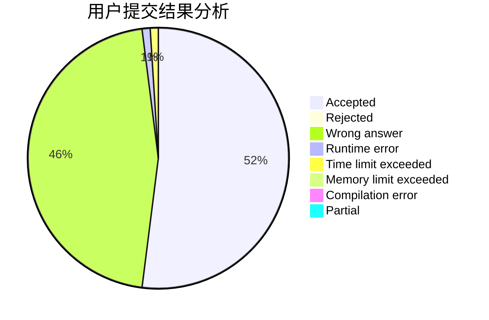
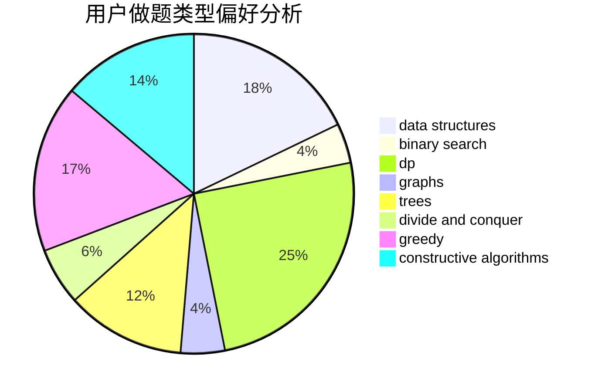
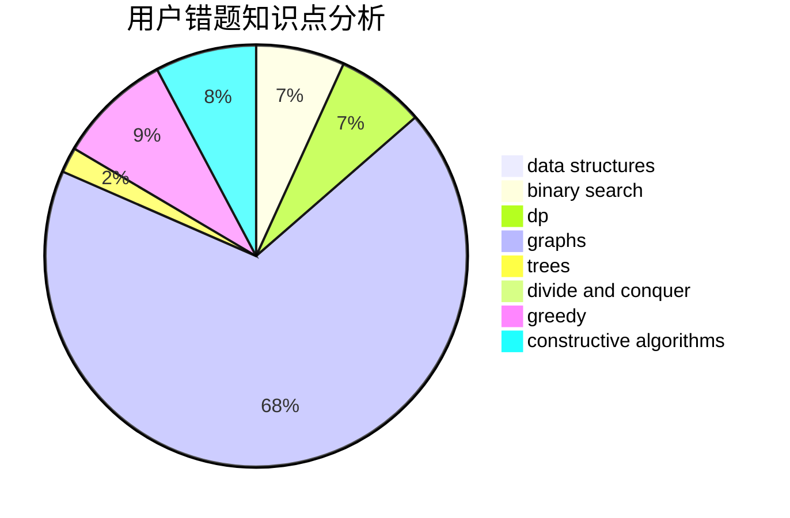

# haomie

<!-- tabs:start -->

#### **用户提交结果分析**

#### **用户做题类型偏好分析**

#### **用户错题知识点分析**

<!-- tabs:end -->
# 推荐题目
[277E](https://codeforces.com/contest/277/problem/E)		flows,
                        trees		  
[1023C](https://codeforces.com/contest/1023/problem/C)		greedy		  
[965B](https://codeforces.com/contest/965/problem/B)		implementation		  
[788B](https://codeforces.com/contest/788/problem/B)		combinatorics,
                        constructive algorithms,
                        dfs and similar,
                        dsu,
                        graphs		  
[582C](https://codeforces.com/contest/582/problem/C)		number theory		  
[243C](https://codeforces.com/contest/243/problem/C)		dfs and similar,
                        implementation		  
[114B](https://codeforces.com/contest/114/problem/B)		bitmasks,
                        brute force,
                        graphs		  
[99B](https://codeforces.com/contest/99/problem/B)		implementation,
                        sortings		  
[165A](https://codeforces.com/contest/165/problem/A)		implementation		  
[1347E](https://codeforces.com/contest/1347/problem/E)		dsu,graphs,sortings,trees		  
