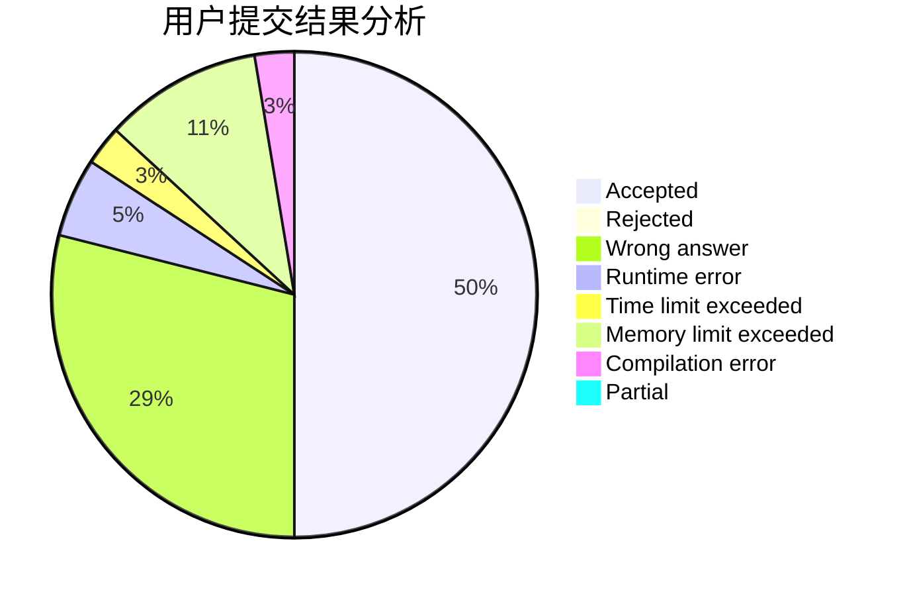
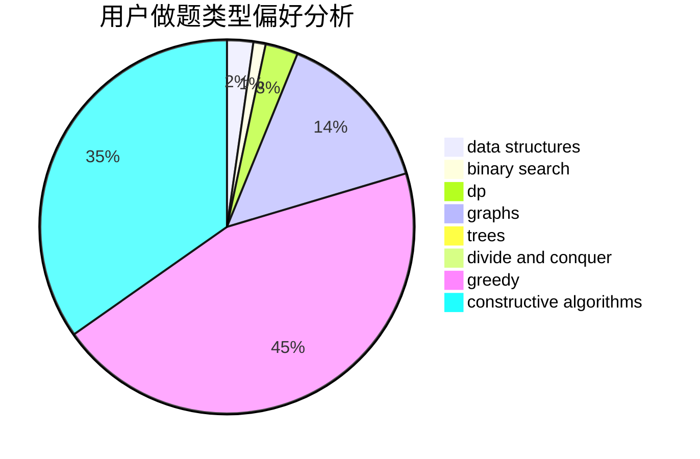
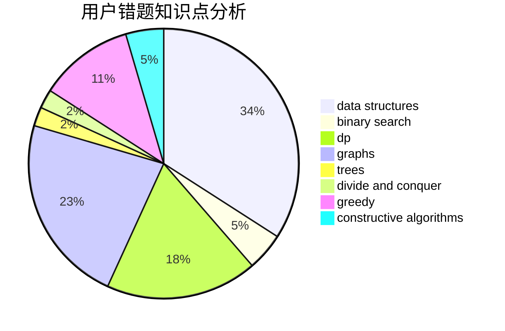

# haoyuan6118

<!-- tabs:start -->

#### **用户提交结果分析**

#### **用户做题类型偏好分析**

#### **用户错题知识点分析**

<!-- tabs:end -->
# 推荐题目
[1439C](https://codeforces.com/contest/1439/problem/C)		binary search,
                        data structures,
                        divide and conquer,
                        greedy,
                        implementation		  
[1486E](https://codeforces.com/contest/1486/problem/E)		binary search,
                        brute force,
                        constructive algorithms,
                        dp,
                        flows,
                        graphs,
                        shortest paths		  
[1457C](https://codeforces.com/contest/1457/problem/C)		dsu,graphs,sortings,trees		  
[868D](https://codeforces.com/contest/868/problem/D)		bitmasks,
                        brute force,
                        dp,
                        implementation,
                        strings		  
[699A](https://codeforces.com/contest/699/problem/A)		implementation		  
[1245C](https://codeforces.com/contest/1245/problem/C)		dp		  
[479E](https://codeforces.com/contest/479/problem/E)		combinatorics,
                        dp		  
[220C](https://codeforces.com/contest/220/problem/C)		data structures		  
[16E](https://codeforces.com/contest/16/problem/E)		bitmasks,
                        dp,
                        probabilities		  
[23B](https://codeforces.com/contest/23/problem/B)		constructive algorithms,
                        graphs,
                        math		  
