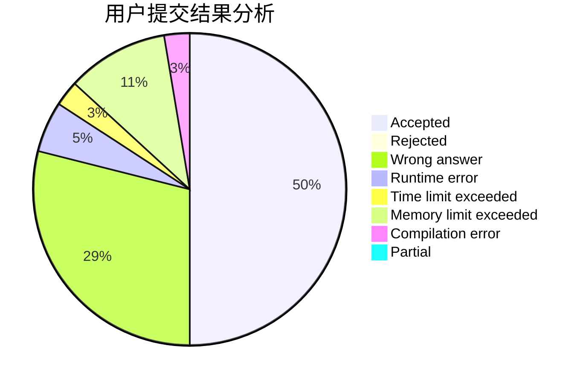
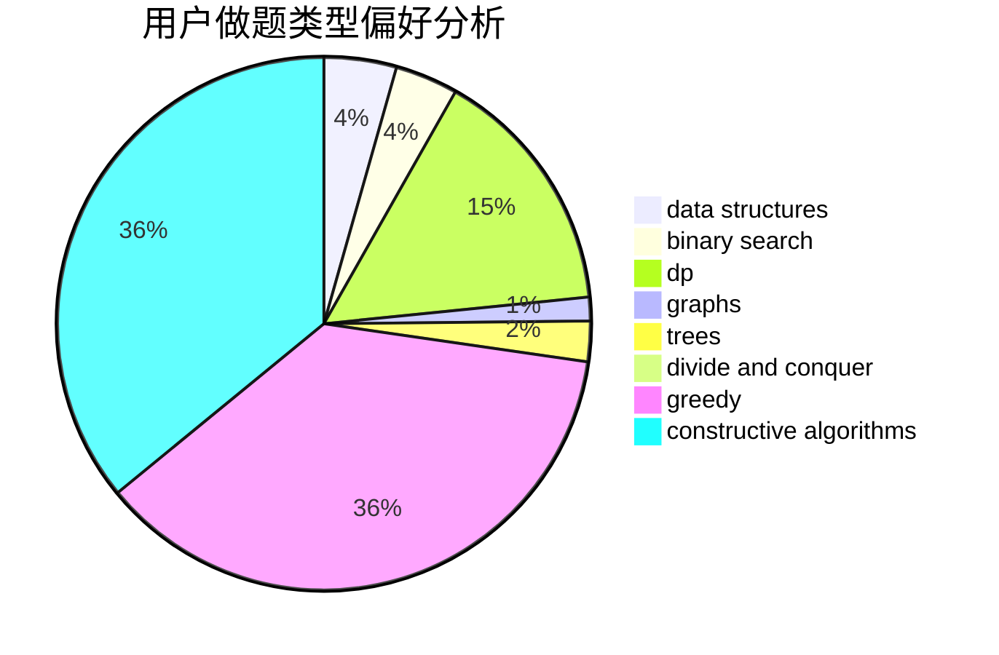
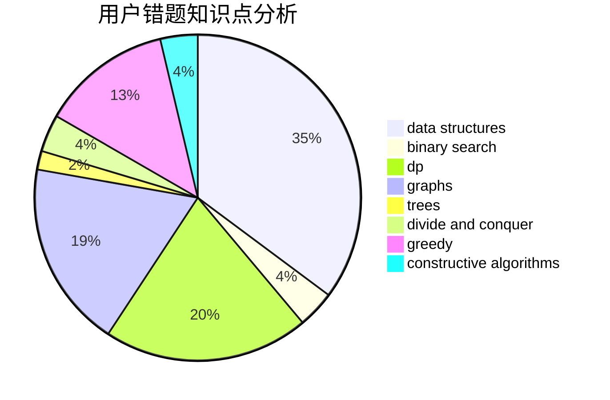

# haoyuan6118

<!-- tabs:start -->

#### **用户提交结果分析**

#### **用户做题类型偏好分析**

#### **用户错题知识点分析**

<!-- tabs:end -->
# 推荐题目
[1430E](https://codeforces.com/contest/1430/problem/E)		data structures,
                        greedy,
                        strings		  
[1478A](https://codeforces.com/contest/1478/problem/A)		brute force,
                        greedy		  
[1447F1](https://codeforces.com/contest/1447F/problem/1)		dsu,graphs,sortings,trees		  
[849B](https://codeforces.com/contest/849/problem/B)		brute force,
                        geometry		  
[673B](https://codeforces.com/contest/673/problem/B)		greedy,
                        implementation		  
[123E](https://codeforces.com/contest/123/problem/E)		dfs and similar,
                        dp,
                        probabilities,
                        trees		  
[460B](https://codeforces.com/contest/460/problem/B)		brute force,
                        implementation,
                        math,
                        number theory		  
[199D](https://codeforces.com/contest/199/problem/D)		dsu,graphs,sortings,trees		  
[1511G](https://codeforces.com/contest/1511/problem/G)		bitmasks,
                        brute force,
                        data structures,
                        games,
                        two pointers		  
[21D](https://codeforces.com/contest/21/problem/D)		bitmasks,
                        graph matchings,
                        graphs		  
