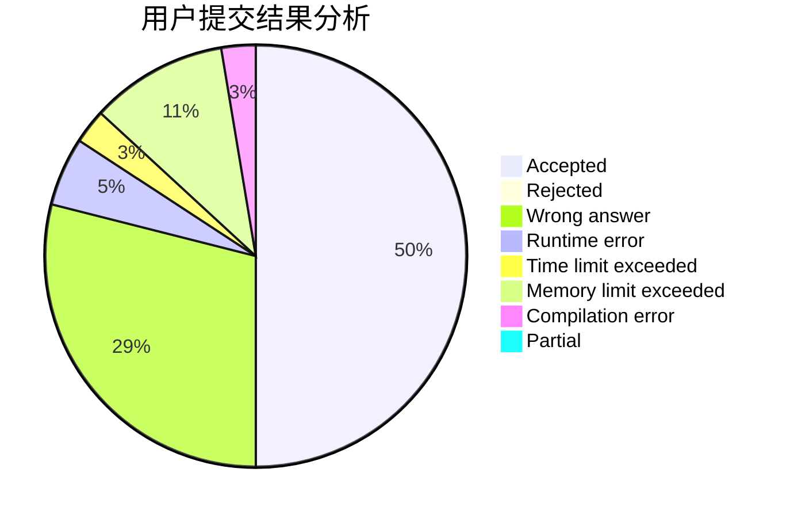
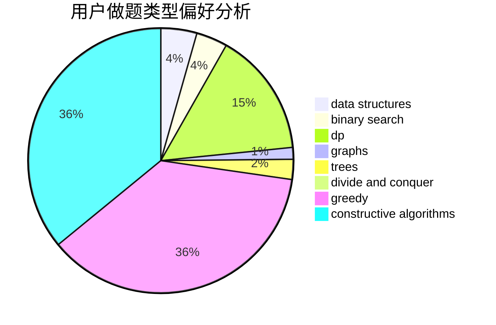
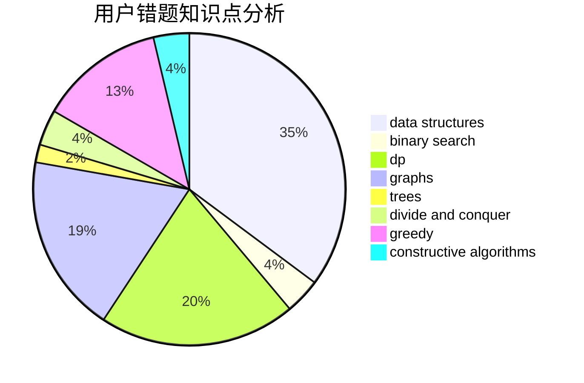

# haoyuan6118
<!-- tabs:start -->
#### **用户提交结果分析**

#### **用户做题类型偏好分析**

#### **用户错题知识点分析**

<!-- tabs:end -->
# 推荐题目
[Chips on a Board](http://codeforces.com/problemset/problem/1511/G)		bitmasks,
                        brute force,
                        data structures,
                        games,
                        two pointers		  
[Problems for Round](http://codeforces.com/problemset/problem/673/B)		greedy,
                        implementation		  
[Tell Your World](http://codeforces.com/problemset/problem/849/B)		brute force,
                        geometry		  
[Little Dima and Equation](http://codeforces.com/problemset/problem/460/B)		brute force,
                        implementation,
                        math,
                        number theory		  
[Traveling Graph](http://codeforces.com/problemset/problem/21/D)		bitmasks,
                        graph matchings,
                        graphs		  
[Antipalindrome](http://codeforces.com/problemset/problem/981/A)		brute force,
                        implementation,
                        strings		  
[Frequency Problem (Easy Version)](https://codeforces.com/contest/1447/problem/F1)		data structures,
                        greedy		  
[Fake NP](http://codeforces.com/problemset/problem/805/A)		greedy,
                        math		  
[Valera and Tubes](http://codeforces.com/problemset/problem/441/C)		constructive algorithms,
                        dfs and similar,
                        implementation		  
[Same Sum Blocks (Hard)](http://codeforces.com/problemset/problem/1141/F2)		data structures,
                        greedy		  
<!-- tabs:start -->
#### **data structures**
[Chips on a Board](http://codeforces.com/problemset/problem/1511/G)		bitmasks,
                        brute force,
                        data structures,
                        games,
                        two pointers		  
[Problems for Round](https://codeforces.com/contest/1447/problem/F1)		data structures,
                        greedy		  
[Tell Your World](http://codeforces.com/problemset/problem/1141/F2)		data structures,
                        greedy		  
[Little Dima and Equation](http://codeforces.com/problemset/problem/524/E)		data structures,
                        sortings		  
[Traveling Graph](http://codeforces.com/problemset/problem/372/C)		data structures,
                        dp,
                        math		  
[Antipalindrome](http://codeforces.com/problemset/problem/538/F)		brute force,
                        data structures,
                        math,
                        sortings		  
[Frequency Problem (Easy Version)](http://codeforces.com/problemset/problem/1494/E)		constructive algorithms,
                        data structures,
                        graphs,
                        hashing		  
[Fake NP](http://codeforces.com/problemset/problem/1430/E)		data structures,
                        greedy,
                        strings		  
[Valera and Tubes](http://codeforces.com/problemset/problem/896/C)		data structures,
                        probabilities		  
[Same Sum Blocks (Hard)](https://codeforces.com/contest/1483/problem/B)		data structures,
                        dsu,
                        implementation,
                        shortest paths		  
#### **binary search**
[Chips on a Board](http://codeforces.com/problemset/problem/1029/F)		binary search,
                        brute force,
                        math,
                        number theory		  
[Problems for Round](https://codeforces.com/contest/1424/problem/J)		binary search,
                        math,
                        number theory,
                        two pointers		  
[Tell Your World](http://codeforces.com/problemset/problem/1492/C)		binary search,
                        data structures,
                        dp,
                        greedy,
                        two pointers		  
[Little Dima and Equation](http://codeforces.com/problemset/problem/1463/D)		binary search,
                        constructive algorithms,
                        greedy,
                        two pointers		  
[Traveling Graph](http://codeforces.com/problemset/problem/1490/G)		binary search,
                        data structures,
                        math		  
[Antipalindrome](http://codeforces.com/problemset/problem/1479/D)		binary search,
                        bitmasks,
                        brute force,
                        data structures,
                        probabilities,
                        trees		  
[Frequency Problem (Easy Version)](http://codeforces.com/problemset/problem/1436/E)		binary search,
                        data structures,
                        two pointers		  
[Fake NP](http://codeforces.com/problemset/problem/1461/D)		binary search,
                        brute force,
                        data structures,
                        divide and conquer,
                        implementation,
                        sortings		  
[Valera and Tubes](http://codeforces.com/problemset/problem/1493/C)		binary search,
                        brute force,
                        constructive algorithms,
                        greedy,
                        strings		  
[Same Sum Blocks (Hard)](http://codeforces.com/problemset/problem/1487/D)		binary search,
                        brute force,
                        math,
                        number theory		  
#### **dp**
[Chips on a Board](http://codeforces.com/problemset/problem/762/D)		dp,
                        greedy,
                        implementation		  
[Problems for Round](http://codeforces.com/problemset/problem/958/C2)		dp		  
[Tell Your World](http://codeforces.com/problemset/problem/123/E)		dfs and similar,
                        dp,
                        probabilities,
                        trees		  
[Little Dima and Equation](http://codeforces.com/problemset/problem/303/E)		dp,
                        math,
                        probabilities		  
[Traveling Graph](http://codeforces.com/problemset/problem/137/D)		dp,
                        strings		  
[Antipalindrome](http://codeforces.com/problemset/problem/258/B)		brute force,
                        combinatorics,
                        dp		  
[Frequency Problem (Easy Version)](http://codeforces.com/problemset/problem/372/C)		data structures,
                        dp,
                        math		  
[Fake NP](http://codeforces.com/problemset/problem/611/D)		dp,
                        hashing,
                        strings		  
[Valera and Tubes](https://codeforces.com/contest/1287/problem/C)		dp,
                        greedy,
                        sortings		  
[Same Sum Blocks (Hard)](http://codeforces.com/problemset/problem/629/C)		dp,
                        strings		  
#### **graph**
[Chips on a Board](http://codeforces.com/problemset/problem/21/D)		bitmasks,
                        graph matchings,
                        graphs		  
[Problems for Round](http://codeforces.com/problemset/problem/404/C)		dfs and similar,
                        graphs,
                        sortings		  
[Tell Your World](http://codeforces.com/problemset/problem/164/C)		flows,
                        graphs		  
[Little Dima and Equation](http://codeforces.com/problemset/problem/1494/E)		constructive algorithms,
                        data structures,
                        graphs,
                        hashing		  
[Traveling Graph](http://codeforces.com/problemset/problem/1487/C)		brute force,
                        constructive algorithms,
                        dfs and similar,
                        graphs,
                        greedy,
                        implementation,
                        math		  
[Antipalindrome](http://codeforces.com/problemset/problem/1437/C)		dp,
                        flows,
                        graph matchings,
                        greedy,
                        math,
                        sortings		  
[Frequency Problem (Easy Version)](http://codeforces.com/problemset/problem/1470/D)		constructive algorithms,
                        dfs and similar,
                        graph matchings,
                        graphs,
                        greedy		  
[Fake NP](http://codeforces.com/problemset/problem/1476/C)		dp,
                        graphs,
                        greedy		  
[Valera and Tubes](http://codeforces.com/problemset/problem/1304/D)		constructive algorithms,
                        graphs,
                        greedy,
                        two pointers		  
[Same Sum Blocks (Hard)](http://codeforces.com/problemset/problem/1475/C)		combinatorics,
                        graphs,
                        math		  
#### **trees**
[Chips on a Board](http://codeforces.com/problemset/problem/123/E)		dfs and similar,
                        dp,
                        probabilities,
                        trees		  
[Problems for Round](http://codeforces.com/problemset/problem/1479/D)		binary search,
                        bitmasks,
                        brute force,
                        data structures,
                        probabilities,
                        trees		  
[Tell Your World](http://codeforces.com/problemset/problem/1511/C)		brute force,
                        data structures,
                        implementation,
                        trees		  
[Little Dima and Equation](http://codeforces.com/problemset/problem/1499/F)		combinatorics,
                        dfs and similar,
                        dp,
                        trees		  
[Traveling Graph](http://codeforces.com/problemset/problem/1491/E)		brute force,
                        dfs and similar,
                        divide and conquer,
                        number theory,
                        trees		  
[Antipalindrome](http://codeforces.com/problemset/problem/1466/D)		data structures,
                        greedy,
                        sortings,
                        trees		  
[Frequency Problem (Easy Version)](http://codeforces.com/problemset/problem/1495/D)		combinatorics,
                        dfs and similar,
                        graphs,
                        math,
                        shortest paths,
                        trees		  
[Fake NP](http://codeforces.com/problemset/problem/1303/G)		data structures,
                        divide and conquer,
                        geometry,
                        trees		  
[Valera and Tubes](http://codeforces.com/problemset/problem/1454/E)		combinatorics,
                        dfs and similar,
                        graphs,
                        trees		  
[Same Sum Blocks (Hard)](http://codeforces.com/problemset/problem/1494/D)		constructive algorithms,
                        data structures,
                        dfs and similar,
                        divide and conquer,
                        dsu,
                        greedy,
                        sortings,
                        trees		  
#### **divide and conquer**
[Chips on a Board](http://codeforces.com/problemset/problem/1461/D)		binary search,
                        brute force,
                        data structures,
                        divide and conquer,
                        implementation,
                        sortings		  
[Problems for Round](http://codeforces.com/problemset/problem/1466/G)		combinatorics,
                        divide and conquer,
                        hashing,
                        math,
                        string suffix structures,
                        strings		  
[Tell Your World](http://codeforces.com/problemset/problem/1490/D)		dfs and similar,
                        divide and conquer,
                        implementation		  
[Little Dima and Equation](https://codeforces.com/contest/1483/problem/C)		data structures,
                        divide and conquer,
                        dp		  
[Traveling Graph](http://codeforces.com/problemset/problem/1491/E)		brute force,
                        dfs and similar,
                        divide and conquer,
                        number theory,
                        trees		  
[Antipalindrome](http://codeforces.com/problemset/problem/1303/G)		data structures,
                        divide and conquer,
                        geometry,
                        trees		  
[Frequency Problem (Easy Version)](http://codeforces.com/problemset/problem/1494/D)		constructive algorithms,
                        data structures,
                        dfs and similar,
                        divide and conquer,
                        dsu,
                        greedy,
                        sortings,
                        trees		  
[Fake NP](http://codeforces.com/problemset/problem/1482/E)		data structures,
                        divide and conquer,
                        dp		  
[Valera and Tubes](http://codeforces.com/problemset/problem/566/C)		dfs and similar,
                        divide and conquer,
                        trees		  
[Same Sum Blocks (Hard)](http://codeforces.com/problemset/problem/1428/F)		binary search,
                        data structures,
                        divide and conquer,
                        dp,
                        two pointers		  
#### **greedy**
[Chips on a Board](http://codeforces.com/problemset/problem/673/B)		greedy,
                        implementation		  
[Problems for Round](https://codeforces.com/contest/1447/problem/F1)		data structures,
                        greedy		  
[Tell Your World](http://codeforces.com/problemset/problem/805/A)		greedy,
                        math		  
[Little Dima and Equation](http://codeforces.com/problemset/problem/1141/F2)		data structures,
                        greedy		  
[Traveling Graph](http://codeforces.com/problemset/problem/762/D)		dp,
                        greedy,
                        implementation		  
[Antipalindrome](http://codeforces.com/problemset/problem/389/A)		greedy,
                        math		  
[Frequency Problem (Easy Version)](http://codeforces.com/problemset/problem/1332/B)		brute force,
                        constructive algorithms,
                        greedy,
                        math,
                        number theory		  
[Fake NP](http://codeforces.com/problemset/problem/1389/D)		brute force,
                        greedy,
                        implementation,
                        math		  
[Valera and Tubes](https://codeforces.com/contest/1287/problem/C)		dp,
                        greedy,
                        sortings		  
[Same Sum Blocks (Hard)](http://codeforces.com/problemset/problem/1478/A)		brute force,
                        greedy		  
#### **constructive algorithms**
[Chips on a Board](http://codeforces.com/problemset/problem/441/C)		constructive algorithms,
                        dfs and similar,
                        implementation		  
[Problems for Round](http://codeforces.com/problemset/problem/631/B)		constructive algorithms,
                        implementation		  
[Tell Your World](http://codeforces.com/problemset/problem/1332/B)		brute force,
                        constructive algorithms,
                        greedy,
                        math,
                        number theory		  
[Little Dima and Equation](http://codeforces.com/problemset/problem/1446/E)		constructive algorithms,
                        dfs and similar		  
[Traveling Graph](http://codeforces.com/problemset/problem/1494/E)		constructive algorithms,
                        data structures,
                        graphs,
                        hashing		  
[Antipalindrome](http://codeforces.com/problemset/problem/1493/A)		constructive algorithms,
                        greedy		  
[Frequency Problem (Easy Version)](http://codeforces.com/problemset/problem/1463/D)		binary search,
                        constructive algorithms,
                        greedy,
                        two pointers		  
[Fake NP](https://codeforces.com/contest/1456/problem/B)		bitmasks,
                        brute force,
                        constructive algorithms		  
[Valera and Tubes](http://codeforces.com/problemset/problem/1492/D)		bitmasks,
                        constructive algorithms,
                        greedy,
                        math		  
[Same Sum Blocks (Hard)](https://codeforces.com/contest/1504/problem/D)		constructive algorithms,
                        games,
                        interactive		  
#### **sortings**
[Chips on a Board](http://codeforces.com/problemset/problem/524/E)		data structures,
                        sortings		  
[Problems for Round](http://codeforces.com/problemset/problem/404/C)		dfs and similar,
                        graphs,
                        sortings		  
[Tell Your World](https://codeforces.com/contest/1287/problem/C)		dp,
                        greedy,
                        sortings		  
[Little Dima and Equation](http://codeforces.com/problemset/problem/538/F)		brute force,
                        data structures,
                        math,
                        sortings		  
[Traveling Graph](https://codeforces.com/contest/1496/problem/C)		geometry,
                        greedy,
                        math,
                        sortings		  
[Antipalindrome](http://codeforces.com/problemset/problem/1495/A)		geometry,
                        greedy,
                        math,
                        sortings		  
[Frequency Problem (Easy Version)](http://codeforces.com/problemset/problem/1497/A)		brute force,
                        data structures,
                        greedy,
                        sortings		  
[Fake NP](http://codeforces.com/problemset/problem/1427/A)		math,
                        sortings		  
[Valera and Tubes](http://codeforces.com/problemset/problem/1461/D)		binary search,
                        brute force,
                        data structures,
                        divide and conquer,
                        implementation,
                        sortings		  
[Same Sum Blocks (Hard)](http://codeforces.com/problemset/problem/1437/C)		dp,
                        flows,
                        graph matchings,
                        greedy,
                        math,
                        sortings		  
<!-- tabs:end -->
