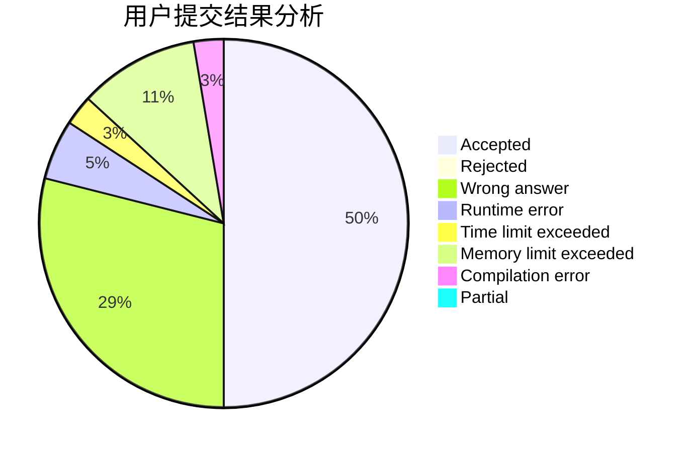
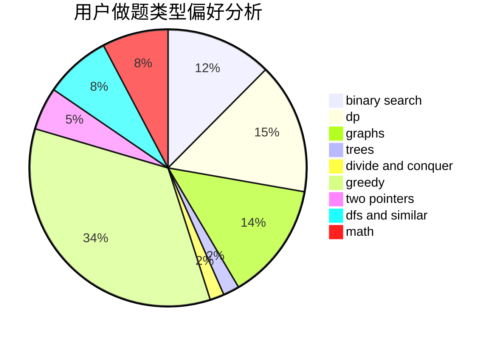

# haoyuan6118

<!-- tabs:start -->

#### **用户提交结果分析**

#### **用户做题类型偏好分析**

<!-- tabs:end -->
# 推荐题目
[1439C](https://codeforces.com/contest/1439/problem/C)
[1486E](https://codeforces.com/contest/1486/problem/E)
[1457C](https://codeforces.com/contest/1457/problem/C)
[868D](https://codeforces.com/contest/868/problem/D)
[699A](https://codeforces.com/contest/699/problem/A)
[1245C](https://codeforces.com/contest/1245/problem/C)
[479E](https://codeforces.com/contest/479/problem/E)
[220C](https://codeforces.com/contest/220/problem/C)
[16E](https://codeforces.com/contest/16/problem/E)
[23B](https://codeforces.com/contest/23/problem/B)
