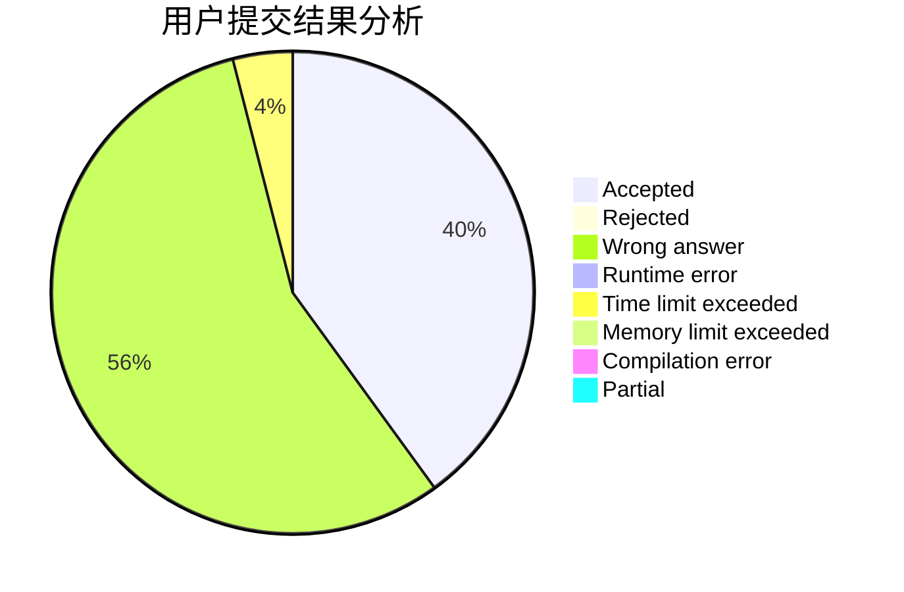
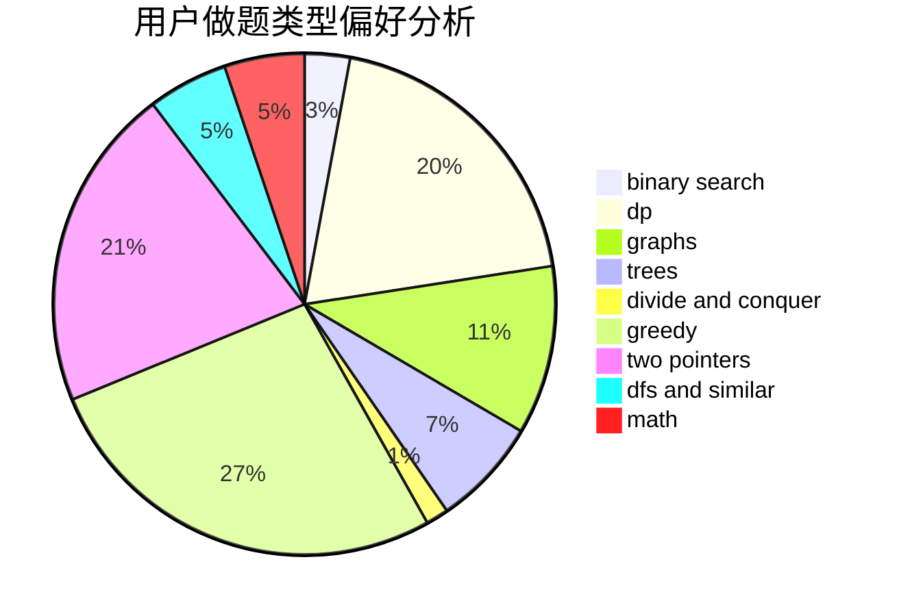

# haoyun1

<!-- tabs:start -->

#### **用户提交结果分析**

#### **用户做题类型偏好分析**

<!-- tabs:end -->
# 推荐题目
[833A](https://codeforces.com/contest/833/problem/A)
[798C](https://codeforces.com/contest/798/problem/C)
[846A](https://codeforces.com/contest/846/problem/A)
[575C](https://codeforces.com/contest/575/problem/C)
[229D](https://codeforces.com/contest/229/problem/D)
[15C](https://codeforces.com/contest/15/problem/C)
[1085A](https://codeforces.com/contest/1085/problem/A)
[1772](https://codeforces.com/contest/177/problem/2)
[810C](https://codeforces.com/contest/810/problem/C)
[6702](https://codeforces.com/contest/670/problem/2)
