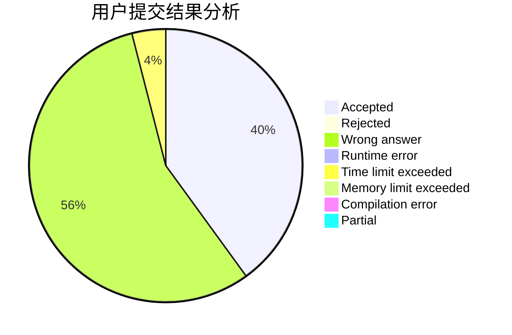
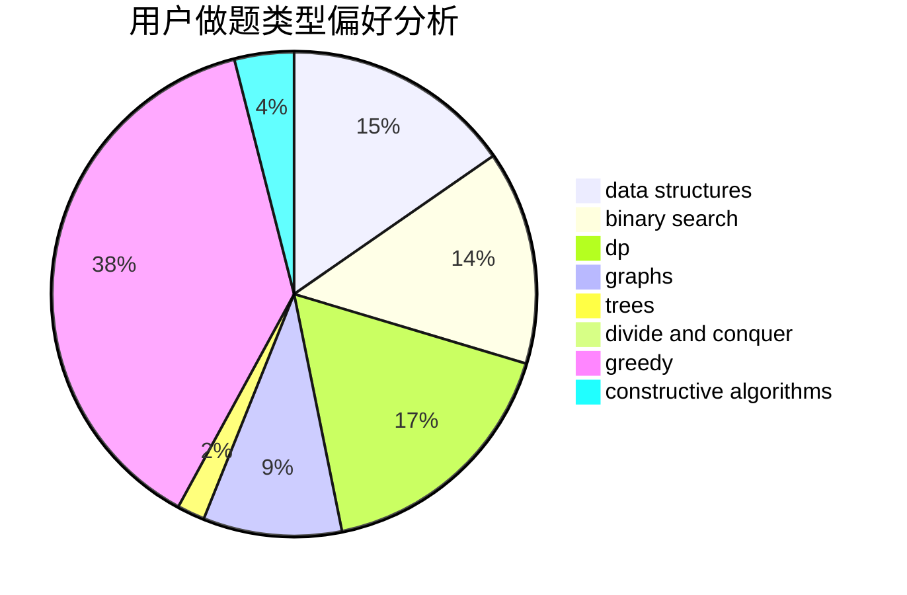
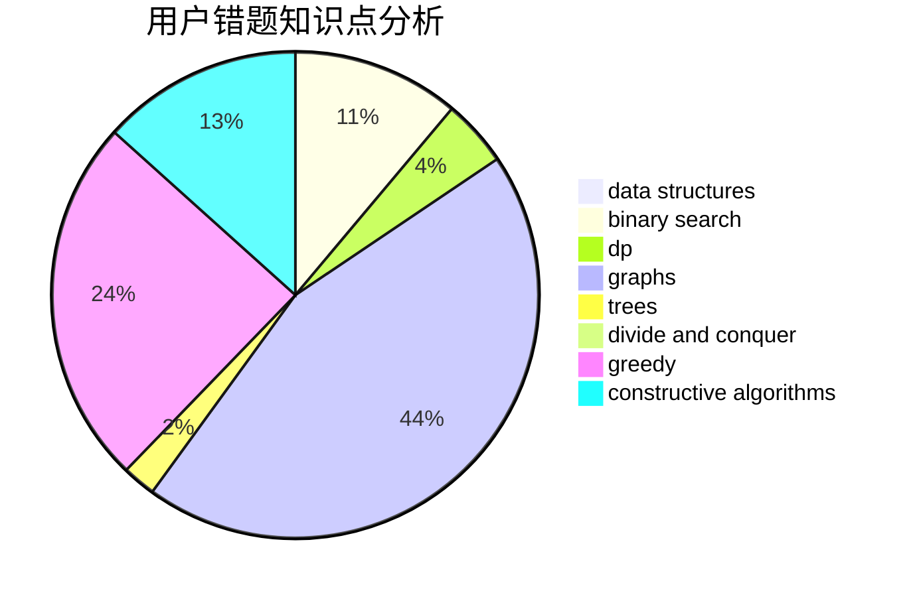

# haoyun1

<!-- tabs:start -->

#### **用户提交结果分析**

#### **用户做题类型偏好分析**

#### **用户错题知识点分析**

<!-- tabs:end -->
# 推荐题目
[814C](https://codeforces.com/contest/814/problem/C)		brute force,
                        dp,
                        strings,
                        two pointers		  
[77E](https://codeforces.com/contest/77/problem/E)		geometry		  
[827E](https://codeforces.com/contest/827/problem/E)		fft,
                        math,
                        strings		  
[550A](https://codeforces.com/contest/550/problem/A)		brute force,
                        dp,
                        greedy,
                        implementation,
                        strings		  
[205B](https://codeforces.com/contest/205/problem/B)		brute force,
                        greedy		  
[1509A](https://codeforces.com/contest/1509/problem/A)		constructive algorithms		  
[1084B](https://codeforces.com/contest/1084/problem/B)		greedy,
                        implementation		  
[156D](https://codeforces.com/contest/156/problem/D)		combinatorics,
                        graphs		  
[796B](https://codeforces.com/contest/796/problem/B)		implementation		  
[641E](https://codeforces.com/contest/641/problem/E)		data structures		  
