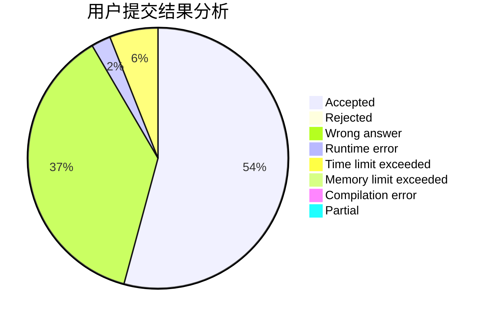
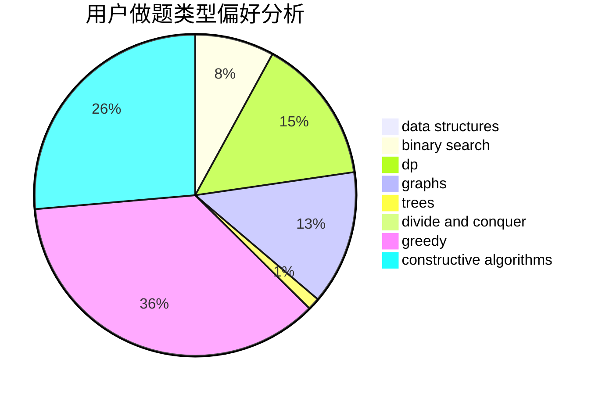
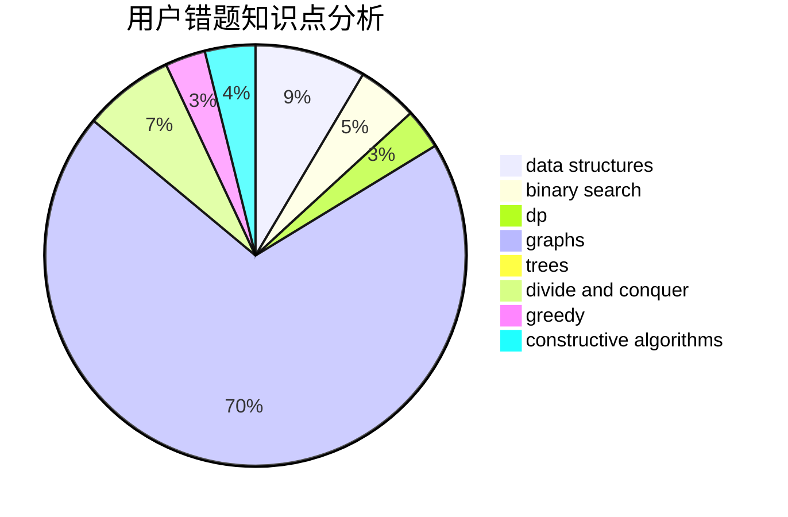

# happy_

<!-- tabs:start -->

#### **用户提交结果分析**

#### **用户做题类型偏好分析**

#### **用户错题知识点分析**

<!-- tabs:end -->
# 推荐题目
[774G](https://codeforces.com/contest/774/problem/G)		*special problem,
                        number theory		  
[380C](https://codeforces.com/contest/380/problem/C)		data structures,
                        schedules		  
[1084B](https://codeforces.com/contest/1084/problem/B)		greedy,
                        implementation		  
[1040D](https://codeforces.com/contest/1040/problem/D)		dsu,graphs,sortings,trees		  
[1071A](https://codeforces.com/contest/1071/problem/A)		dsu,graphs,sortings,trees		  
[828D](https://codeforces.com/contest/828/problem/D)		dsu,graphs,sortings,trees		  
[570B](https://codeforces.com/contest/570/problem/B)		constructive algorithms,
                        games,
                        greedy,
                        implementation,
                        math		  
[510D](https://codeforces.com/contest/510/problem/D)		bitmasks,
                        brute force,
                        dp,
                        math		  
[38G](https://codeforces.com/contest/38/problem/G)		data structures		  
[1216C](https://codeforces.com/contest/1216/problem/C)		geometry,
                        math		  
