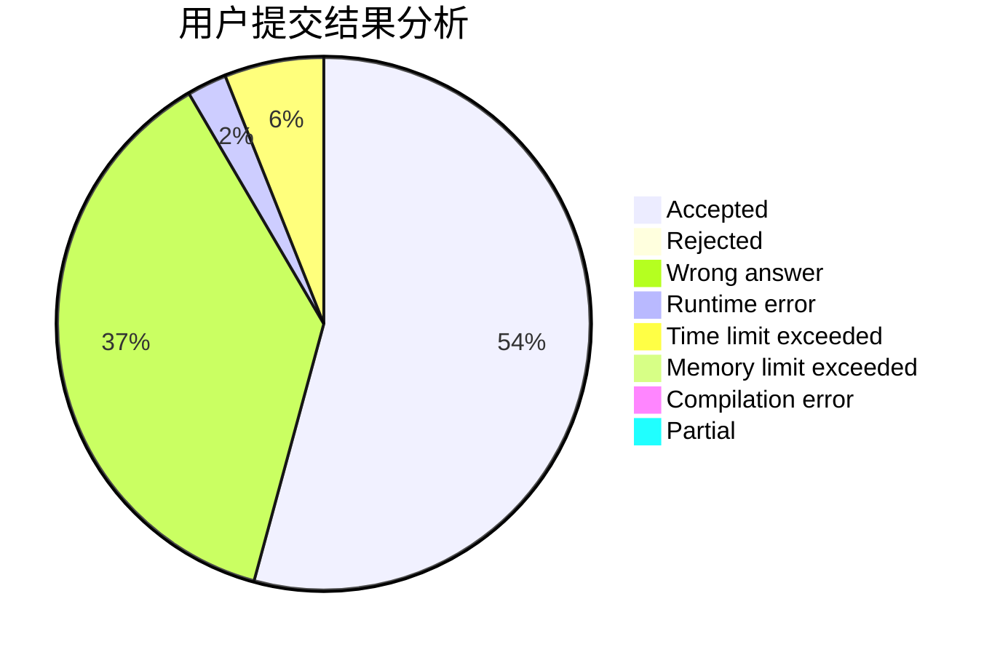
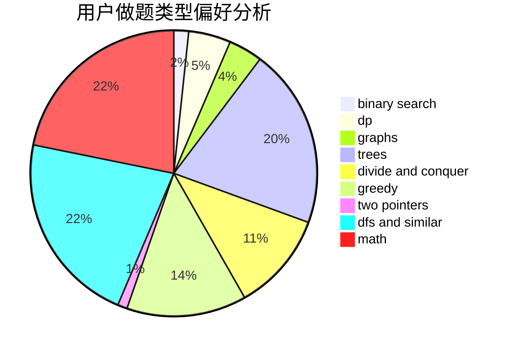

# happy_

<!-- tabs:start -->

#### **用户提交结果分析**

#### **用户做题类型偏好分析**

<!-- tabs:end -->
# 推荐题目
[793F](https://codeforces.com/contest/793/problem/F)
[411A](https://codeforces.com/contest/411/problem/A)
[1085A](https://codeforces.com/contest/1085/problem/A)
[1041C](https://codeforces.com/contest/1041/problem/C)
[1071D](https://codeforces.com/contest/1071/problem/D)
[847B](https://codeforces.com/contest/847/problem/B)
[590D](https://codeforces.com/contest/590/problem/D)
[534B](https://codeforces.com/contest/534/problem/B)
[41E](https://codeforces.com/contest/41/problem/E)
[1221G](https://codeforces.com/contest/1221/problem/G)
