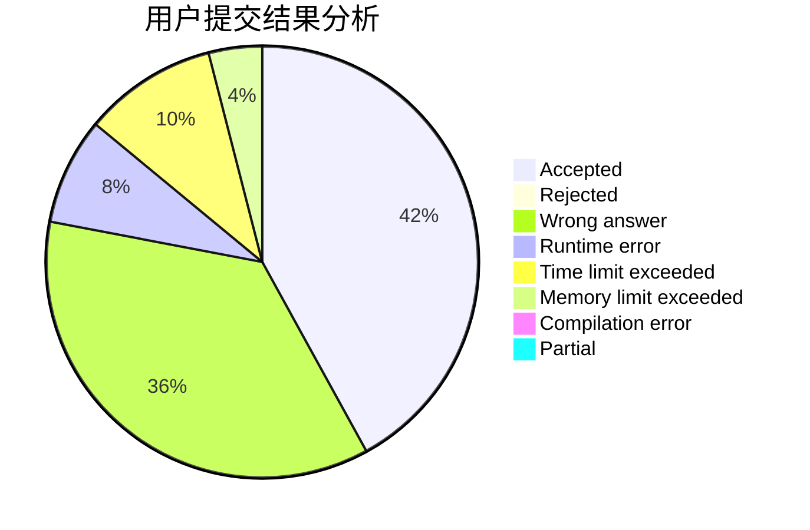
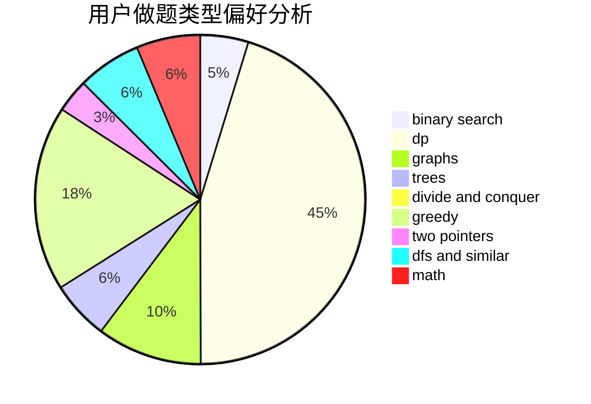

# happydef

<!-- tabs:start -->

#### **用户提交结果分析**

#### **用户做题类型偏好分析**

<!-- tabs:end -->
# 推荐题目
[788D](https://codeforces.com/contest/788/problem/D)
[870C](https://codeforces.com/contest/870/problem/C)
[285E](https://codeforces.com/contest/285/problem/E)
[1310C](https://codeforces.com/contest/1310/problem/C)
[736B](https://codeforces.com/contest/736/problem/B)
[98C](https://codeforces.com/contest/98/problem/C)
[822D](https://codeforces.com/contest/822/problem/D)
[1013A](https://codeforces.com/contest/1013/problem/A)
[725C](https://codeforces.com/contest/725/problem/C)
[837A](https://codeforces.com/contest/837/problem/A)
