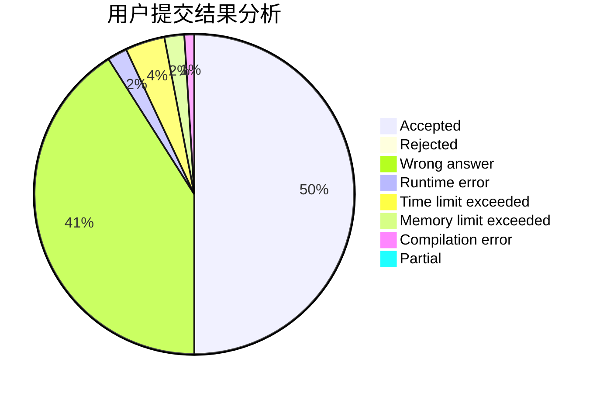
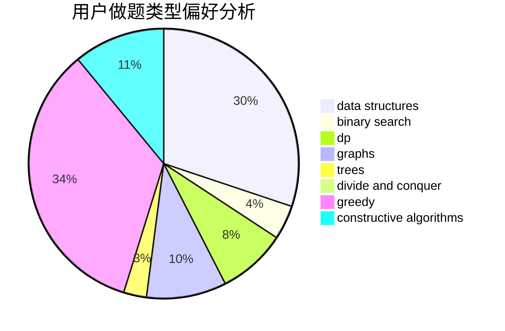

# hat

<!-- tabs:start -->

#### **用户提交结果分析**

#### **用户做题类型偏好分析**

#### **用户错题知识点分析**

<!-- tabs:end -->
# 推荐题目
[683B](https://codeforces.com/contest/683/problem/B)		*special problem		  
[869B](https://codeforces.com/contest/869/problem/B)		math		  
[1217F](https://codeforces.com/contest/1217/problem/F)		data structures,
                        divide and conquer,
                        dsu,
                        graphs,
                        trees		  
[1054G](https://codeforces.com/contest/1054/problem/G)		constructive algorithms,
                        greedy,
                        math		  
[711D](https://codeforces.com/contest/711/problem/D)		combinatorics,
                        dfs and similar,
                        graphs,
                        math		  
[13741](https://codeforces.com/contest/1374/problem/1)		dsu,graphs,sortings,trees		  
[1230E](https://codeforces.com/contest/1230/problem/E)		dsu,graphs,sortings,trees		  
[1157A](https://codeforces.com/contest/1157/problem/A)		implementation		  
[10D](https://codeforces.com/contest/10/problem/D)		dp		  
[1324B](https://codeforces.com/contest/1324/problem/B)		brute force,
                        strings		  
