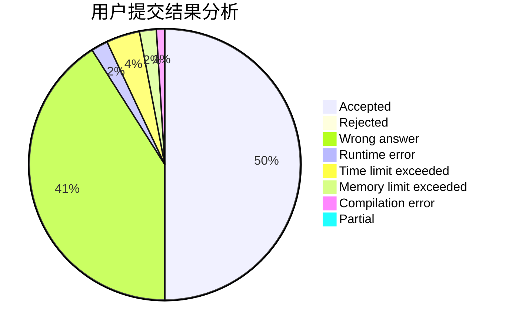
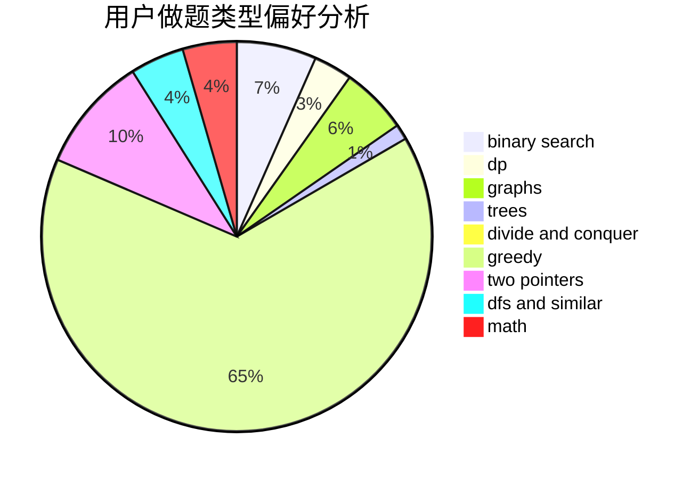

# hat

<!-- tabs:start -->

#### **用户提交结果分析**

#### **用户做题类型偏好分析**

<!-- tabs:end -->
# 推荐题目
[683B](https://codeforces.com/contest/683/problem/B)
[869B](https://codeforces.com/contest/869/problem/B)
[1217F](https://codeforces.com/contest/1217/problem/F)
[1054G](https://codeforces.com/contest/1054/problem/G)
[711D](https://codeforces.com/contest/711/problem/D)
[13741](https://codeforces.com/contest/1374/problem/1)
[1230E](https://codeforces.com/contest/1230/problem/E)
[1157A](https://codeforces.com/contest/1157/problem/A)
[10D](https://codeforces.com/contest/10/problem/D)
[1324B](https://codeforces.com/contest/1324/problem/B)
