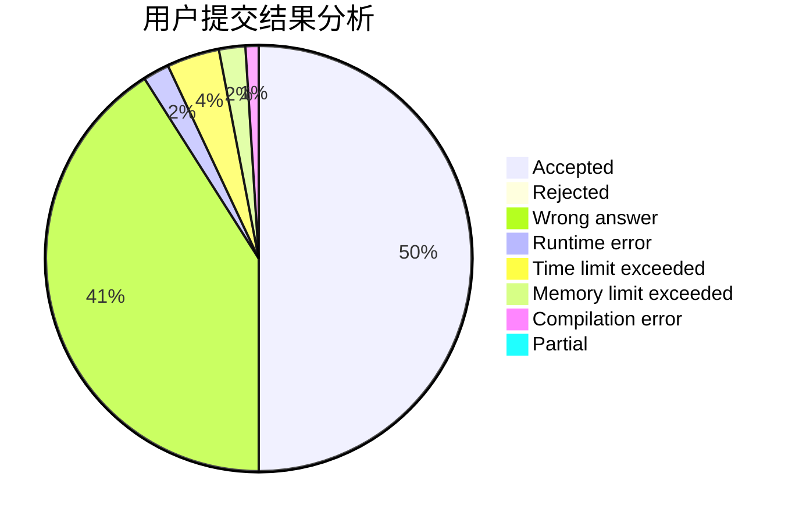
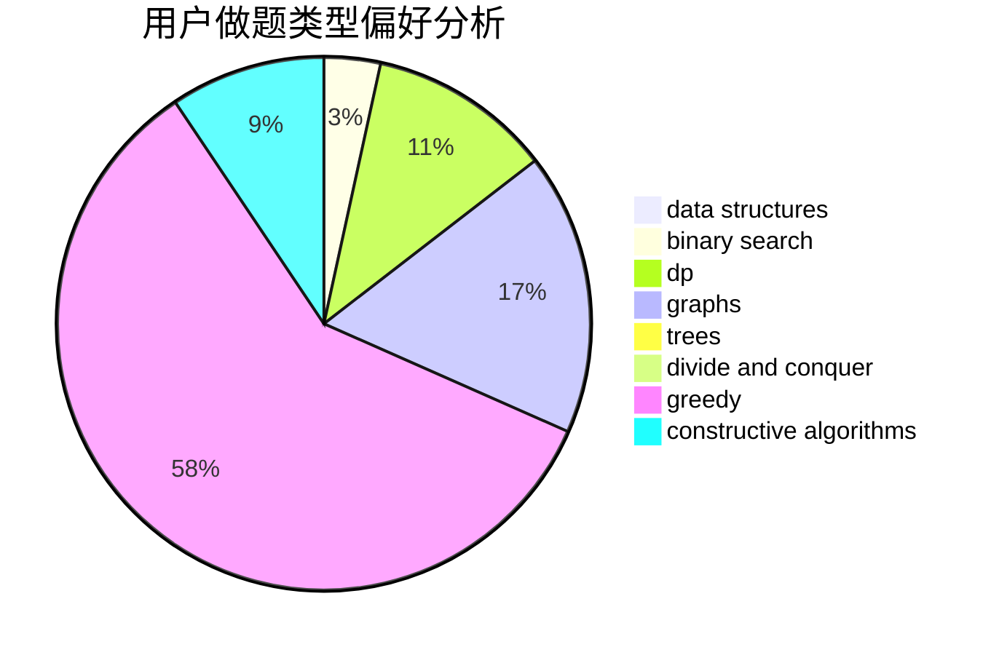

# hat

<!-- tabs:start -->

#### **用户提交结果分析**

#### **用户做题类型偏好分析**

#### **用户错题知识点分析**

<!-- tabs:end -->
# 推荐题目
[664A](https://codeforces.com/contest/664/problem/A)		math,
                        number theory		  
[850C](https://codeforces.com/contest/850/problem/C)		bitmasks,
                        dp,
                        games		  
[1213D1](https://codeforces.com/contest/1213D/problem/1)		brute force,
                        implementation		  
[1054C](https://codeforces.com/contest/1054/problem/C)		constructive algorithms,
                        implementation		  
[691F](https://codeforces.com/contest/691/problem/F)		brute force,
                        dp,
                        number theory		  
[1367B](https://codeforces.com/contest/1367/problem/B)		greedy,
                        math		  
[1223F](https://codeforces.com/contest/1223/problem/F)		data structures,
                        divide and conquer,
                        dp,
                        hashing		  
[1155C](https://codeforces.com/contest/1155/problem/C)		math,
                        number theory		  
[109B](https://codeforces.com/contest/109/problem/B)		brute force,
                        probabilities		  
[1314C](https://codeforces.com/contest/1314/problem/C)		dsu,graphs,sortings,trees		  
