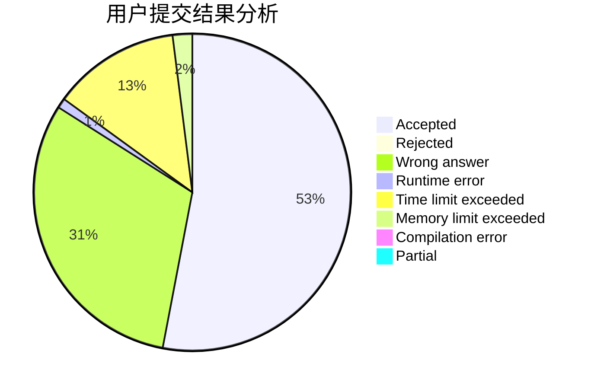
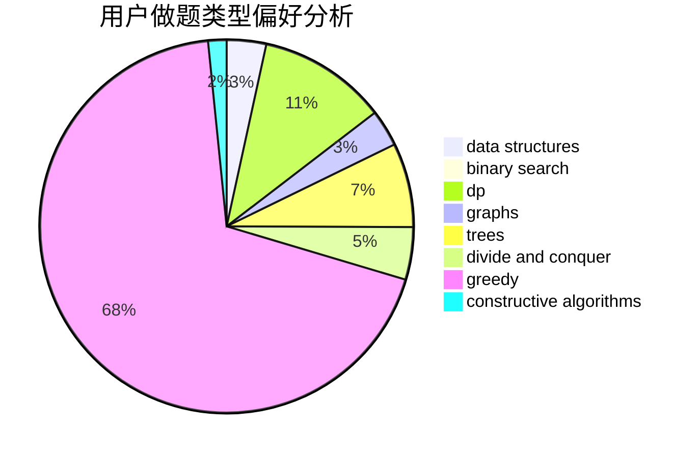

# hautzy

<!-- tabs:start -->

#### **用户提交结果分析**

#### **用户做题类型偏好分析**

#### **用户错题知识点分析**

<!-- tabs:end -->
# 推荐题目
[803C](https://codeforces.com/contest/803/problem/C)		constructive algorithms,
                        greedy,
                        math		  
[231A](https://codeforces.com/contest/231/problem/A)		brute force,
                        greedy		  
[190E](https://codeforces.com/contest/190/problem/E)		data structures,
                        dsu,
                        graphs,
                        hashing,
                        sortings		  
[918A](https://codeforces.com/contest/918/problem/A)		brute force,
                        implementation		  
[656F](https://codeforces.com/contest/656/problem/F)		*special problem		  
[614A](https://codeforces.com/contest/614/problem/A)		brute force,
                        implementation		  
[830A](https://codeforces.com/contest/830/problem/A)		binary search,
                        brute force,
                        dp,
                        greedy,
                        sortings		  
[959A](https://codeforces.com/contest/959/problem/A)		games,
                        math		  
[549F](https://codeforces.com/contest/549/problem/F)		data structures,
                        divide and conquer		  
[1195D2](https://codeforces.com/contest/1195D/problem/2)		combinatorics,
                        math,
                        number theory		  
