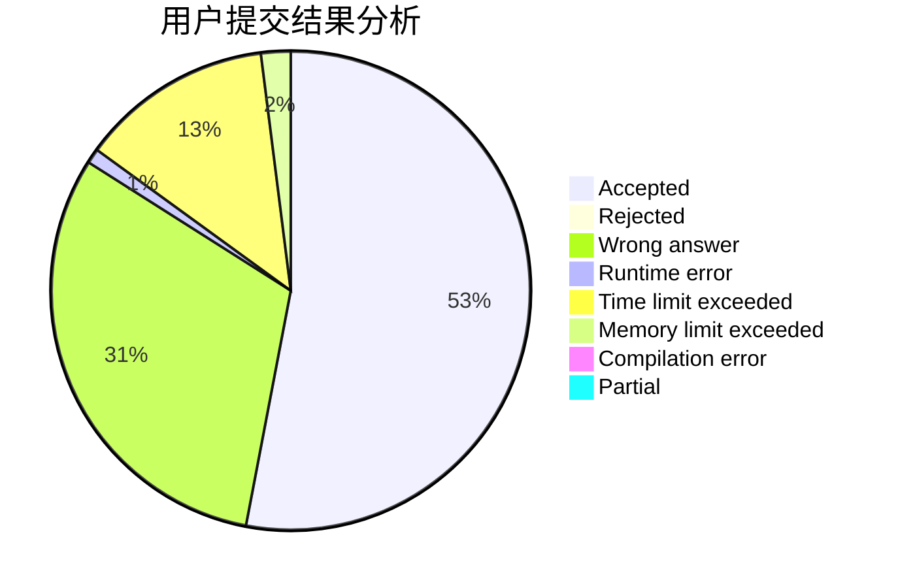
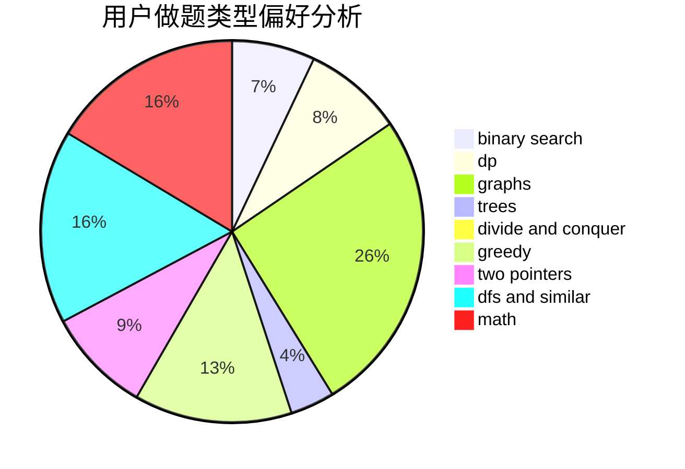

# hautzy

<!-- tabs:start -->

#### **用户提交结果分析**

#### **用户做题类型偏好分析**

<!-- tabs:end -->
# 推荐题目
[819A](https://codeforces.com/contest/819/problem/A)
[251D](https://codeforces.com/contest/251/problem/D)
[215E](https://codeforces.com/contest/215/problem/E)
[938D](https://codeforces.com/contest/938/problem/D)
[678F](https://codeforces.com/contest/678/problem/F)
[633B](https://codeforces.com/contest/633/problem/B)
[848A](https://codeforces.com/contest/848/problem/A)
[980E](https://codeforces.com/contest/980/problem/E)
[574D](https://codeforces.com/contest/574/problem/D)
[119A](https://codeforces.com/contest/119/problem/A)
