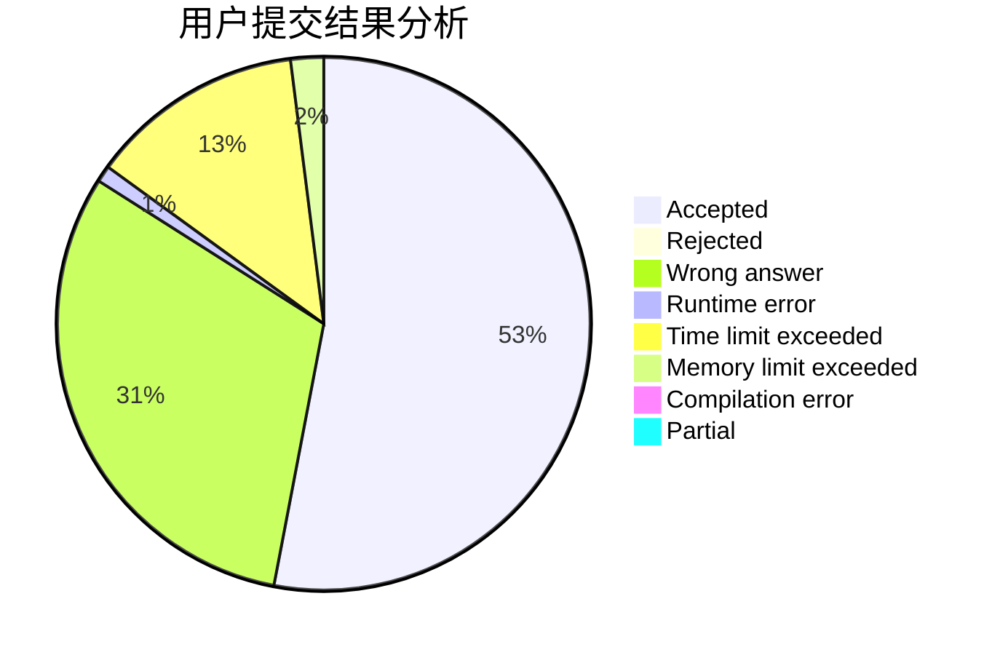
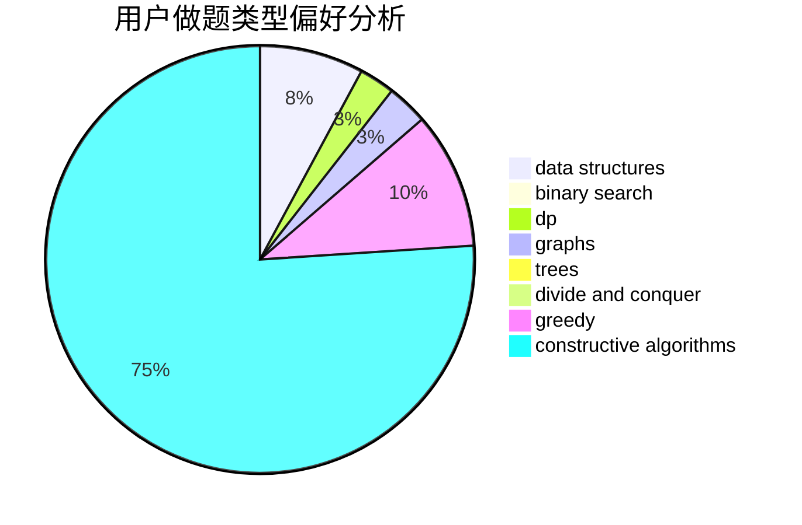

# hautzy

<!-- tabs:start -->

#### **用户提交结果分析**

#### **用户做题类型偏好分析**

#### **用户错题知识点分析**

<!-- tabs:end -->
# 推荐题目
[819A](https://codeforces.com/contest/819/problem/A)		games,
                        greedy		  
[251D](https://codeforces.com/contest/251/problem/D)		bitmasks,
                        math		  
[215E](https://codeforces.com/contest/215/problem/E)		combinatorics,
                        dp,
                        number theory		  
[938D](https://codeforces.com/contest/938/problem/D)		data structures,
                        graphs,
                        shortest paths		  
[678F](https://codeforces.com/contest/678/problem/F)		data structures,
                        divide and conquer,
                        geometry		  
[633B](https://codeforces.com/contest/633/problem/B)		brute force,
                        constructive algorithms,
                        math,
                        number theory		  
[848A](https://codeforces.com/contest/848/problem/A)		constructive algorithms		  
[980E](https://codeforces.com/contest/980/problem/E)		data structures,
                        greedy,
                        trees		  
[574D](https://codeforces.com/contest/574/problem/D)		dsu,graphs,sortings,trees		  
[119A](https://codeforces.com/contest/119/problem/A)		implementation		  
