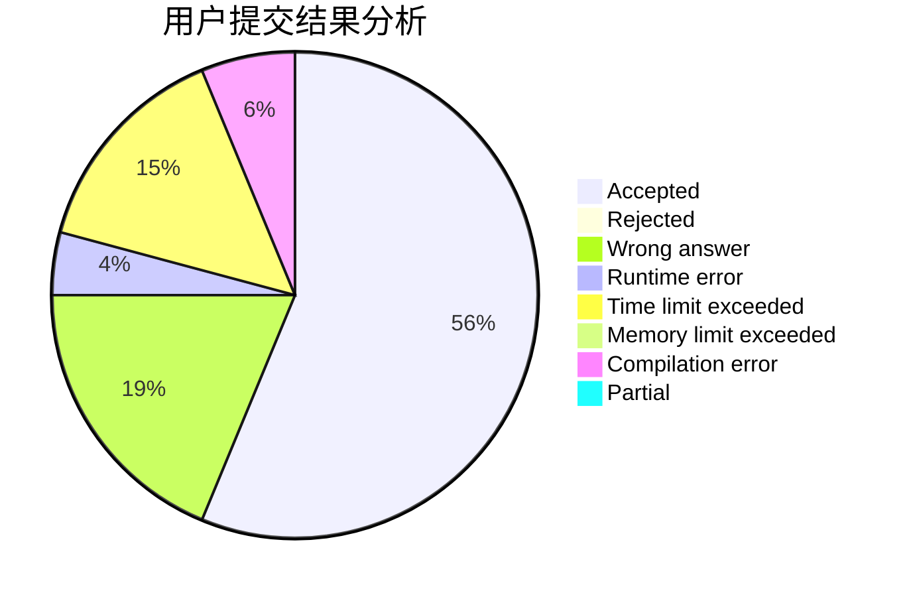
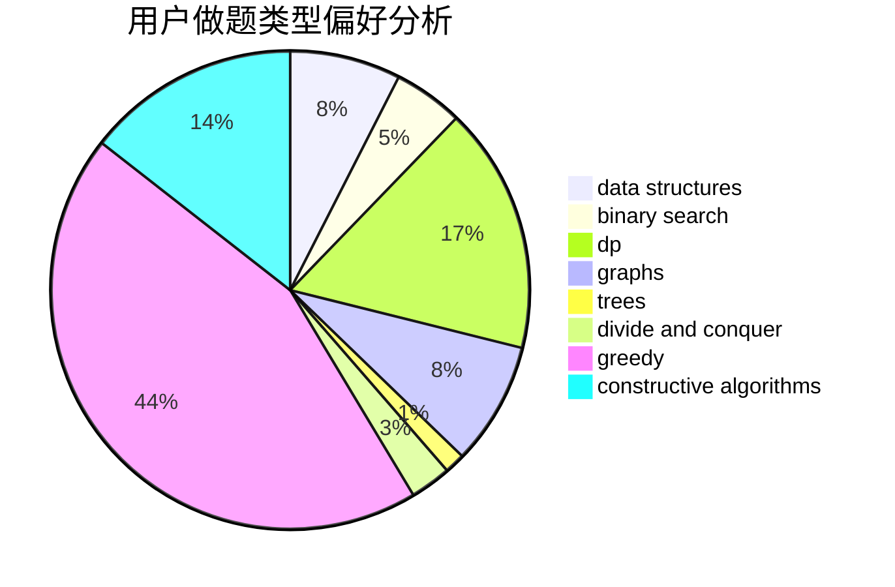
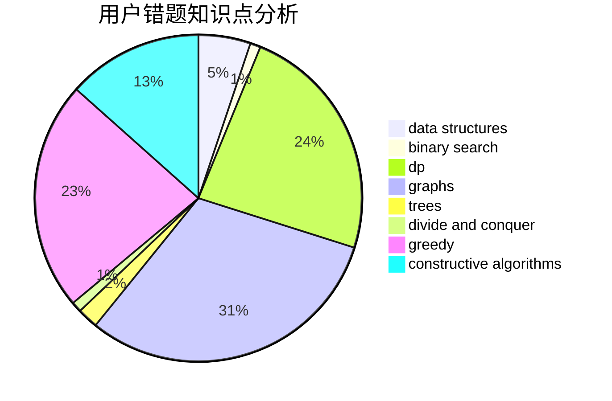

# hazy_007

<!-- tabs:start -->

#### **用户提交结果分析**

#### **用户做题类型偏好分析**

#### **用户错题知识点分析**

<!-- tabs:end -->
# 推荐题目
[1213C](https://codeforces.com/contest/1213/problem/C)		math		  
[952F](https://codeforces.com/contest/952/problem/F)		nan		  
[263A](https://codeforces.com/contest/263/problem/A)		implementation		  
[377E](https://codeforces.com/contest/377/problem/E)		dp,
                        geometry		  
[1310C](https://codeforces.com/contest/1310/problem/C)		binary search,
                        dp,
                        strings		  
[319A](https://codeforces.com/contest/319/problem/A)		combinatorics,
                        math		  
[205B](https://codeforces.com/contest/205/problem/B)		brute force,
                        greedy		  
[1007E](https://codeforces.com/contest/1007/problem/E)		dp		  
[26A](https://codeforces.com/contest/26/problem/A)		number theory		  
[737E](https://codeforces.com/contest/737/problem/E)		graph matchings,
                        graphs,
                        greedy,
                        schedules		  
