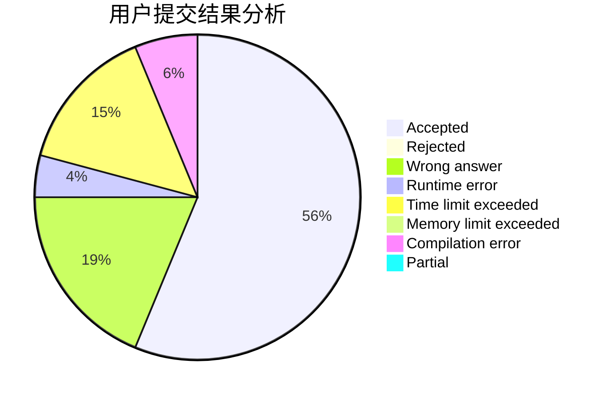
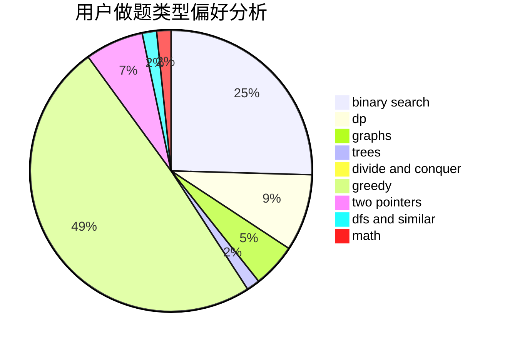

# hazy_007

<!-- tabs:start -->

#### **用户提交结果分析**

#### **用户做题类型偏好分析**

<!-- tabs:end -->
# 推荐题目
[1217E](https://codeforces.com/contest/1217/problem/E)
[975E](https://codeforces.com/contest/975/problem/E)
[27D](https://codeforces.com/contest/27/problem/D)
[407B](https://codeforces.com/contest/407/problem/B)
[1316F](https://codeforces.com/contest/1316/problem/F)
[349B](https://codeforces.com/contest/349/problem/B)
[229D](https://codeforces.com/contest/229/problem/D)
[1008C](https://codeforces.com/contest/1008/problem/C)
[286B](https://codeforces.com/contest/286/problem/B)
[759B](https://codeforces.com/contest/759/problem/B)
