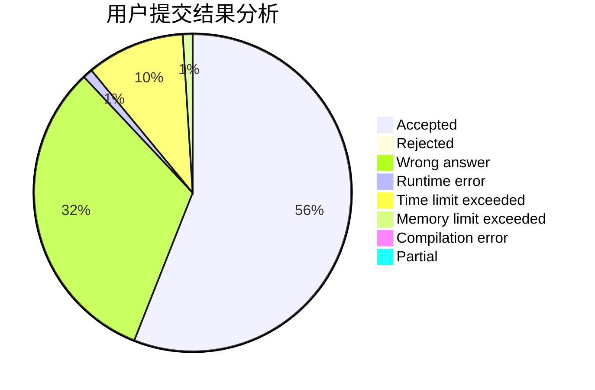
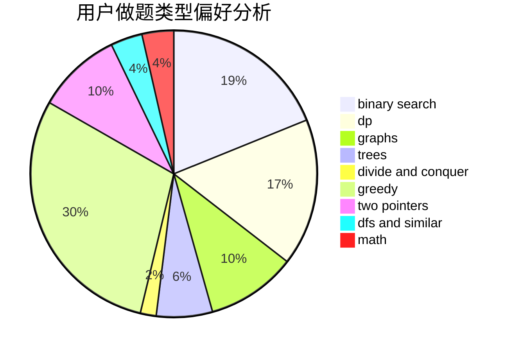

# hcmdgh

<!-- tabs:start -->

#### **用户提交结果分析**

#### **用户做题类型偏好分析**

<!-- tabs:end -->
# 推荐题目
[9E](https://codeforces.com/contest/9/problem/E)
[1399F](https://codeforces.com/contest/1399/problem/F)
[13573](https://codeforces.com/contest/1357/problem/3)
[1215B](https://codeforces.com/contest/1215/problem/B)
[758F](https://codeforces.com/contest/758/problem/F)
[666A](https://codeforces.com/contest/666/problem/A)
[774C](https://codeforces.com/contest/774/problem/C)
[875A](https://codeforces.com/contest/875/problem/A)
[1099D](https://codeforces.com/contest/1099/problem/D)
[938B](https://codeforces.com/contest/938/problem/B)
