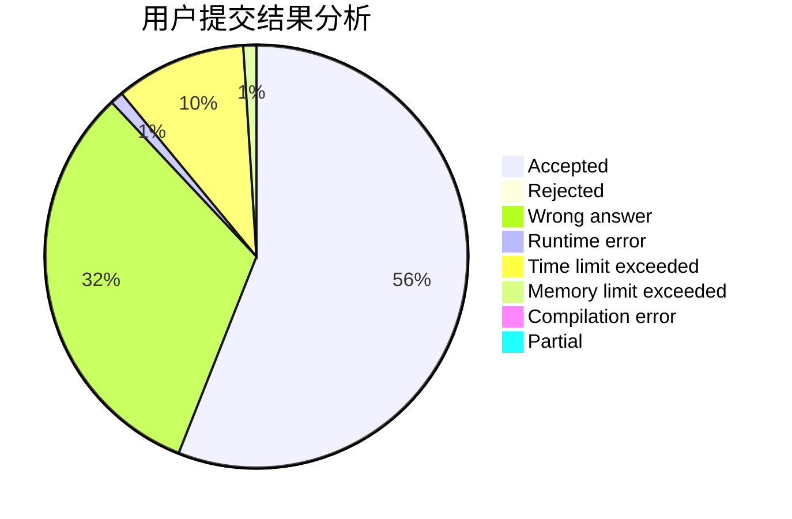
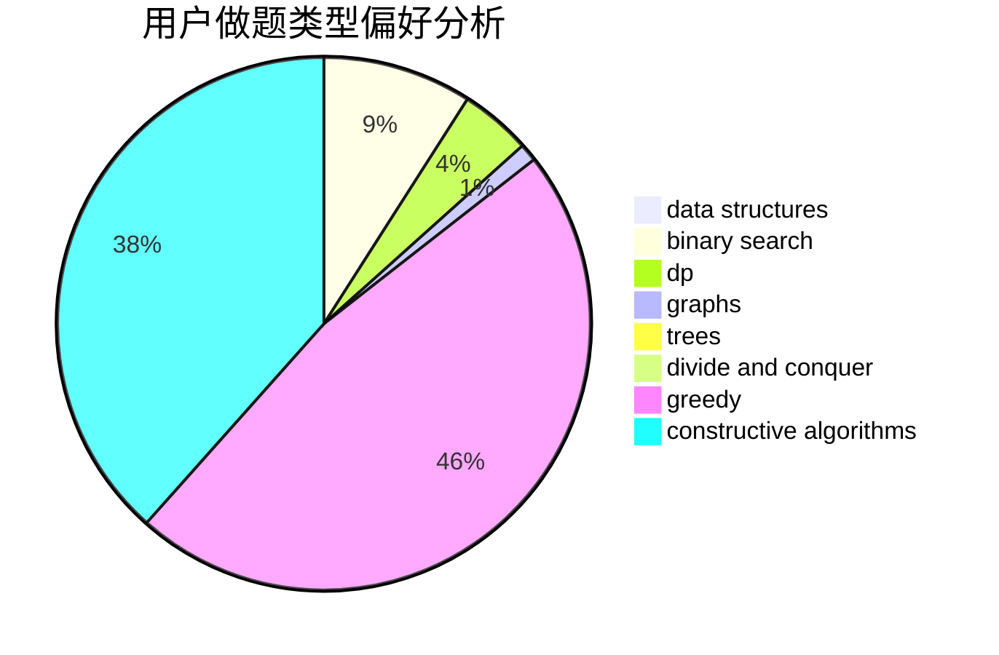
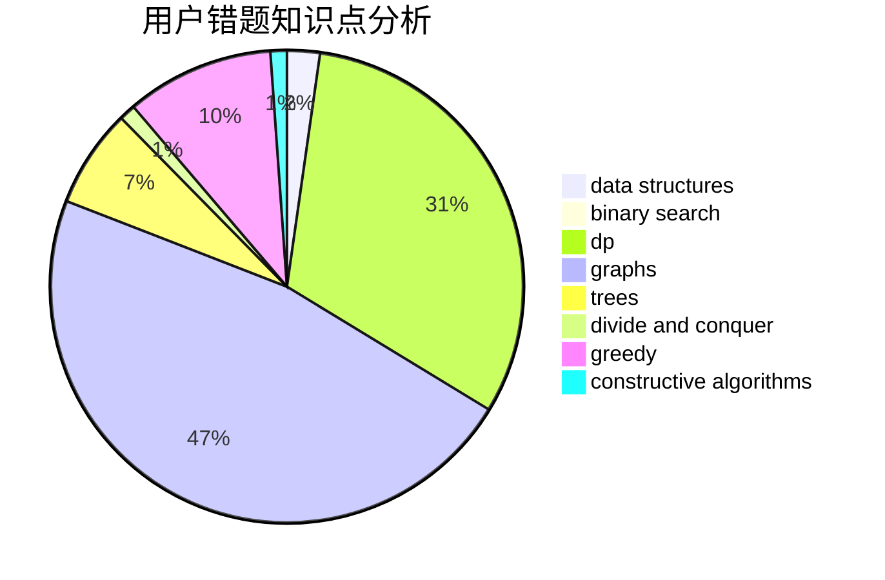

# hcmdgh

<!-- tabs:start -->

#### **用户提交结果分析**

#### **用户做题类型偏好分析**

#### **用户错题知识点分析**

<!-- tabs:end -->
# 推荐题目
[985D](https://codeforces.com/contest/985/problem/D)		binary search,
                        constructive algorithms,
                        math		  
[1391B](https://codeforces.com/contest/1391/problem/B)		brute force,
                        greedy,
                        implementation		  
[134B](https://codeforces.com/contest/134/problem/B)		brute force,
                        dfs and similar,
                        math,
                        number theory		  
[1209E2](https://codeforces.com/contest/1209E/problem/2)		bitmasks,
                        dp,
                        greedy,
                        sortings		  
[737B](https://codeforces.com/contest/737/problem/B)		dsu,graphs,sortings,trees		  
[633F](https://codeforces.com/contest/633/problem/F)		dfs and similar,
                        dp,
                        graphs,
                        trees		  
[755F](https://codeforces.com/contest/755/problem/F)		bitmasks,
                        dp,
                        greedy		  
[855F](https://codeforces.com/contest/855/problem/F)		binary search,
                        data structures		  
[1099A](https://codeforces.com/contest/1099/problem/A)		implementation		  
[917D](https://codeforces.com/contest/917/problem/D)		dp,
                        math,
                        matrices,
                        trees		  
