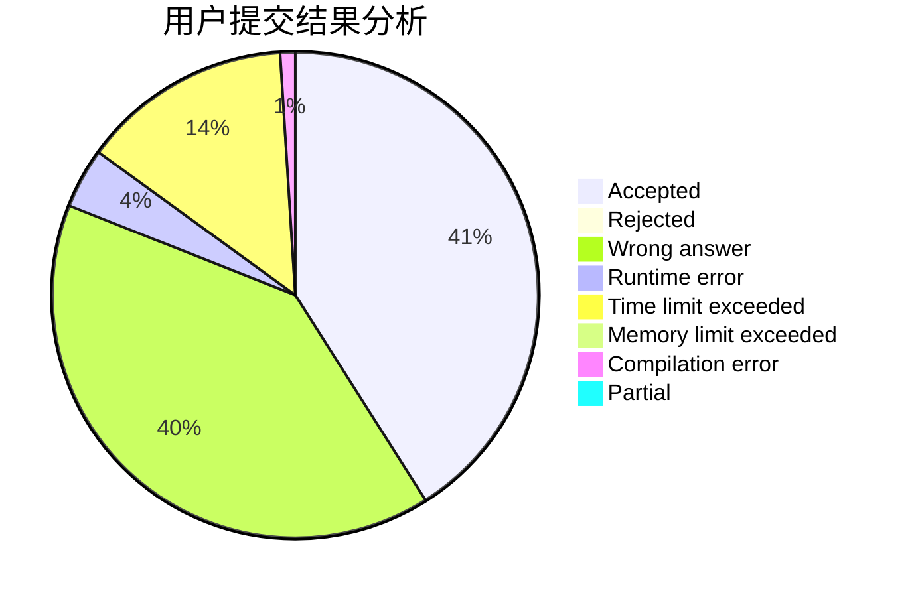
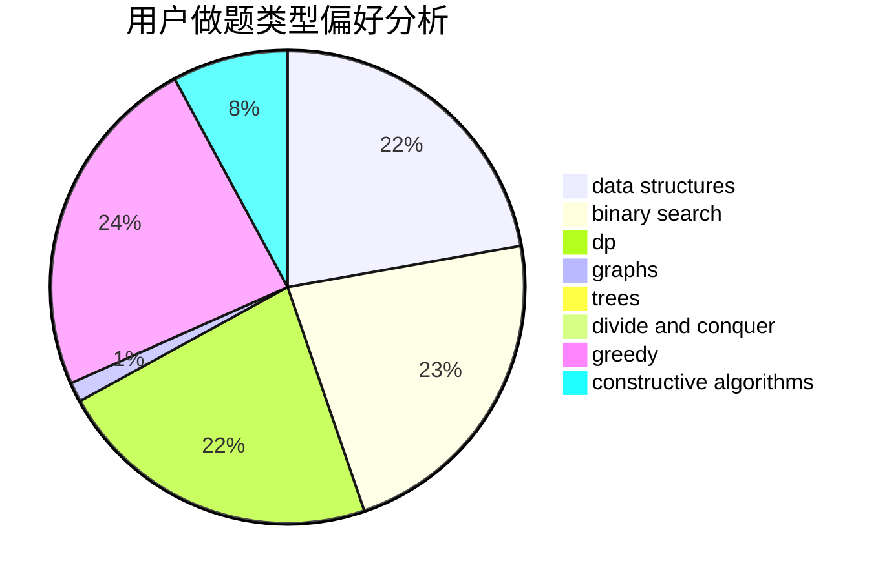
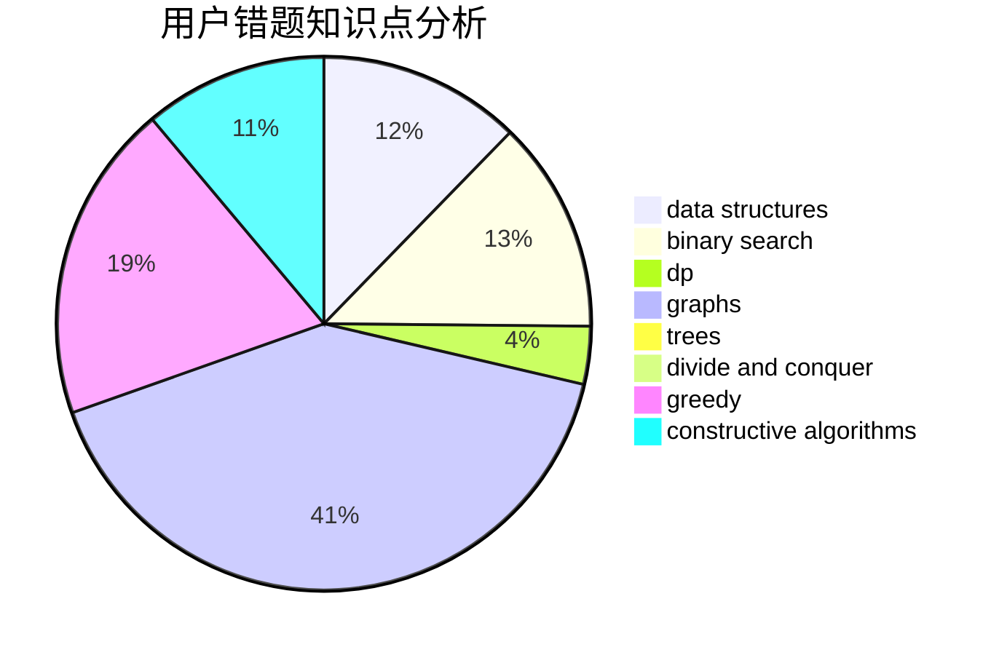

# hdgfgs

<!-- tabs:start -->

#### **用户提交结果分析**

#### **用户做题类型偏好分析**

#### **用户错题知识点分析**

<!-- tabs:end -->
# 推荐题目
[1482E](https://codeforces.com/contest/1482/problem/E)		data structures,
                        divide and conquer,
                        dp		  
[1374C](https://codeforces.com/contest/1374/problem/C)		greedy,
                        strings		  
[703C](https://codeforces.com/contest/703/problem/C)		geometry,
                        implementation		  
[764B](https://codeforces.com/contest/764/problem/B)		constructive algorithms,
                        implementation		  
[699B](https://codeforces.com/contest/699/problem/B)		implementation		  
[180D](https://codeforces.com/contest/180/problem/D)		greedy,
                        strings		  
[183D](https://codeforces.com/contest/183/problem/D)		dp,
                        greedy,
                        probabilities		  
[870A](https://codeforces.com/contest/870/problem/A)		brute force,
                        implementation		  
[1145B](https://codeforces.com/contest/1145/problem/B)		brute force		  
[825C](https://codeforces.com/contest/825/problem/C)		greedy,
                        implementation		  
