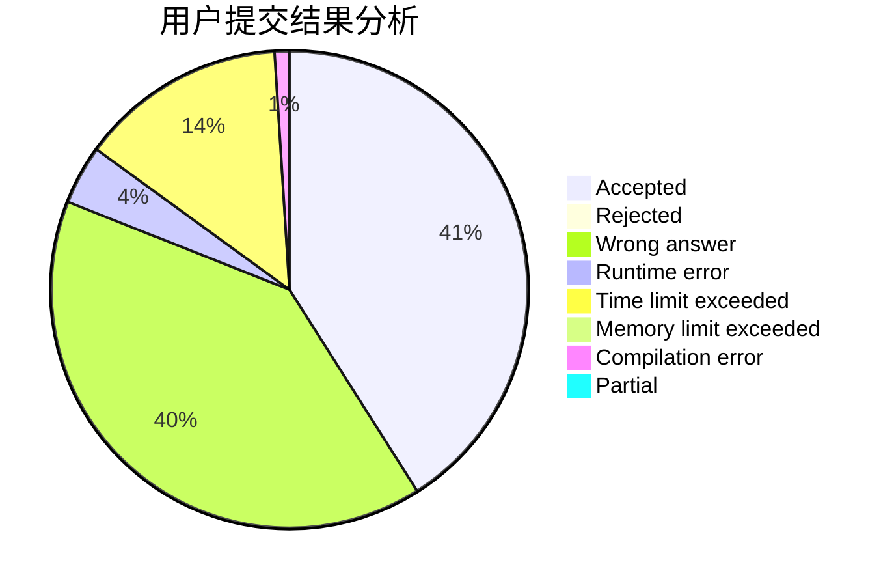
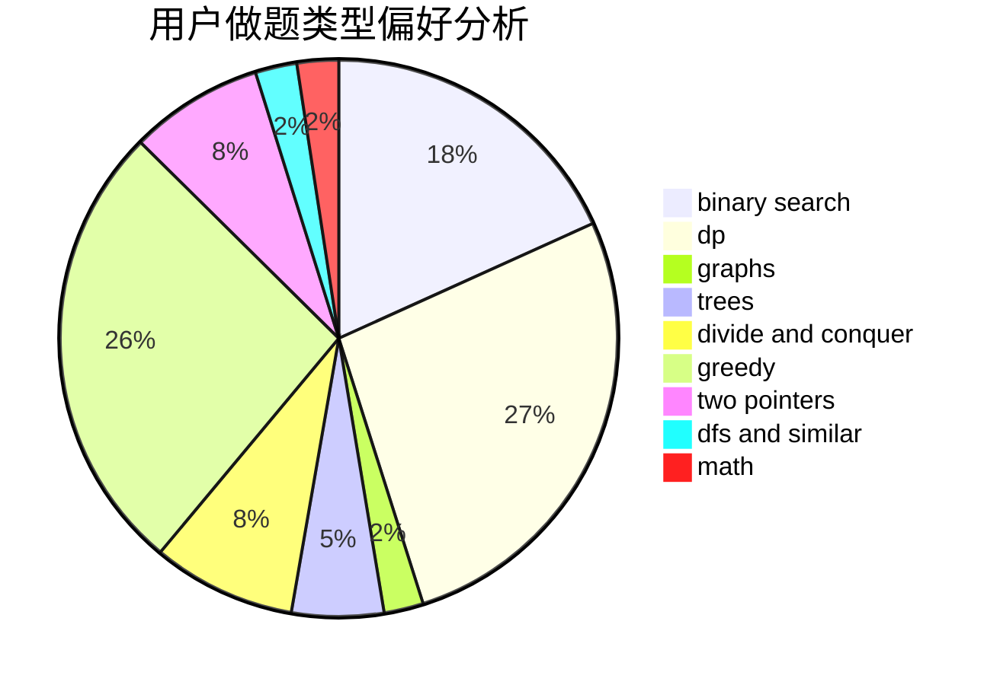

# hdgfgs

<!-- tabs:start -->

#### **用户提交结果分析**

#### **用户做题类型偏好分析**

<!-- tabs:end -->
# 推荐题目
[1490C](https://codeforces.com/contest/1490/problem/C)
[1383B](https://codeforces.com/contest/1383/problem/B)
[722D](https://codeforces.com/contest/722/problem/D)
[782E](https://codeforces.com/contest/782/problem/E)
[716A](https://codeforces.com/contest/716/problem/A)
[208A](https://codeforces.com/contest/208/problem/A)
[20A](https://codeforces.com/contest/20/problem/A)
[890B](https://codeforces.com/contest/890/problem/B)
[1147C](https://codeforces.com/contest/1147/problem/C)
[843D](https://codeforces.com/contest/843/problem/D)
