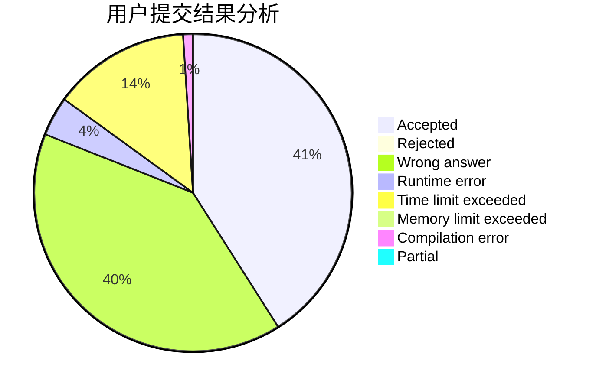
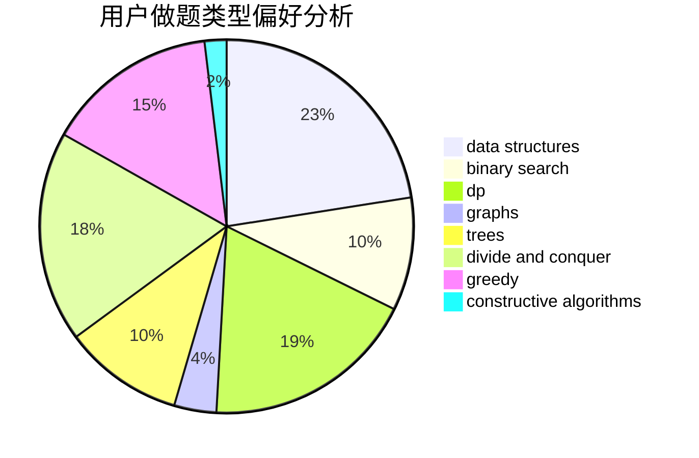
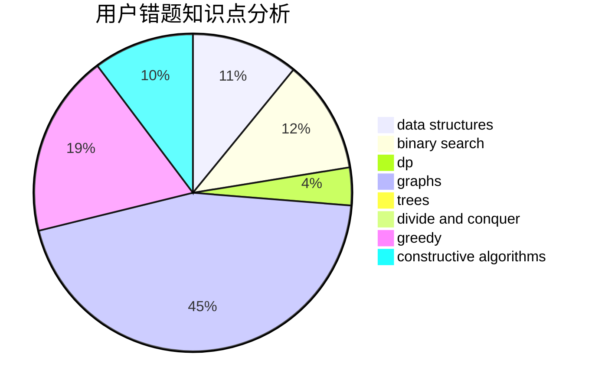

# hdgfgs

<!-- tabs:start -->

#### **用户提交结果分析**

#### **用户做题类型偏好分析**

#### **用户错题知识点分析**

<!-- tabs:end -->
# 推荐题目
[1490C](https://codeforces.com/contest/1490/problem/C)		binary search,
                        brute force,
                        brute force,
                        math		  
[1383B](https://codeforces.com/contest/1383/problem/B)		bitmasks,
                        constructive algorithms,
                        dp,
                        games,
                        greedy,
                        math		  
[722D](https://codeforces.com/contest/722/problem/D)		binary search,
                        data structures,
                        dfs and similar,
                        greedy,
                        strings,
                        trees		  
[782E](https://codeforces.com/contest/782/problem/E)		dsu,graphs,sortings,trees		  
[716A](https://codeforces.com/contest/716/problem/A)		implementation		  
[208A](https://codeforces.com/contest/208/problem/A)		strings		  
[20A](https://codeforces.com/contest/20/problem/A)		implementation		  
[890B](https://codeforces.com/contest/890/problem/B)		dsu,graphs,sortings,trees		  
[1147C](https://codeforces.com/contest/1147/problem/C)		games		  
[843D](https://codeforces.com/contest/843/problem/D)		graphs,
                        shortest paths		  
