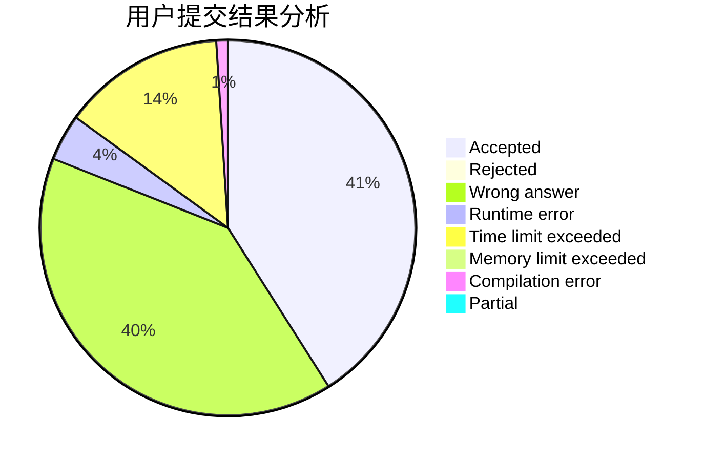
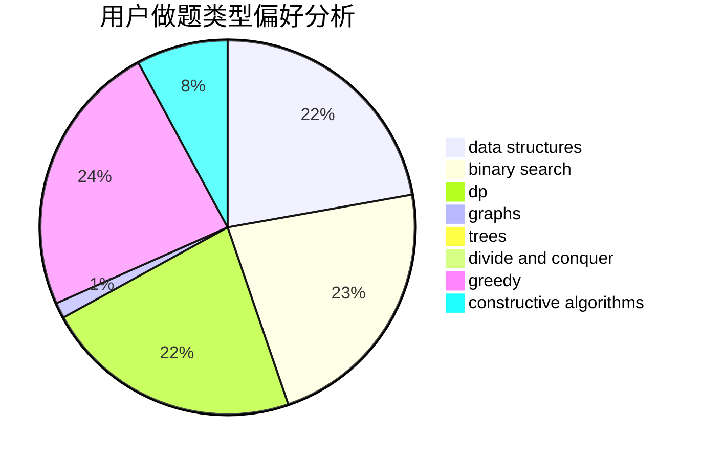
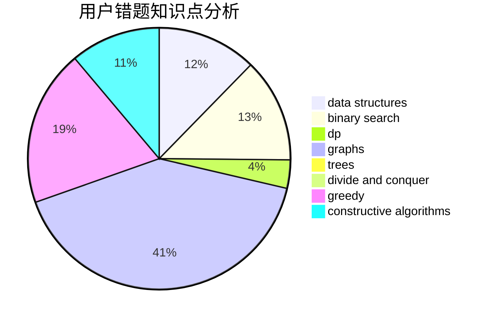

# hdgfgs
<!-- tabs:start -->
#### **用户提交结果分析**

#### **用户做题类型偏好分析**

#### **用户错题知识点分析**

<!-- tabs:end -->
# 推荐题目
[Move Brackets](http://codeforces.com/problemset/problem/1374/C)		greedy,
                        strings		  
[Skyline Photo](http://codeforces.com/problemset/problem/1482/E)		data structures,
                        divide and conquer,
                        dp		  
[Chris and Road](http://codeforces.com/problemset/problem/703/C)		geometry,
                        implementation		  
[Timofey and cubes](http://codeforces.com/problemset/problem/764/B)		constructive algorithms,
                        implementation		  
[One Bomb](http://codeforces.com/problemset/problem/699/B)		implementation		  
[T-shirt](http://codeforces.com/problemset/problem/183/D)		dp,
                        greedy,
                        probabilities		  
[Uncle Bogdan and Projections](http://codeforces.com/problemset/problem/1388/E)		data structures,
                        geometry,
                        sortings		  
[Satellites](http://codeforces.com/problemset/problem/856/E)		nan		  
[The Child and Binary Tree](http://codeforces.com/problemset/problem/438/E)		combinatorics,
                        divide and conquer,
                        fft,
                        number theory		  
[Stadium and Games](http://codeforces.com/problemset/problem/325/B)		binary search,
                        math		  
<!-- tabs:start -->
#### **data structures**
[Move Brackets](http://codeforces.com/problemset/problem/1482/E)		data structures,
                        divide and conquer,
                        dp		  
[Skyline Photo](http://codeforces.com/problemset/problem/1388/E)		data structures,
                        geometry,
                        sortings		  
[Chris and Road](http://codeforces.com/problemset/problem/607/D)		data structures,
                        trees		  
[Timofey and cubes](http://codeforces.com/problemset/problem/1195/E)		data structures,
                        two pointers		  
[One Bomb](http://codeforces.com/problemset/problem/1416/E)		binary search,
                        data structures,
                        dp,
                        greedy		  
[T-shirt](http://codeforces.com/problemset/problem/19/D)		data structures		  
[Uncle Bogdan and Projections](http://codeforces.com/problemset/problem/348/C)		brute force,
                        data structures		  
[Satellites](http://codeforces.com/problemset/problem/1492/C)		binary search,
                        data structures,
                        dp,
                        greedy,
                        two pointers		  
[The Child and Binary Tree](http://codeforces.com/problemset/problem/1490/G)		binary search,
                        data structures,
                        math		  
[Stadium and Games](http://codeforces.com/problemset/problem/1479/D)		binary search,
                        bitmasks,
                        brute force,
                        data structures,
                        probabilities,
                        trees		  
#### **binary search**
[Move Brackets](http://codeforces.com/problemset/problem/325/B)		binary search,
                        math		  
[Skyline Photo](http://codeforces.com/problemset/problem/772/A)		binary search,
                        math		  
[Chris and Road](http://codeforces.com/problemset/problem/653/D)		binary search,
                        flows,
                        graphs		  
[Timofey and cubes](http://codeforces.com/problemset/problem/1129/E)		binary search,
                        interactive,
                        trees		  
[One Bomb](http://codeforces.com/problemset/problem/1416/E)		binary search,
                        data structures,
                        dp,
                        greedy		  
[T-shirt](http://codeforces.com/problemset/problem/1492/C)		binary search,
                        data structures,
                        dp,
                        greedy,
                        two pointers		  
[Uncle Bogdan and Projections](http://codeforces.com/problemset/problem/1463/D)		binary search,
                        constructive algorithms,
                        greedy,
                        two pointers		  
[Satellites](http://codeforces.com/problemset/problem/1490/G)		binary search,
                        data structures,
                        math		  
[The Child and Binary Tree](http://codeforces.com/problemset/problem/1479/D)		binary search,
                        bitmasks,
                        brute force,
                        data structures,
                        probabilities,
                        trees		  
[Stadium and Games](http://codeforces.com/problemset/problem/1436/E)		binary search,
                        data structures,
                        two pointers		  
#### **dp**
[Move Brackets](http://codeforces.com/problemset/problem/1482/E)		data structures,
                        divide and conquer,
                        dp		  
[Skyline Photo](http://codeforces.com/problemset/problem/183/D)		dp,
                        greedy,
                        probabilities		  
[Chris and Road](http://codeforces.com/problemset/problem/758/E)		dfs and similar,
                        dp,
                        graphs,
                        greedy,
                        trees		  
[Timofey and cubes](http://codeforces.com/problemset/problem/1279/E)		combinatorics,
                        dp		  
[One Bomb](https://codeforces.com/contest/1345/problem/E)		dfs and similar,
                        dp,
                        graphs,
                        math		  
[T-shirt](http://codeforces.com/problemset/problem/1416/E)		binary search,
                        data structures,
                        dp,
                        greedy		  
[Uncle Bogdan and Projections](http://codeforces.com/problemset/problem/1119/E)		brute force,
                        dp,
                        fft,
                        greedy,
                        ternary search		  
[Satellites](http://codeforces.com/problemset/problem/1422/C)		combinatorics,
                        dp,
                        math		  
[The Child and Binary Tree](http://codeforces.com/problemset/problem/1492/C)		binary search,
                        data structures,
                        dp,
                        greedy,
                        two pointers		  
[Stadium and Games](https://codeforces.com/contest/1457/problem/C)		brute force,
                        dp,
                        implementation		  
#### **graph**
[Move Brackets](http://codeforces.com/problemset/problem/758/E)		dfs and similar,
                        dp,
                        graphs,
                        greedy,
                        trees		  
[Skyline Photo](https://codeforces.com/contest/1345/problem/E)		dfs and similar,
                        dp,
                        graphs,
                        math		  
[Chris and Road](http://codeforces.com/problemset/problem/653/D)		binary search,
                        flows,
                        graphs		  
[Timofey and cubes](http://codeforces.com/problemset/problem/243/B)		graphs,
                        sortings		  
[One Bomb](http://codeforces.com/problemset/problem/1009/G)		bitmasks,
                        flows,
                        graph matchings,
                        graphs,
                        greedy		  
[T-shirt](http://codeforces.com/problemset/problem/1020/B)		brute force,
                        dfs and similar,
                        graphs		  
[Uncle Bogdan and Projections](http://codeforces.com/problemset/problem/1495/D)		combinatorics,
                        dfs and similar,
                        graphs,
                        math,
                        shortest paths,
                        trees		  
[Satellites](http://codeforces.com/problemset/problem/1487/C)		brute force,
                        constructive algorithms,
                        dfs and similar,
                        graphs,
                        greedy,
                        implementation,
                        math		  
[The Child and Binary Tree](http://codeforces.com/problemset/problem/1437/C)		dp,
                        flows,
                        graph matchings,
                        greedy,
                        math,
                        sortings		  
[Stadium and Games](http://codeforces.com/problemset/problem/1470/D)		constructive algorithms,
                        dfs and similar,
                        graph matchings,
                        graphs,
                        greedy		  
#### **trees**
[Move Brackets](http://codeforces.com/problemset/problem/758/E)		dfs and similar,
                        dp,
                        graphs,
                        greedy,
                        trees		  
[Skyline Photo](http://codeforces.com/problemset/problem/607/D)		data structures,
                        trees		  
[Chris and Road](http://codeforces.com/problemset/problem/1129/E)		binary search,
                        interactive,
                        trees		  
[Timofey and cubes](http://codeforces.com/problemset/problem/1495/D)		combinatorics,
                        dfs and similar,
                        graphs,
                        math,
                        shortest paths,
                        trees		  
[One Bomb](http://codeforces.com/problemset/problem/1479/D)		binary search,
                        bitmasks,
                        brute force,
                        data structures,
                        probabilities,
                        trees		  
[T-shirt](http://codeforces.com/problemset/problem/1511/C)		brute force,
                        data structures,
                        implementation,
                        trees		  
[Uncle Bogdan and Projections](http://codeforces.com/problemset/problem/1499/F)		combinatorics,
                        dfs and similar,
                        dp,
                        trees		  
[Satellites](http://codeforces.com/problemset/problem/1491/E)		brute force,
                        dfs and similar,
                        divide and conquer,
                        number theory,
                        trees		  
[The Child and Binary Tree](http://codeforces.com/problemset/problem/1466/D)		data structures,
                        greedy,
                        sortings,
                        trees		  
[Stadium and Games](http://codeforces.com/problemset/problem/1495/D)		combinatorics,
                        dfs and similar,
                        graphs,
                        math,
                        shortest paths,
                        trees		  
#### **divide and conquer**
[Move Brackets](http://codeforces.com/problemset/problem/1482/E)		data structures,
                        divide and conquer,
                        dp		  
[Skyline Photo](http://codeforces.com/problemset/problem/438/E)		combinatorics,
                        divide and conquer,
                        fft,
                        number theory		  
[Chris and Road](http://codeforces.com/problemset/problem/1461/D)		binary search,
                        brute force,
                        data structures,
                        divide and conquer,
                        implementation,
                        sortings		  
[Timofey and cubes](http://codeforces.com/problemset/problem/1466/G)		combinatorics,
                        divide and conquer,
                        hashing,
                        math,
                        string suffix structures,
                        strings		  
[One Bomb](http://codeforces.com/problemset/problem/1490/D)		dfs and similar,
                        divide and conquer,
                        implementation		  
[T-shirt](https://codeforces.com/contest/1483/problem/C)		data structures,
                        divide and conquer,
                        dp		  
[Uncle Bogdan and Projections](http://codeforces.com/problemset/problem/1491/E)		brute force,
                        dfs and similar,
                        divide and conquer,
                        number theory,
                        trees		  
[Satellites](http://codeforces.com/problemset/problem/1303/G)		data structures,
                        divide and conquer,
                        geometry,
                        trees		  
[The Child and Binary Tree](http://codeforces.com/problemset/problem/1494/D)		constructive algorithms,
                        data structures,
                        dfs and similar,
                        divide and conquer,
                        dsu,
                        greedy,
                        sortings,
                        trees		  
[Stadium and Games](http://codeforces.com/problemset/problem/1482/E)		data structures,
                        divide and conquer,
                        dp		  
#### **greedy**
[Move Brackets](http://codeforces.com/problemset/problem/1374/C)		greedy,
                        strings		  
[Skyline Photo](http://codeforces.com/problemset/problem/183/D)		dp,
                        greedy,
                        probabilities		  
[Chris and Road](http://codeforces.com/problemset/problem/758/E)		dfs and similar,
                        dp,
                        graphs,
                        greedy,
                        trees		  
[Timofey and cubes](http://codeforces.com/problemset/problem/319/D)		greedy,
                        hashing,
                        string suffix structures,
                        strings		  
[One Bomb](http://codeforces.com/problemset/problem/1077/E)		greedy,
                        sortings		  
[T-shirt](http://codeforces.com/problemset/problem/853/A)		greedy		  
[Uncle Bogdan and Projections](http://codeforces.com/problemset/problem/180/D)		greedy,
                        strings		  
[Satellites](http://codeforces.com/problemset/problem/1251/C)		greedy,
                        two pointers		  
[The Child and Binary Tree](http://codeforces.com/problemset/problem/1406/A)		greedy,
                        implementation,
                        math		  
[Stadium and Games](http://codeforces.com/problemset/problem/1312/C)		bitmasks,
                        greedy,
                        implementation,
                        math,
                        number theory,
                        ternary search		  
#### **constructive algorithms**
[Move Brackets](http://codeforces.com/problemset/problem/764/B)		constructive algorithms,
                        implementation		  
[Skyline Photo](http://codeforces.com/problemset/problem/341/E)		constructive algorithms,
                        greedy		  
[Chris and Road](http://codeforces.com/problemset/problem/1455/B)		constructive algorithms,
                        math		  
[Timofey and cubes](http://codeforces.com/problemset/problem/1327/C)		constructive algorithms,
                        implementation		  
[One Bomb](http://codeforces.com/problemset/problem/1493/A)		constructive algorithms,
                        greedy		  
[T-shirt](http://codeforces.com/problemset/problem/1463/D)		binary search,
                        constructive algorithms,
                        greedy,
                        two pointers		  
[Uncle Bogdan and Projections](https://codeforces.com/contest/1456/problem/B)		bitmasks,
                        brute force,
                        constructive algorithms		  
[Satellites](http://codeforces.com/problemset/problem/1492/D)		bitmasks,
                        constructive algorithms,
                        greedy,
                        math		  
[The Child and Binary Tree](https://codeforces.com/contest/1504/problem/D)		constructive algorithms,
                        games,
                        interactive		  
[Stadium and Games](https://codeforces.com/contest/1483/problem/A)		brute force,
                        constructive algorithms,
                        greedy,
                        implementation		  
#### **sortings**
[Move Brackets](http://codeforces.com/problemset/problem/1388/E)		data structures,
                        geometry,
                        sortings		  
[Skyline Photo](http://codeforces.com/problemset/problem/1077/E)		greedy,
                        sortings		  
[Chris and Road](http://codeforces.com/problemset/problem/243/B)		graphs,
                        sortings		  
[Timofey and cubes](http://codeforces.com/problemset/problem/1282/C)		greedy,
                        sortings,
                        two pointers		  
[One Bomb](https://codeforces.com/contest/1496/problem/C)		geometry,
                        greedy,
                        math,
                        sortings		  
[T-shirt](http://codeforces.com/problemset/problem/1495/A)		geometry,
                        greedy,
                        math,
                        sortings		  
[Uncle Bogdan and Projections](http://codeforces.com/problemset/problem/1497/A)		brute force,
                        data structures,
                        greedy,
                        sortings		  
[Satellites](http://codeforces.com/problemset/problem/1427/A)		math,
                        sortings		  
[The Child and Binary Tree](http://codeforces.com/problemset/problem/1461/D)		binary search,
                        brute force,
                        data structures,
                        divide and conquer,
                        implementation,
                        sortings		  
[Stadium and Games](http://codeforces.com/problemset/problem/1437/C)		dp,
                        flows,
                        graph matchings,
                        greedy,
                        math,
                        sortings		  
<!-- tabs:end -->
