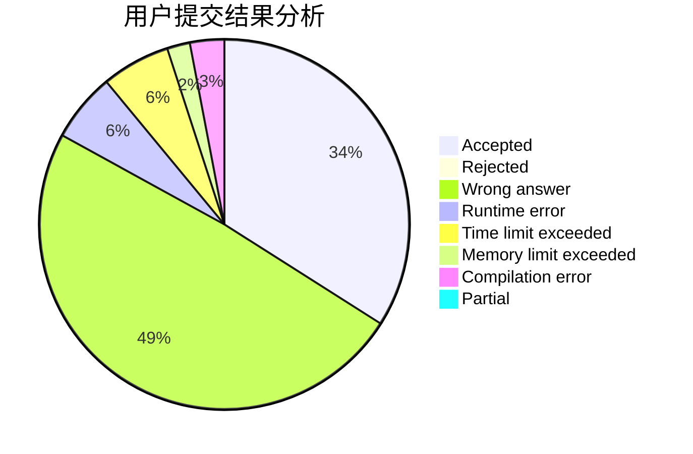
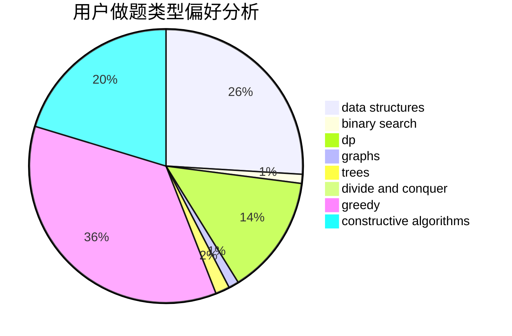
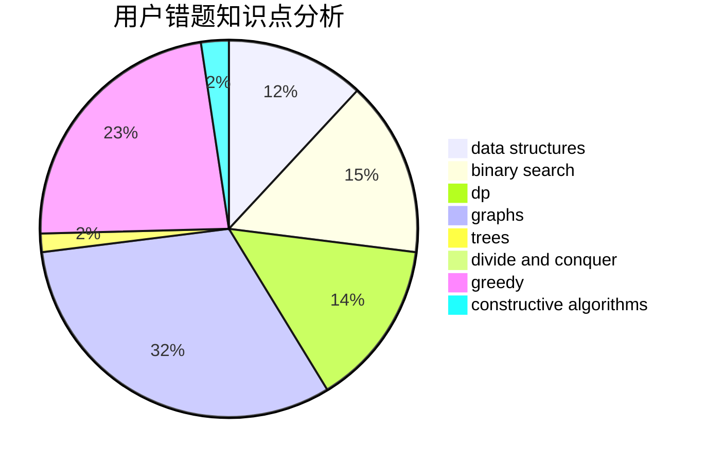

# heading_for_ZJU

<!-- tabs:start -->

#### **用户提交结果分析**

#### **用户做题类型偏好分析**

#### **用户错题知识点分析**

<!-- tabs:end -->
# 推荐题目
[1311C](https://codeforces.com/contest/1311/problem/C)		brute force		  
[1422E](https://codeforces.com/contest/1422/problem/E)		dp,
                        greedy,
                        implementation,
                        strings		  
[1384E](https://codeforces.com/contest/1384/problem/E)		dsu,graphs,sortings,trees		  
[1312E](https://codeforces.com/contest/1312/problem/E)		dp,
                        greedy		  
[1380F](https://codeforces.com/contest/1380/problem/F)		data structures,
                        dp,
                        matrices		  
[1059B](https://codeforces.com/contest/1059/problem/B)		implementation		  
[1228E](https://codeforces.com/contest/1228/problem/E)		combinatorics,
                        dp,
                        math		  
[744C](https://codeforces.com/contest/744/problem/C)		bitmasks,
                        brute force,
                        dp		  
[121D](https://codeforces.com/contest/121/problem/D)		binary search,
                        implementation,
                        two pointers		  
[736D](https://codeforces.com/contest/736/problem/D)		math,
                        matrices		  
