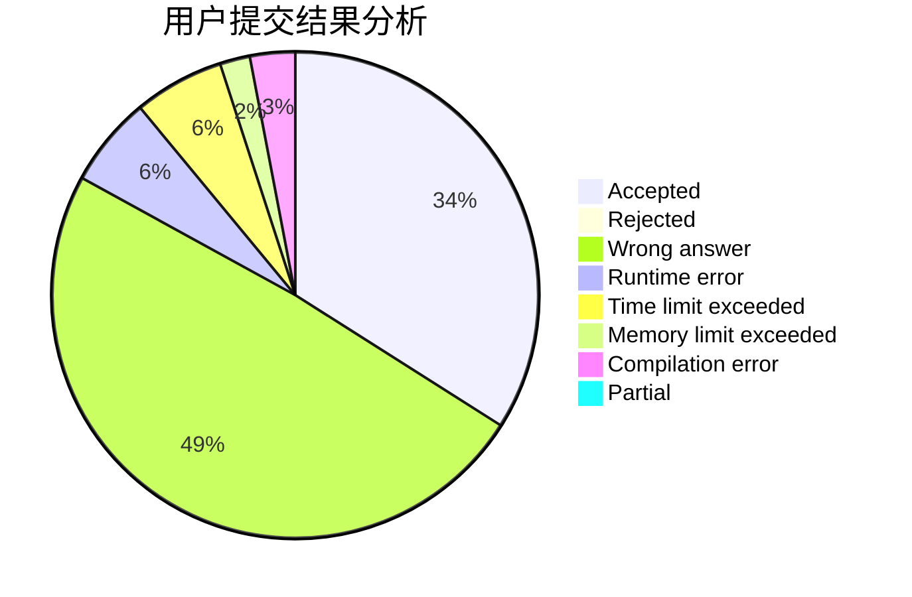
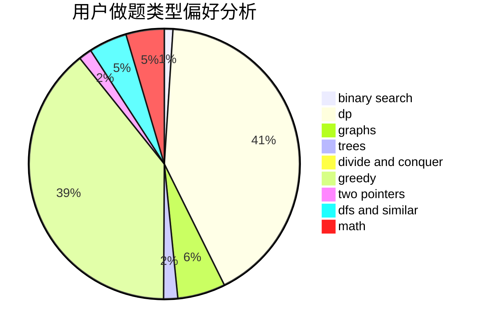

# heading_for_ZJU

<!-- tabs:start -->

#### **用户提交结果分析**

#### **用户做题类型偏好分析**

<!-- tabs:end -->
# 推荐题目
[1311C](https://codeforces.com/contest/1311/problem/C)
[1422E](https://codeforces.com/contest/1422/problem/E)
[1384E](https://codeforces.com/contest/1384/problem/E)
[1312E](https://codeforces.com/contest/1312/problem/E)
[1380F](https://codeforces.com/contest/1380/problem/F)
[1059B](https://codeforces.com/contest/1059/problem/B)
[1228E](https://codeforces.com/contest/1228/problem/E)
[744C](https://codeforces.com/contest/744/problem/C)
[121D](https://codeforces.com/contest/121/problem/D)
[736D](https://codeforces.com/contest/736/problem/D)
