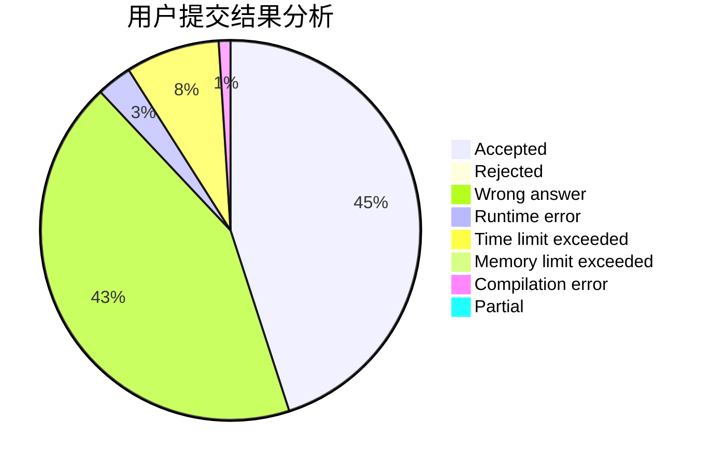
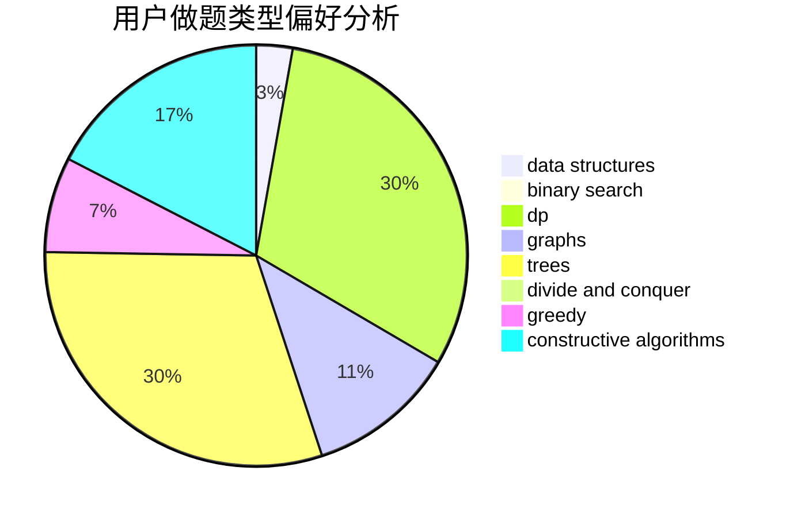
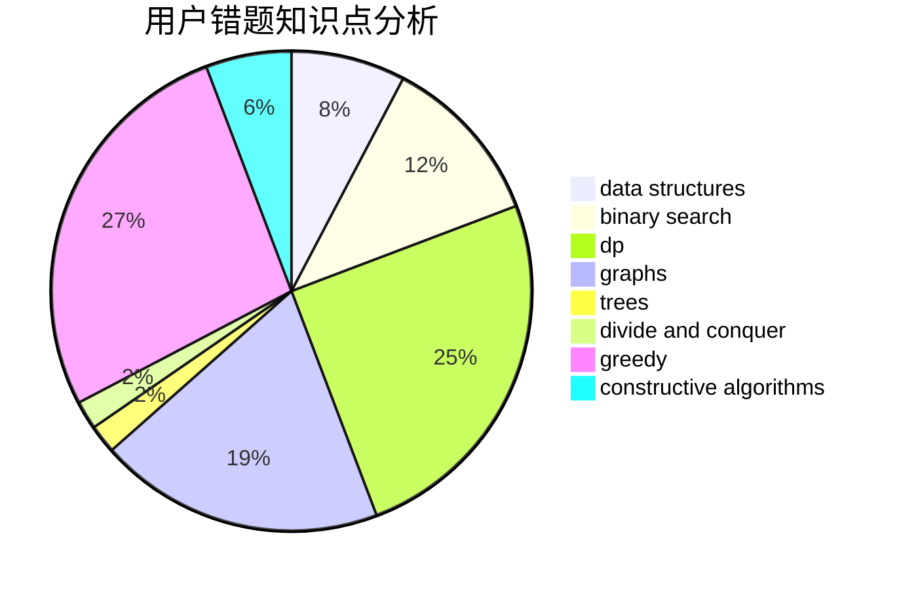

# hebtu2019010920kwq

<!-- tabs:start -->

#### **用户提交结果分析**

#### **用户做题类型偏好分析**

#### **用户错题知识点分析**

<!-- tabs:end -->
# 推荐题目
[453B](https://codeforces.com/contest/453/problem/B)		bitmasks,
                        brute force,
                        dp		  
[803D](https://codeforces.com/contest/803/problem/D)		binary search,
                        greedy		  
[1297D](https://codeforces.com/contest/1297/problem/D)		*special problem,
                        binary search,
                        greedy,
                        sortings		  
[977A](https://codeforces.com/contest/977/problem/A)		implementation		  
[327A](https://codeforces.com/contest/327/problem/A)		brute force,
                        dp,
                        implementation		  
[254B](https://codeforces.com/contest/254/problem/B)		brute force,
                        implementation		  
[635E](https://codeforces.com/contest/635/problem/E)		dsu,graphs,sortings,trees		  
[845A](https://codeforces.com/contest/845/problem/A)		implementation,
                        sortings		  
[1043A](https://codeforces.com/contest/1043/problem/A)		implementation,
                        math		  
[436C](https://codeforces.com/contest/436/problem/C)		dsu,
                        graphs,
                        greedy,
                        trees		  
