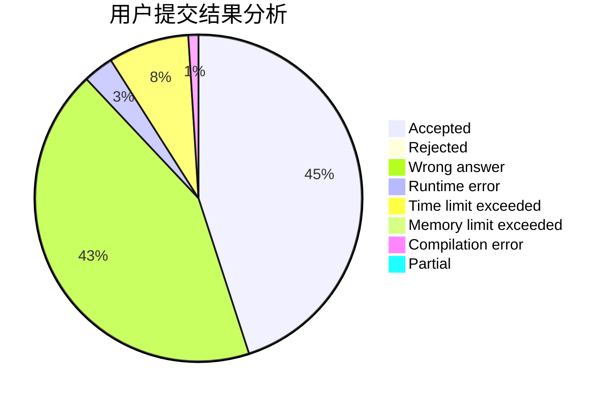
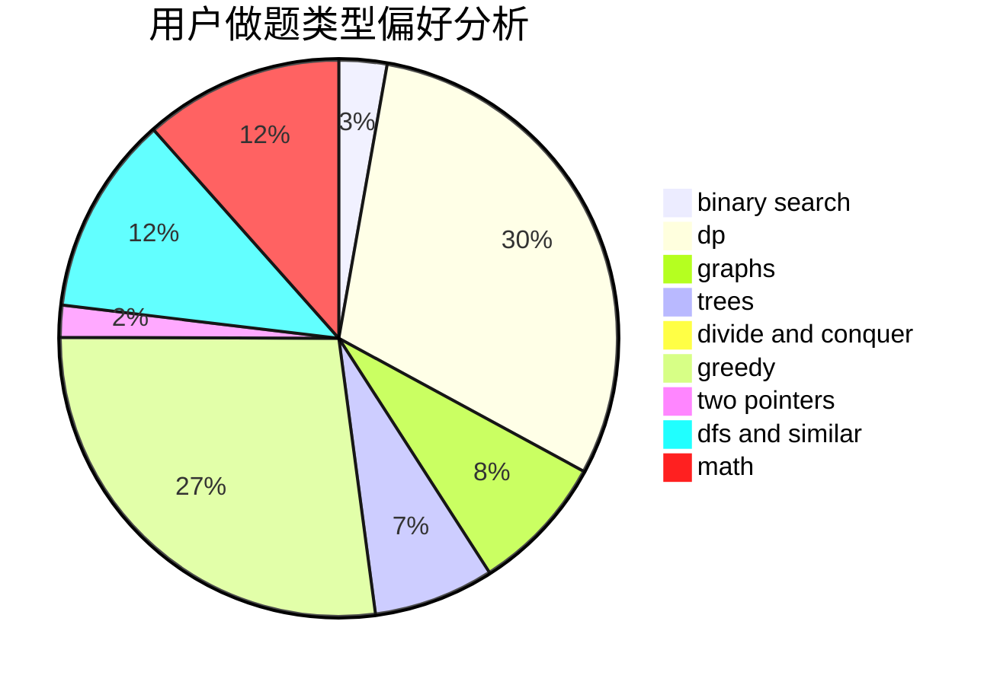

# hebtu2019010920kwq

<!-- tabs:start -->

#### **用户提交结果分析**

#### **用户做题类型偏好分析**

<!-- tabs:end -->
# 推荐题目
[453B](https://codeforces.com/contest/453/problem/B)
[803D](https://codeforces.com/contest/803/problem/D)
[1297D](https://codeforces.com/contest/1297/problem/D)
[977A](https://codeforces.com/contest/977/problem/A)
[327A](https://codeforces.com/contest/327/problem/A)
[254B](https://codeforces.com/contest/254/problem/B)
[635E](https://codeforces.com/contest/635/problem/E)
[845A](https://codeforces.com/contest/845/problem/A)
[1043A](https://codeforces.com/contest/1043/problem/A)
[436C](https://codeforces.com/contest/436/problem/C)
