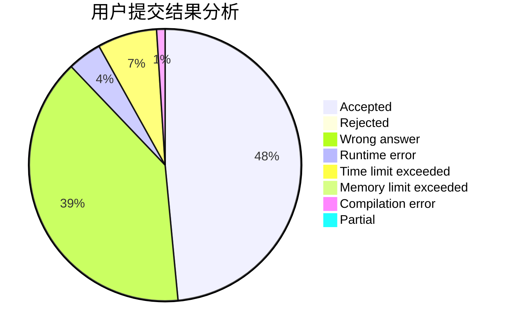
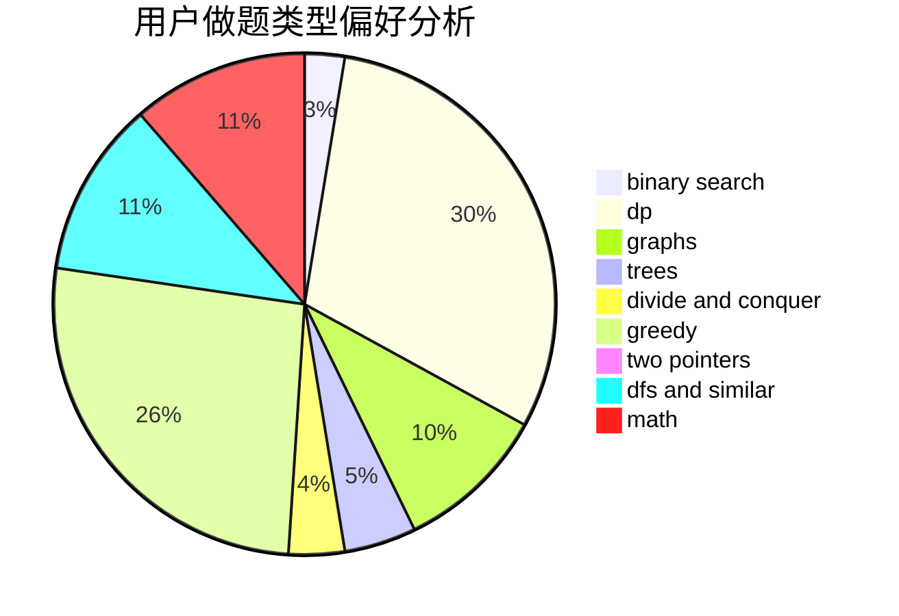

# hebtu2020010927

<!-- tabs:start -->

#### **用户提交结果分析**

#### **用户做题类型偏好分析**

<!-- tabs:end -->
# 推荐题目
[1350C](https://codeforces.com/contest/1350/problem/C)
[936D](https://codeforces.com/contest/936/problem/D)
[44A](https://codeforces.com/contest/44/problem/A)
[1161C](https://codeforces.com/contest/1161/problem/C)
[1185A](https://codeforces.com/contest/1185/problem/A)
[4C](https://codeforces.com/contest/4/problem/C)
[1095A](https://codeforces.com/contest/1095/problem/A)
[669A](https://codeforces.com/contest/669/problem/A)
[1029D](https://codeforces.com/contest/1029/problem/D)
[940F](https://codeforces.com/contest/940/problem/F)
