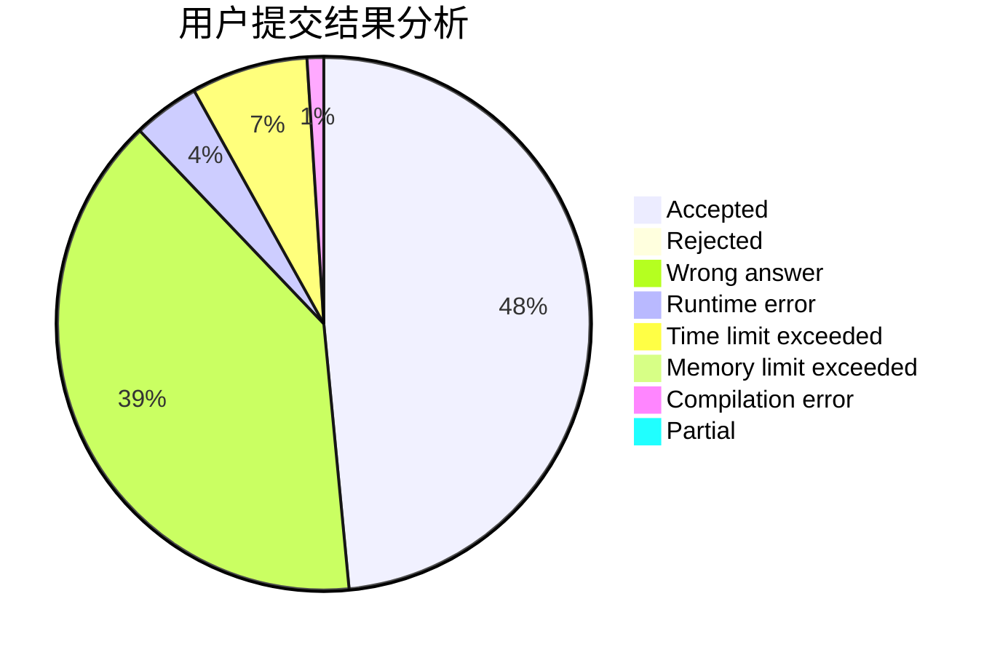
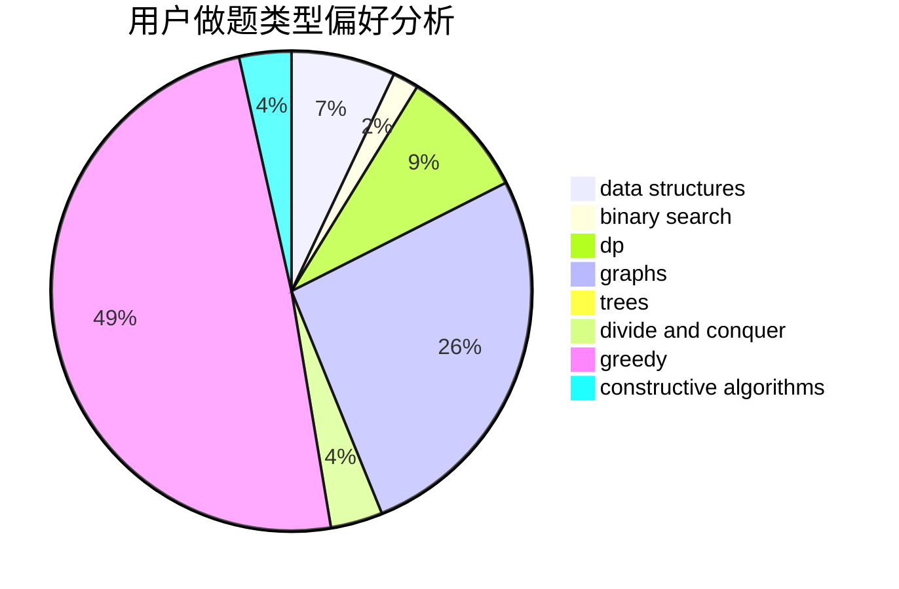
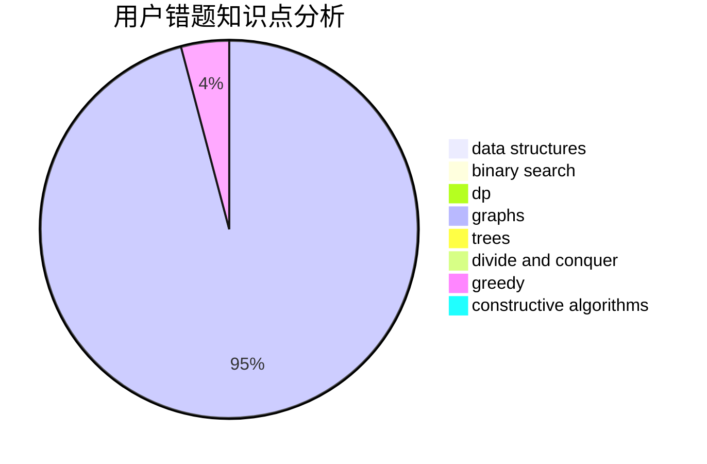

# hebtu2020010927

<!-- tabs:start -->

#### **用户提交结果分析**

#### **用户做题类型偏好分析**

#### **用户错题知识点分析**

<!-- tabs:end -->
# 推荐题目
[1343E](https://codeforces.com/contest/1343/problem/E)		brute force,
                        graphs,
                        greedy,
                        shortest paths,
                        sortings		  
[916C](https://codeforces.com/contest/916/problem/C)		constructive algorithms,
                        graphs,
                        shortest paths		  
[427B](https://codeforces.com/contest/427/problem/B)		data structures,
                        implementation		  
[1158D](https://codeforces.com/contest/1158/problem/D)		constructive algorithms,
                        geometry,
                        greedy,
                        math		  
[1182E](https://codeforces.com/contest/1182/problem/E)		dp,
                        math,
                        matrices,
                        number theory		  
[47B](https://codeforces.com/contest/47/problem/B)		implementation		  
[1093E](https://codeforces.com/contest/1093/problem/E)		data structures		  
[639D](https://codeforces.com/contest/639/problem/D)		data structures,
                        greedy,
                        sortings,
                        two pointers		  
[1029A](https://codeforces.com/contest/1029/problem/A)		implementation,
                        strings		  
[920G](https://codeforces.com/contest/920/problem/G)		binary search,
                        bitmasks,
                        brute force,
                        combinatorics,
                        math,
                        number theory		  
