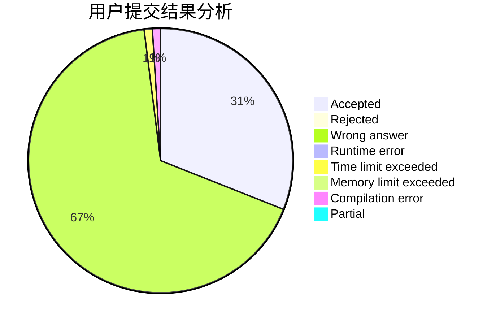
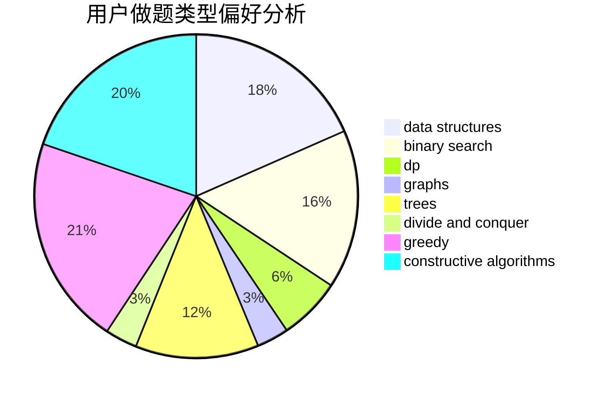
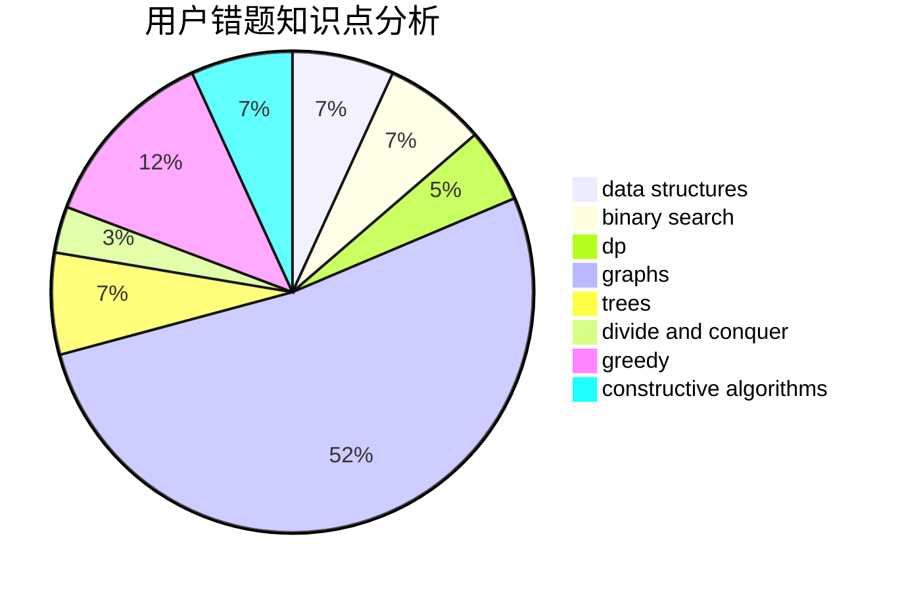

# heguangfu

<!-- tabs:start -->

#### **用户提交结果分析**

#### **用户做题类型偏好分析**

#### **用户错题知识点分析**

<!-- tabs:end -->
# 推荐题目
[1270A](https://codeforces.com/contest/1270/problem/A)		games,
                        greedy,
                        math		  
[1276B](https://codeforces.com/contest/1276/problem/B)		combinatorics,
                        dfs and similar,
                        dsu,
                        graphs		  
[946F](https://codeforces.com/contest/946/problem/F)		combinatorics,
                        dp,
                        matrices		  
[125A](https://codeforces.com/contest/125/problem/A)		math		  
[622F](https://codeforces.com/contest/622/problem/F)		math		  
[916E](https://codeforces.com/contest/916/problem/E)		data structures,
                        trees		  
[1068D](https://codeforces.com/contest/1068/problem/D)		dsu,graphs,sortings,trees		  
[818F](https://codeforces.com/contest/818/problem/F)		binary search,
                        math,
                        ternary search		  
[1344A](https://codeforces.com/contest/1344/problem/A)		math,
                        number theory,
                        sortings		  
[1250F](https://codeforces.com/contest/1250/problem/F)		brute force,
                        implementation		  
