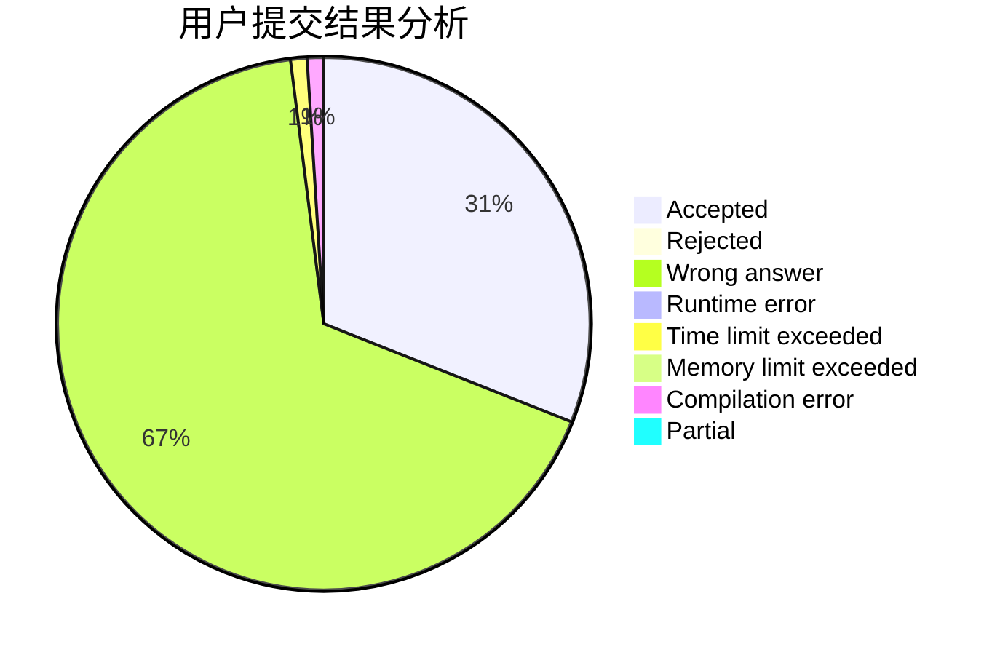
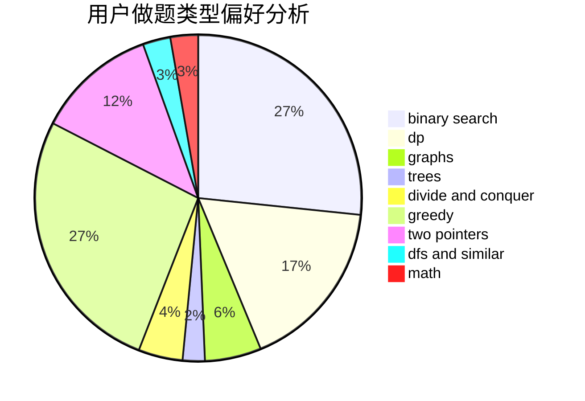

# heguangfu

<!-- tabs:start -->

#### **用户提交结果分析**

#### **用户做题类型偏好分析**

<!-- tabs:end -->
# 推荐题目
[1279A](https://codeforces.com/contest/1279/problem/A)
[1282C](https://codeforces.com/contest/1282/problem/C)
[963C](https://codeforces.com/contest/963/problem/C)
[1265C](https://codeforces.com/contest/1265/problem/C)
[650E](https://codeforces.com/contest/650/problem/E)
[937A](https://codeforces.com/contest/937/problem/A)
[106B](https://codeforces.com/contest/106/problem/B)
[838E](https://codeforces.com/contest/838/problem/E)
[1350E](https://codeforces.com/contest/1350/problem/E)
[1254E](https://codeforces.com/contest/1254/problem/E)
