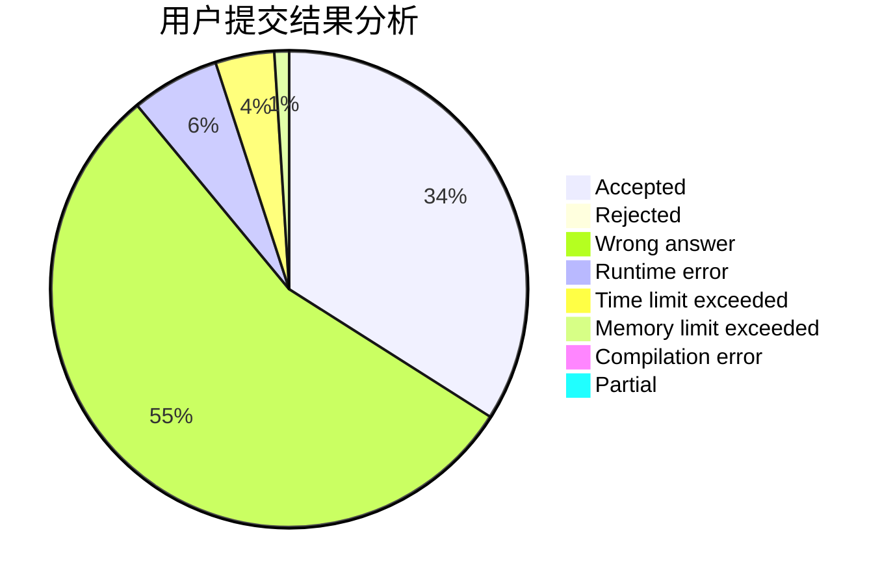
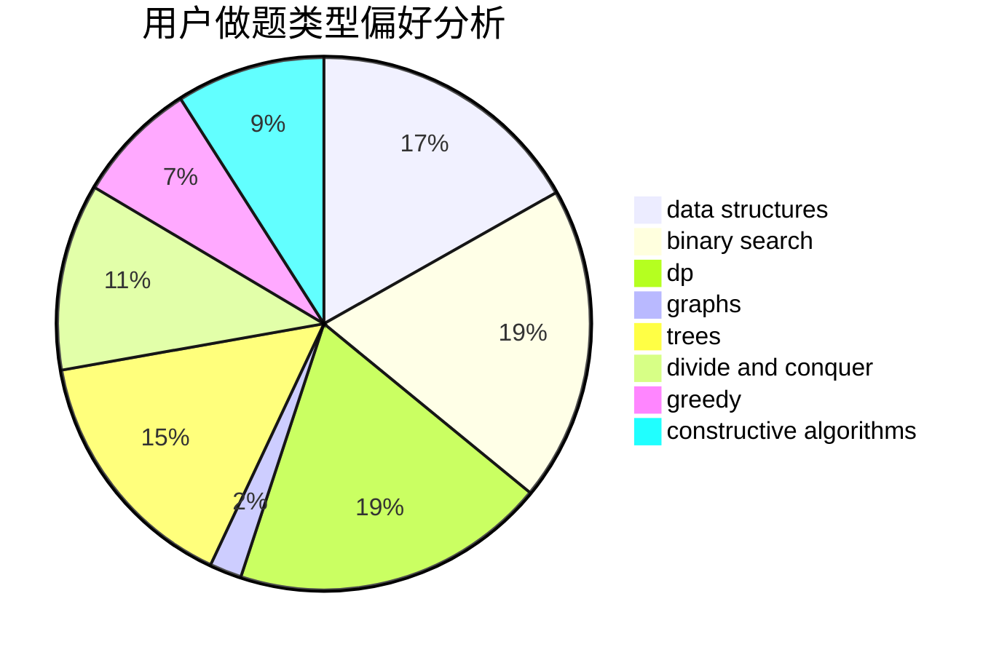
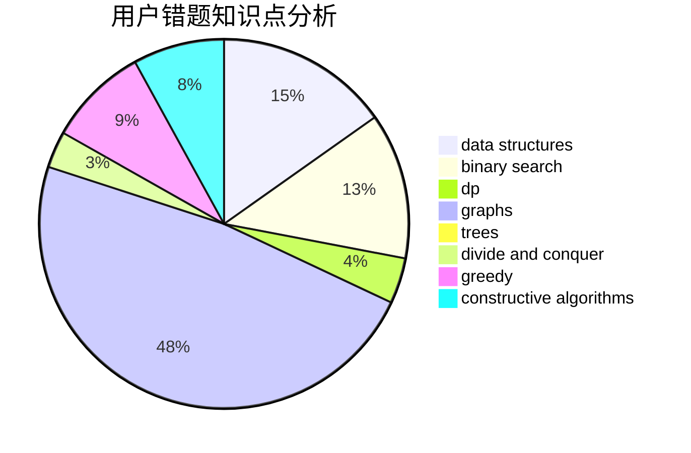

# BSBandme

<!-- tabs:start -->

#### **用户提交结果分析**

#### **用户做题类型偏好分析**

#### **用户错题知识点分析**

<!-- tabs:end -->
# 推荐题目
[480A](https://codeforces.com/contest/480/problem/A)		dsu,graphs,sortings,trees		  
[1416D](https://codeforces.com/contest/1416/problem/D)		data structures,
                        dsu,
                        graphs,
                        implementation,
                        trees		  
[47B](https://codeforces.com/contest/47/problem/B)		implementation		  
[1102E](https://codeforces.com/contest/1102/problem/E)		combinatorics,
                        sortings		  
[343A](https://codeforces.com/contest/343/problem/A)		math,
                        number theory		  
[482A](https://codeforces.com/contest/482/problem/A)		constructive algorithms,
                        greedy		  
[357B](https://codeforces.com/contest/357/problem/B)		constructive algorithms,
                        implementation		  
[482E](https://codeforces.com/contest/482/problem/E)		data structures,
                        trees		  
[1164K](https://codeforces.com/contest/1164/problem/K)		dsu,graphs,sortings,trees		  
[1279F](https://codeforces.com/contest/1279/problem/F)		binary search,
                        dp		  
