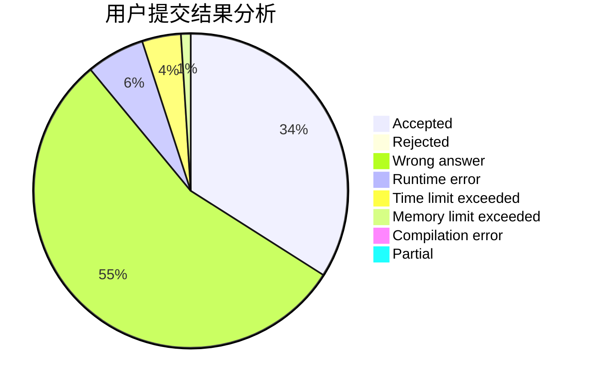
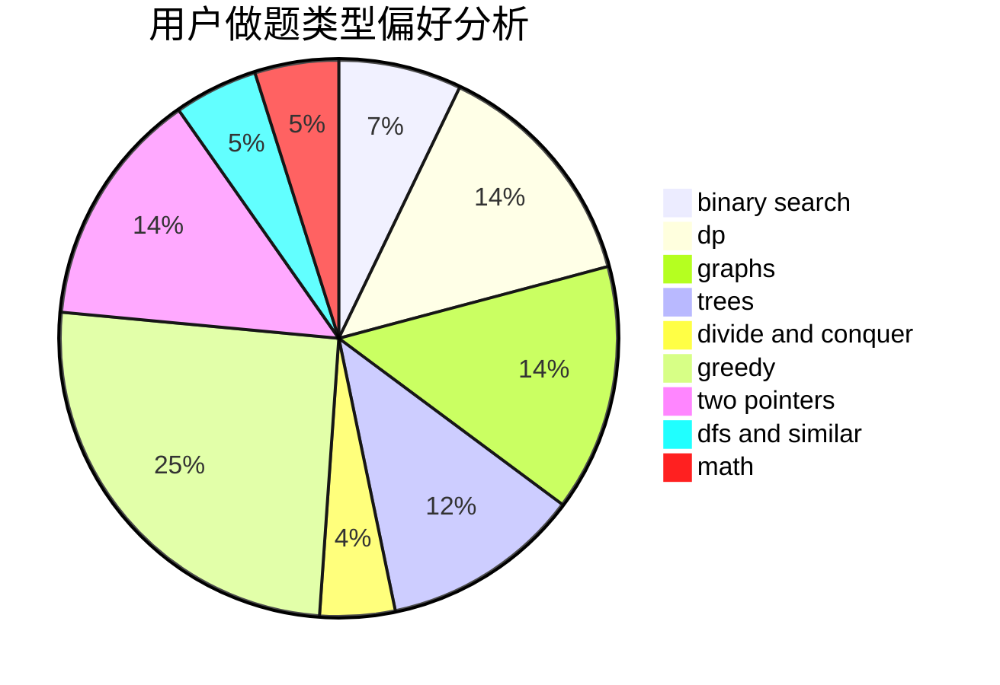

# BSBandme

<!-- tabs:start -->

#### **用户提交结果分析**

#### **用户做题类型偏好分析**

<!-- tabs:end -->
# 推荐题目
[480A](https://codeforces.com/contest/480/problem/A)
[1416D](https://codeforces.com/contest/1416/problem/D)
[47B](https://codeforces.com/contest/47/problem/B)
[1102E](https://codeforces.com/contest/1102/problem/E)
[343A](https://codeforces.com/contest/343/problem/A)
[482A](https://codeforces.com/contest/482/problem/A)
[357B](https://codeforces.com/contest/357/problem/B)
[482E](https://codeforces.com/contest/482/problem/E)
[1164K](https://codeforces.com/contest/1164/problem/K)
[1279F](https://codeforces.com/contest/1279/problem/F)
