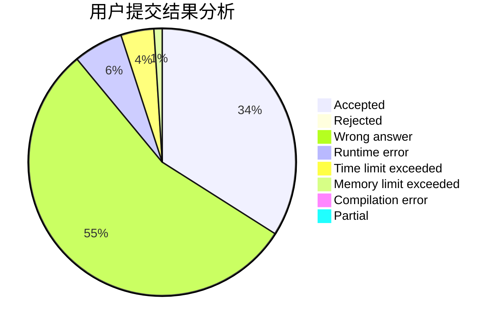
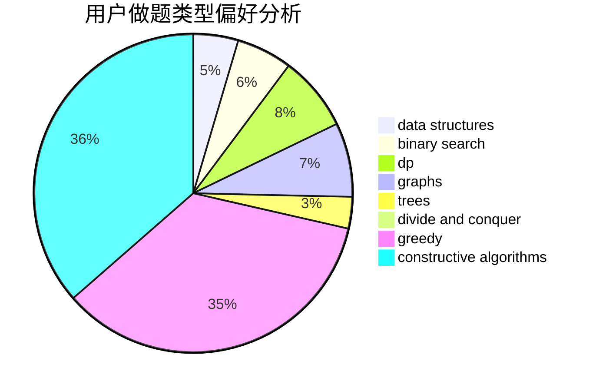
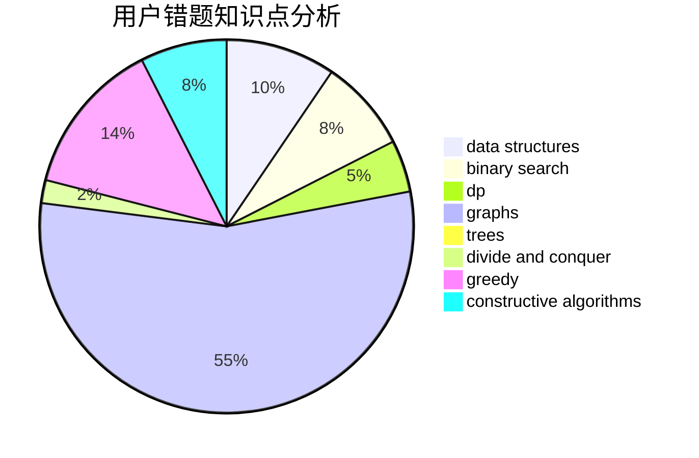

# BSBandme

<!-- tabs:start -->

#### **用户提交结果分析**

#### **用户做题类型偏好分析**

#### **用户错题知识点分析**

<!-- tabs:end -->
# 推荐题目
[461A](https://codeforces.com/contest/461/problem/A)		greedy,
                        sortings		  
[1405C](https://codeforces.com/contest/1405/problem/C)		dsu,graphs,sortings,trees		  
[460D](https://codeforces.com/contest/460/problem/D)		brute force,
                        constructive algorithms,
                        math		  
[1102B](https://codeforces.com/contest/1102/problem/B)		greedy,
                        sortings		  
[316E2](https://codeforces.com/contest/316E/problem/2)		data structures,
                        math		  
[462A](https://codeforces.com/contest/462/problem/A)		brute force,
                        implementation		  
[329E](https://codeforces.com/contest/329/problem/E)		math		  
[463A](https://codeforces.com/contest/463/problem/A)		brute force,
                        implementation		  
[1162D](https://codeforces.com/contest/1162/problem/D)		dsu,graphs,sortings,trees		  
[1270F](https://codeforces.com/contest/1270/problem/F)		math,
                        strings		  
