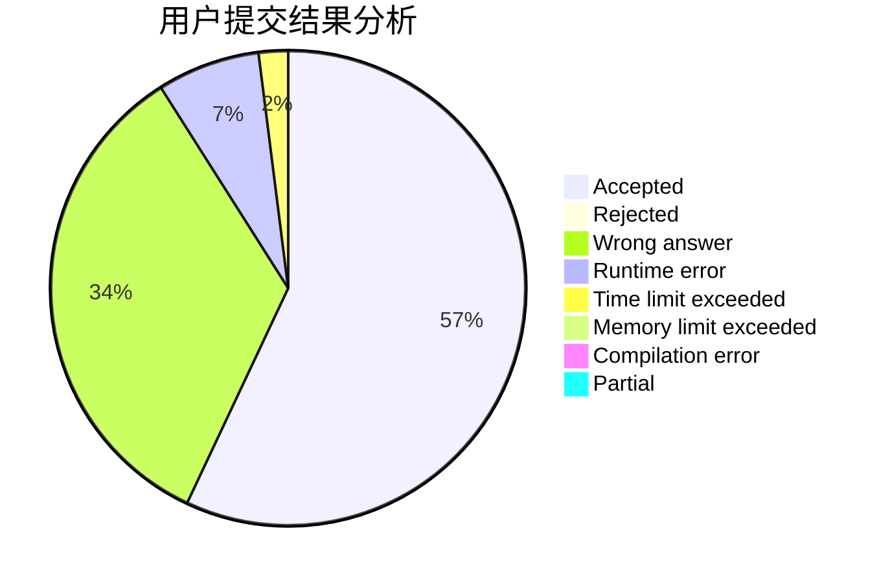
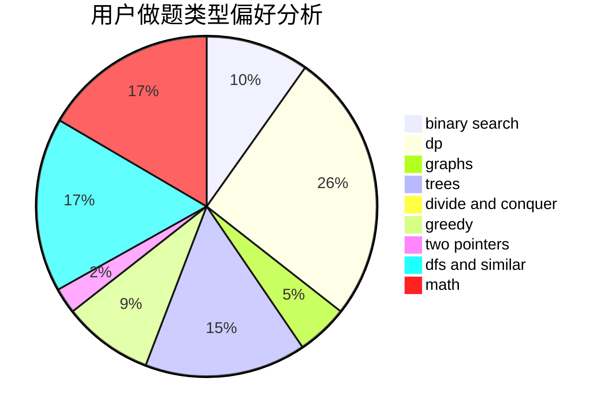

# hehezhou

<!-- tabs:start -->

#### **用户提交结果分析**

#### **用户做题类型偏好分析**

<!-- tabs:end -->
# 推荐题目
[1228B](https://codeforces.com/contest/1228/problem/B)
[174B](https://codeforces.com/contest/174/problem/B)
[1432F](https://codeforces.com/contest/1432/problem/F)
[1250A](https://codeforces.com/contest/1250/problem/A)
[1194E](https://codeforces.com/contest/1194/problem/E)
[1381E](https://codeforces.com/contest/1381/problem/E)
[883H](https://codeforces.com/contest/883/problem/H)
[1054D](https://codeforces.com/contest/1054/problem/D)
[231D](https://codeforces.com/contest/231/problem/D)
[453E](https://codeforces.com/contest/453/problem/E)
