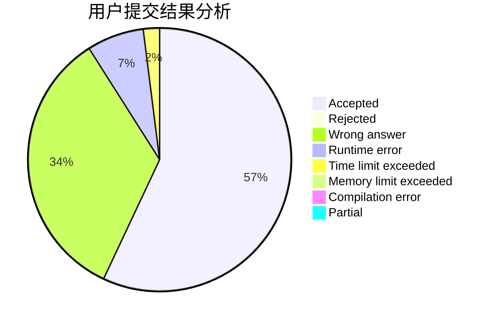
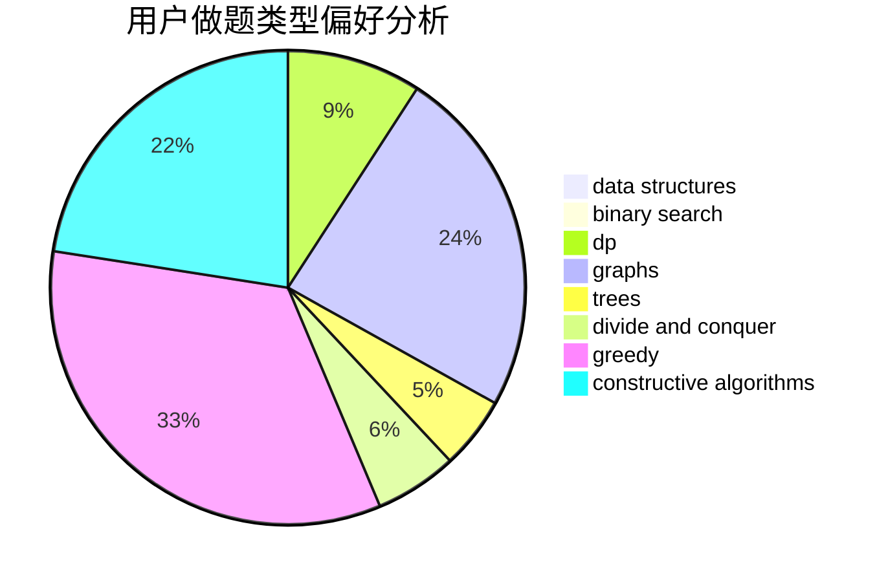
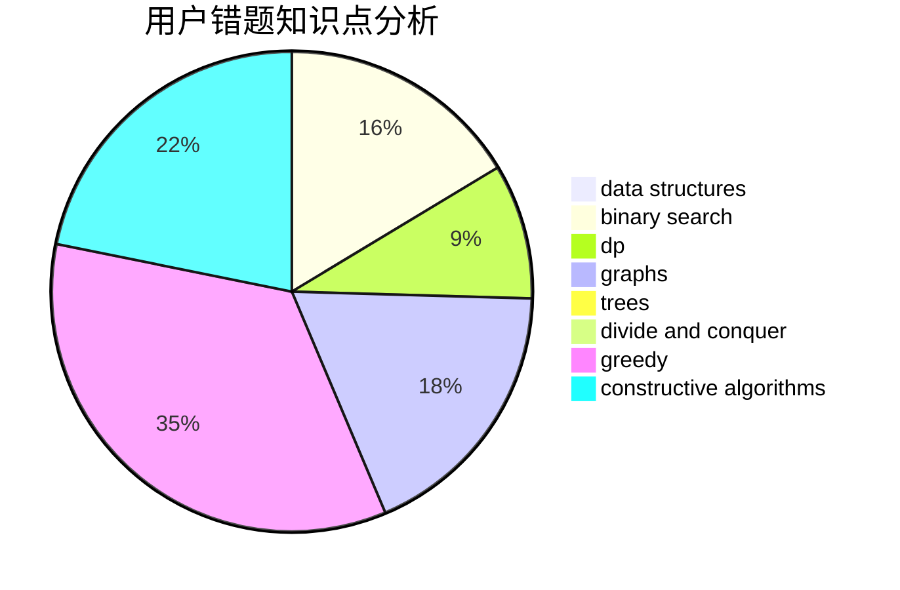

# hehezhou

<!-- tabs:start -->

#### **用户提交结果分析**

#### **用户做题类型偏好分析**

#### **用户错题知识点分析**

<!-- tabs:end -->
# 推荐题目
[1220B](https://codeforces.com/contest/1220/problem/B)		math,
                        number theory		  
[1513F](https://codeforces.com/contest/1513/problem/F)		brute force,
                        constructive algorithms,
                        data structures,
                        sortings		  
[1424G](https://codeforces.com/contest/1424/problem/G)		data structures,
                        sortings		  
[1244F](https://codeforces.com/contest/1244/problem/F)		constructive algorithms,
                        implementation		  
[1189C](https://codeforces.com/contest/1189/problem/C)		data structures,
                        dp,
                        implementation,
                        math		  
[1373B](https://codeforces.com/contest/1373/problem/B)		games		  
[863F](https://codeforces.com/contest/863/problem/F)		flows		  
[1054A](https://codeforces.com/contest/1054/problem/A)		implementation		  
[20B](https://codeforces.com/contest/20/problem/B)		math		  
[433B](https://codeforces.com/contest/433/problem/B)		dp,
                        implementation,
                        sortings		  
