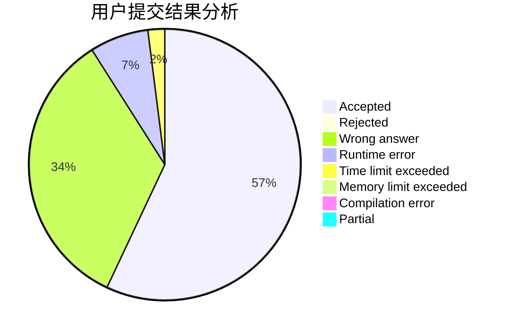
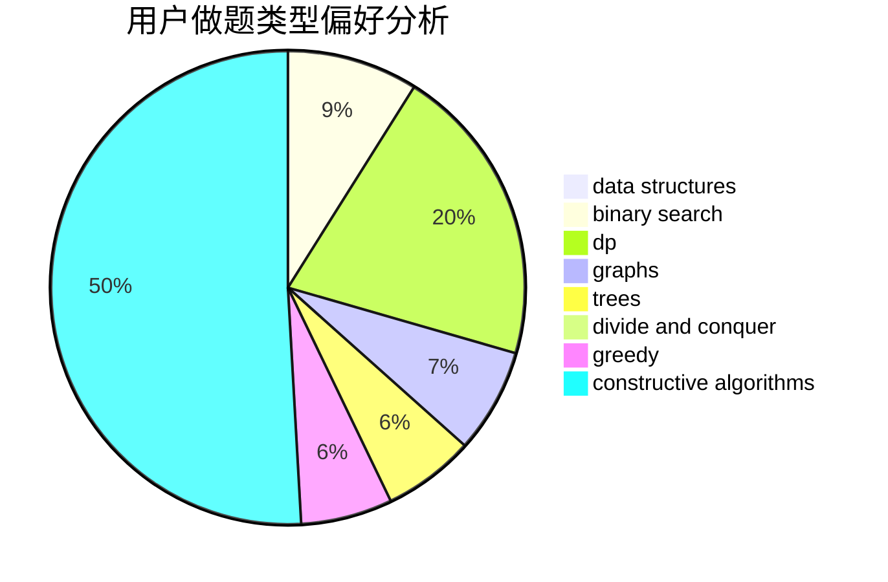

# hehezhou

<!-- tabs:start -->

#### **用户提交结果分析**

#### **用户做题类型偏好分析**

#### **用户错题知识点分析**

<!-- tabs:end -->
# 推荐题目
[1228B](https://codeforces.com/contest/1228/problem/B)		implementation,
                        math		  
[174B](https://codeforces.com/contest/174/problem/B)		dp,
                        greedy,
                        implementation		  
[1432F](https://codeforces.com/contest/1432/problem/F)		dsu,graphs,sortings,trees		  
[1250A](https://codeforces.com/contest/1250/problem/A)		implementation		  
[1194E](https://codeforces.com/contest/1194/problem/E)		bitmasks,
                        brute force,
                        data structures,
                        geometry,
                        sortings		  
[1381E](https://codeforces.com/contest/1381/problem/E)		geometry,
                        math,
                        sortings		  
[883H](https://codeforces.com/contest/883/problem/H)		brute force,
                        implementation,
                        strings		  
[1054D](https://codeforces.com/contest/1054/problem/D)		greedy,
                        implementation		  
[231D](https://codeforces.com/contest/231/problem/D)		brute force,
                        geometry		  
[453E](https://codeforces.com/contest/453/problem/E)		data structures		  
