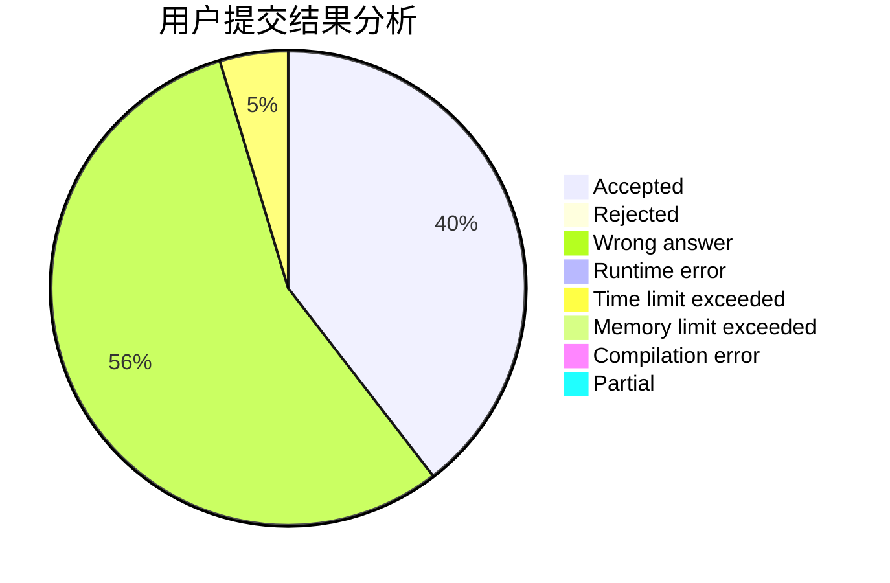
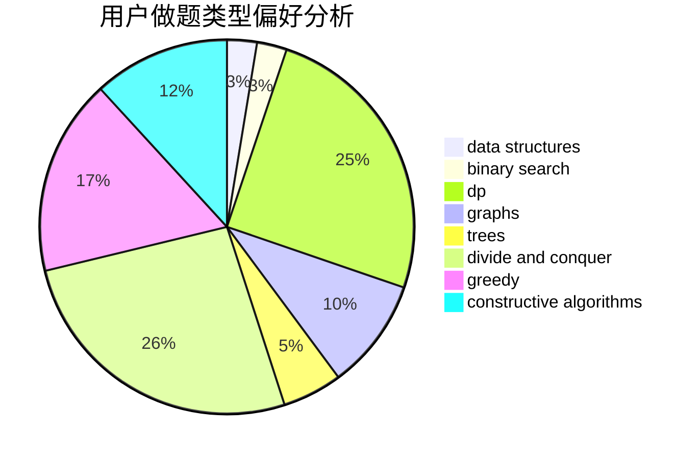

# heiheihei123

<!-- tabs:start -->

#### **用户提交结果分析**

#### **用户做题类型偏好分析**

#### **用户错题知识点分析**

<!-- tabs:end -->
# 推荐题目
[1118E](https://codeforces.com/contest/1118/problem/E)		constructive algorithms,
                        implementation		  
[1361C](https://codeforces.com/contest/1361/problem/C)		binary search,
                        bitmasks,
                        constructive algorithms,
                        dfs and similar,
                        dsu,
                        graphs		  
[1164M](https://codeforces.com/contest/1164/problem/M)		dsu,graphs,sortings,trees		  
[1397E](https://codeforces.com/contest/1397/problem/E)		dsu,graphs,sortings,trees		  
[290C](https://codeforces.com/contest/290/problem/C)		*special problem,
                        graph matchings,
                        implementation,
                        trees		  
[1402A](https://codeforces.com/contest/1402/problem/A)		*special problem,
                        data structures,
                        dsu,
                        implementation,
                        math,
                        sortings		  
[1064D](https://codeforces.com/contest/1064/problem/D)		dsu,graphs,sortings,trees		  
[988F](https://codeforces.com/contest/988/problem/F)		dp		  
[611A](https://codeforces.com/contest/611/problem/A)		implementation		  
[801D](https://codeforces.com/contest/801/problem/D)		dsu,graphs,sortings,trees		  
