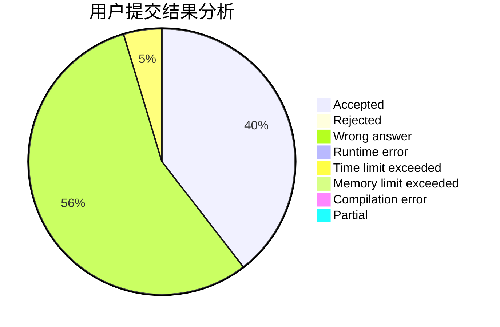
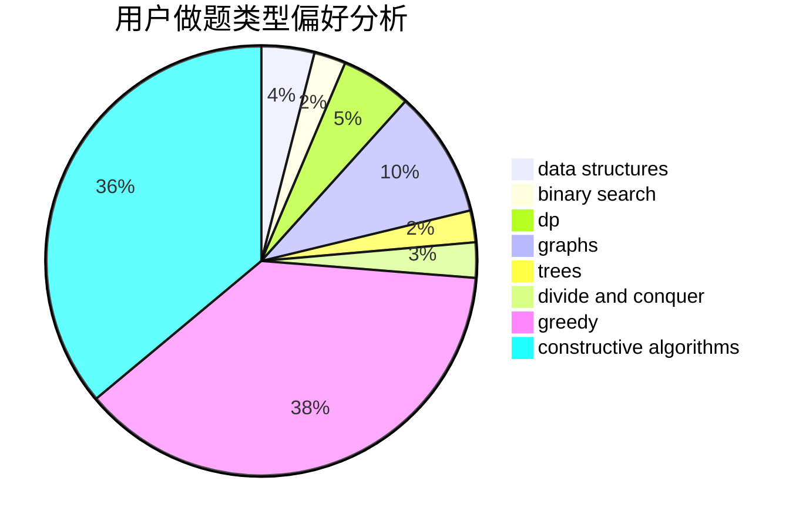

# heiheihei123

<!-- tabs:start -->

#### **用户提交结果分析**

#### **用户做题类型偏好分析**

#### **用户错题知识点分析**

<!-- tabs:end -->
# 推荐题目
[1117A](https://codeforces.com/contest/1117/problem/A)		implementation,
                        math		  
[1354F](https://codeforces.com/contest/1354/problem/F)		constructive algorithms,
                        dp,
                        flows,
                        graph matchings,
                        greedy,
                        sortings		  
[1162E](https://codeforces.com/contest/1162/problem/E)		dsu,graphs,sortings,trees		  
[1388B](https://codeforces.com/contest/1388/problem/B)		greedy,
                        math		  
[276C](https://codeforces.com/contest/276/problem/C)		data structures,
                        greedy,
                        implementation,
                        sortings		  
[1394B](https://codeforces.com/contest/1394/problem/B)		brute force,
                        dfs and similar,
                        graphs,
                        hashing		  
[1064A](https://codeforces.com/contest/1064/problem/A)		brute force,
                        geometry,
                        math		  
[967C](https://codeforces.com/contest/967/problem/C)		dsu,graphs,sortings,trees		  
[591C](https://codeforces.com/contest/591/problem/C)		dsu,graphs,sortings,trees		  
[784D](https://codeforces.com/contest/784/problem/D)		*special problem,
                        implementation		  
