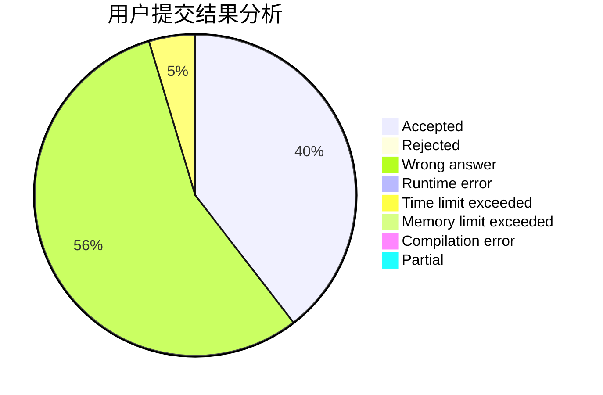
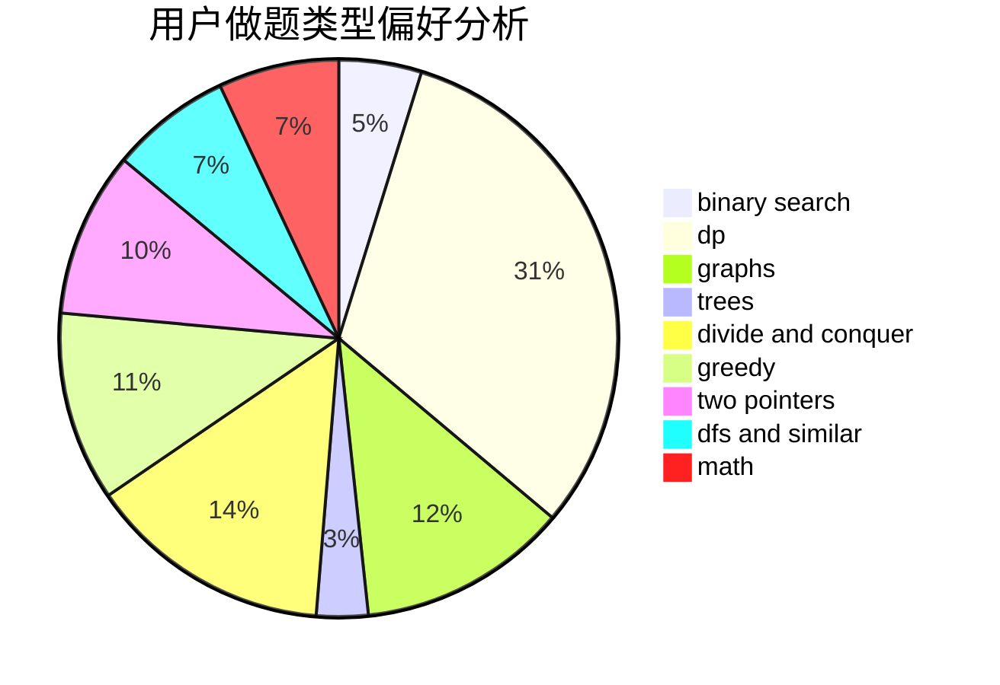

# heiheihei123

<!-- tabs:start -->

#### **用户提交结果分析**

#### **用户做题类型偏好分析**

<!-- tabs:end -->
# 推荐题目
[1118E](https://codeforces.com/contest/1118/problem/E)
[1361C](https://codeforces.com/contest/1361/problem/C)
[1164M](https://codeforces.com/contest/1164/problem/M)
[1397E](https://codeforces.com/contest/1397/problem/E)
[290C](https://codeforces.com/contest/290/problem/C)
[1402A](https://codeforces.com/contest/1402/problem/A)
[1064D](https://codeforces.com/contest/1064/problem/D)
[988F](https://codeforces.com/contest/988/problem/F)
[611A](https://codeforces.com/contest/611/problem/A)
[801D](https://codeforces.com/contest/801/problem/D)
