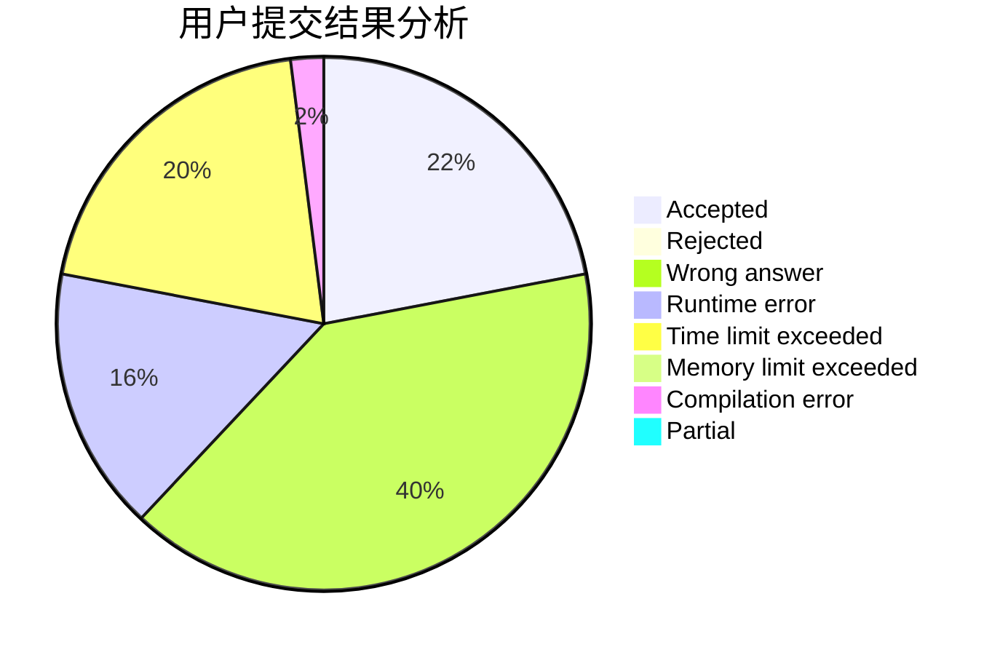
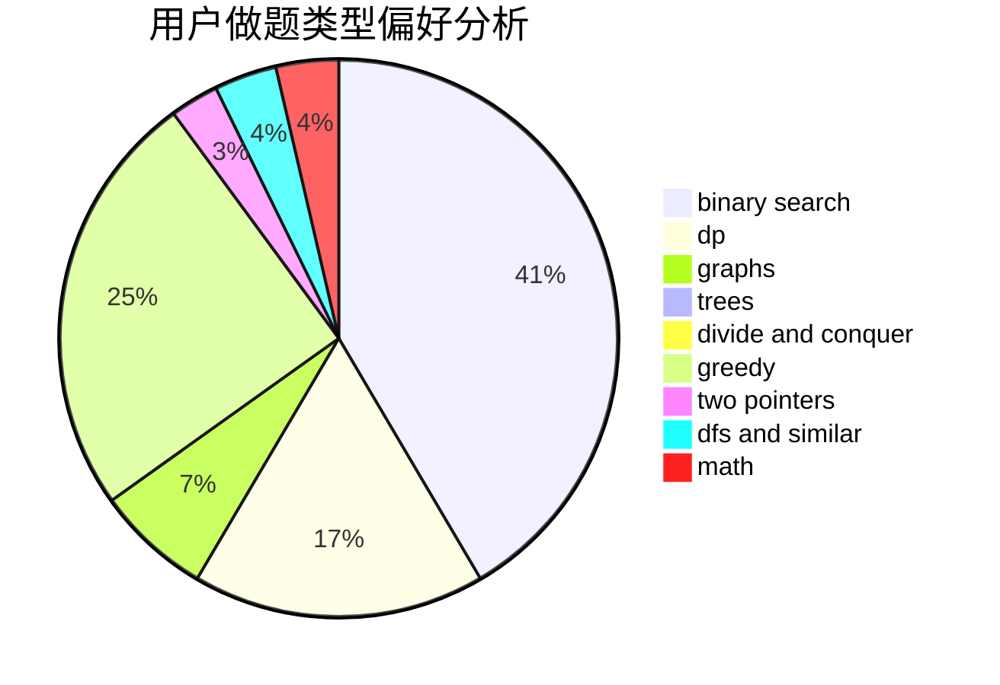

# helium_7

<!-- tabs:start -->

#### **用户提交结果分析**

#### **用户做题类型偏好分析**

<!-- tabs:end -->
# 推荐题目
[1470E](https://codeforces.com/contest/1470/problem/E)
[459C](https://codeforces.com/contest/459/problem/C)
[703A](https://codeforces.com/contest/703/problem/A)
[1255A](https://codeforces.com/contest/1255/problem/A)
[253A](https://codeforces.com/contest/253/problem/A)
[228E](https://codeforces.com/contest/228/problem/E)
[1056G](https://codeforces.com/contest/1056/problem/G)
[1459F](https://codeforces.com/contest/1459/problem/F)
[922D](https://codeforces.com/contest/922/problem/D)
[29B](https://codeforces.com/contest/29/problem/B)
