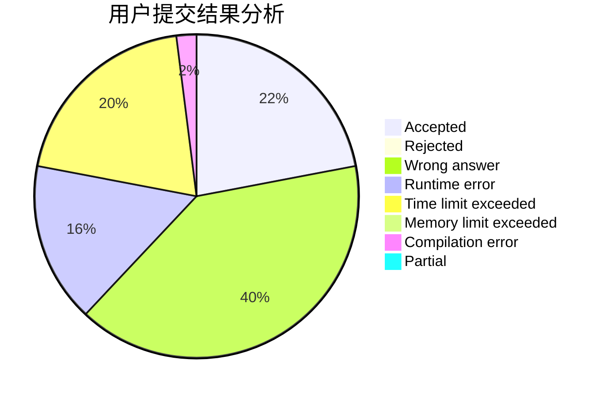
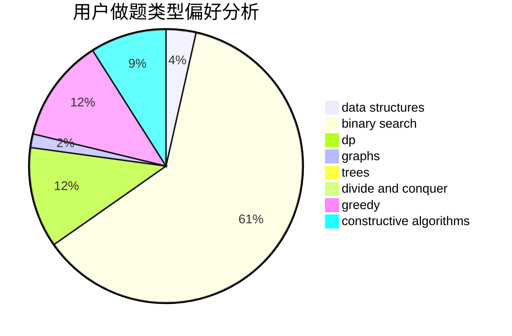

# helium_7

<!-- tabs:start -->

#### **用户提交结果分析**

#### **用户做题类型偏好分析**

#### **用户错题知识点分析**

<!-- tabs:end -->
# 推荐题目
[1470E](https://codeforces.com/contest/1470/problem/E)		binary search,
                        combinatorics,
                        data structures,
                        dp,
                        graphs,
                        implementation,
                        two pointers		  
[459C](https://codeforces.com/contest/459/problem/C)		combinatorics,
                        constructive algorithms,
                        math		  
[703A](https://codeforces.com/contest/703/problem/A)		implementation		  
[1255A](https://codeforces.com/contest/1255/problem/A)		math		  
[253A](https://codeforces.com/contest/253/problem/A)		greedy		  
[228E](https://codeforces.com/contest/228/problem/E)		2-sat,
                        dfs and similar,
                        dsu,
                        graphs		  
[1056G](https://codeforces.com/contest/1056/problem/G)		brute force,
                        data structures,
                        graphs		  
[1459F](https://codeforces.com/contest/1459/problem/F)		dsu,graphs,sortings,trees		  
[922D](https://codeforces.com/contest/922/problem/D)		greedy,
                        sortings		  
[29B](https://codeforces.com/contest/29/problem/B)		implementation		  
